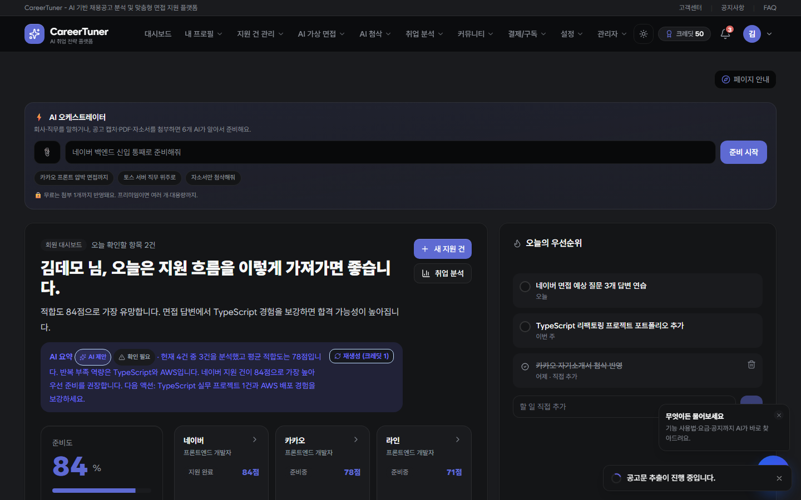
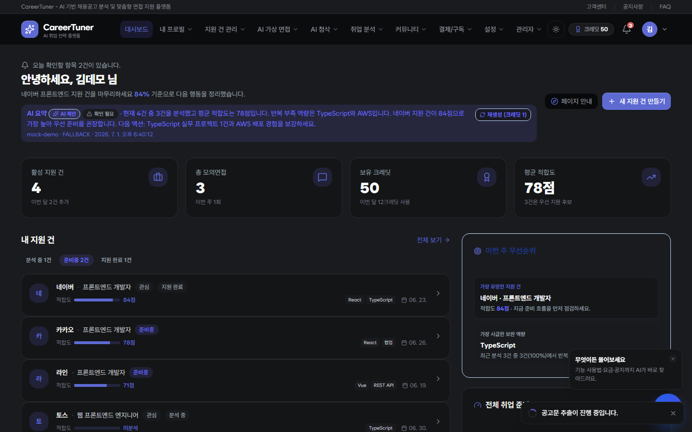
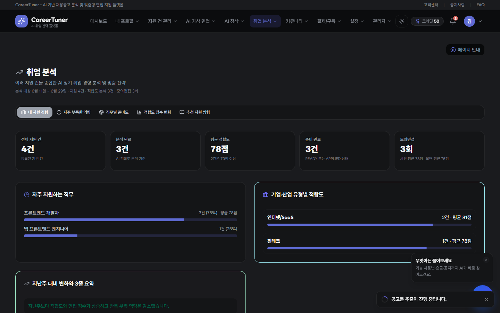
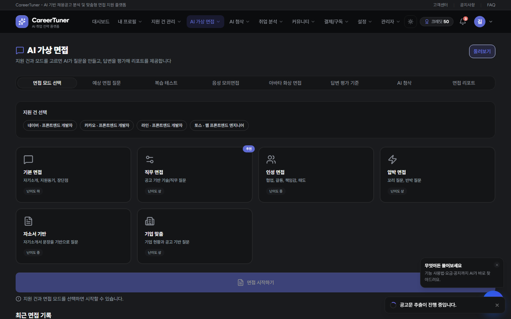
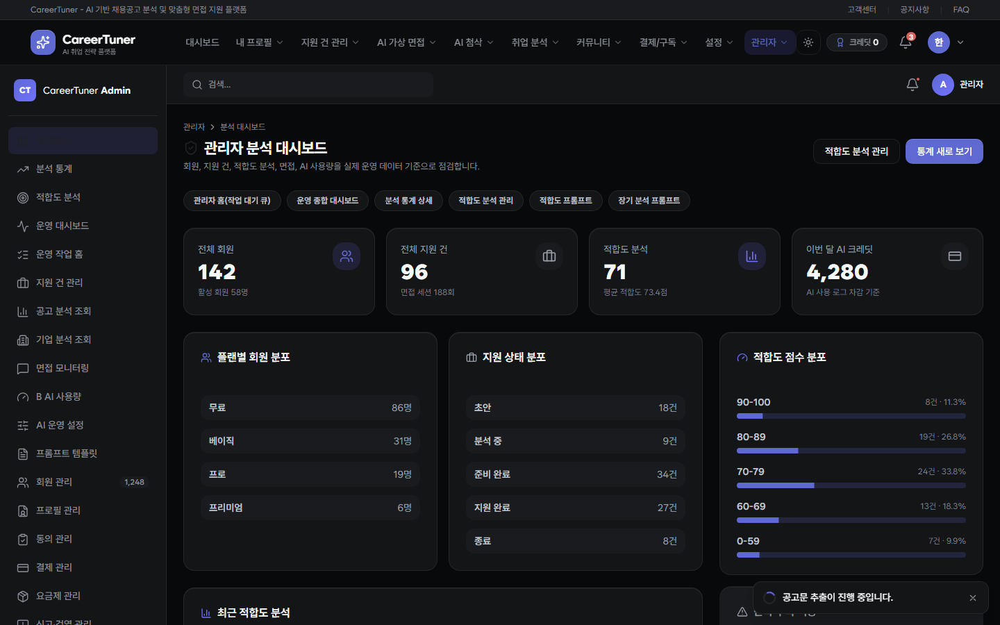
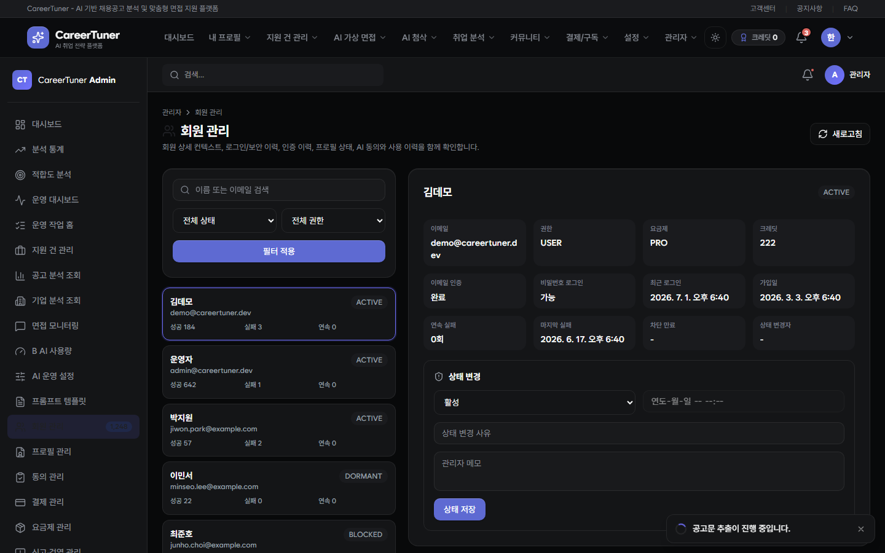
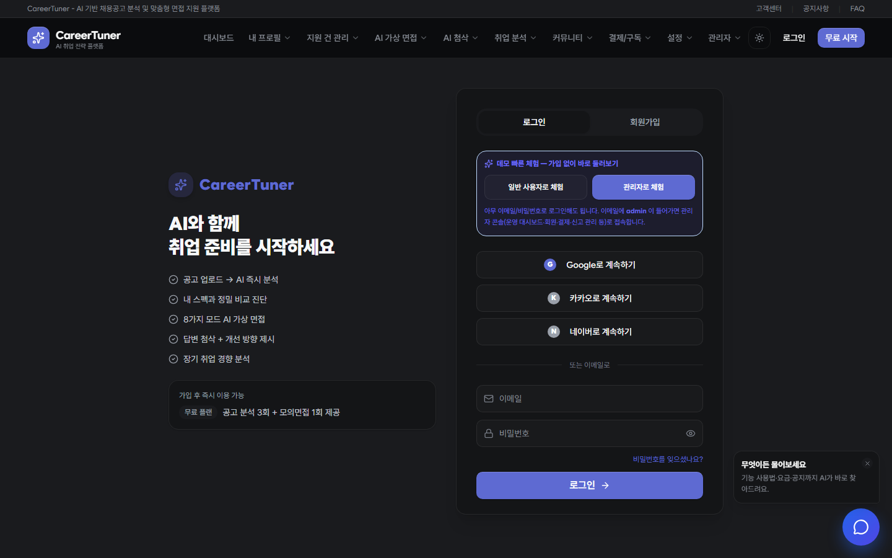
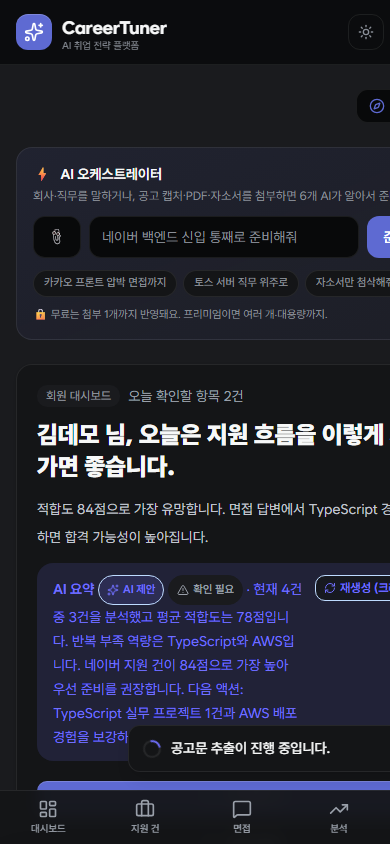

# CareerTuner

**채용공고에 맞춰 스펙과 면접 답변을 조정하는 AI 취업 전략·가상 면접 준비 플랫폼.**

취업 준비는 공고마다 요구가 다른데, 준비는 늘 "이력서 한 벌 · 자기소개서 한 벌"로 뭉뚱그려집니다.
CareerTuner는 준비의 단위를 **지원 건(Application Case)** 으로 잡습니다. 공고 하나를 올리면
요구조건·기업 현황 분석 → 내 프로필과의 적합도 비교 → 부족 역량·학습 방향 → 예상 질문 →
**AI 모의면접 → 답변 평가·첨삭 → 장기 취업 경향 분석**까지, 그 공고에 맞춘 준비가 지원 건 하나 안에서 이어집니다.

<p align="center">
  <a href="https://notetester.github.io/CareerTunerPortfolio/"></a>
  <a href="https://notetester.github.io/CareerTunerPortfolio/docs/"></a>
</p>

<p align="center">
  
  
  
  
  
  
  
  
  
</p>

> **이 저장소는 6인 팀 프로젝트의 포트폴리오 공개본입니다.** 비공개 원본의 전체 커밋 이력을 보존하되,
> API 키·DB 자격증명·내부 IP 등 민감정보는 전 이력에서 제거했습니다. 자세한 내용은 [🔒 공개본 안내](#-공개본-안내)를 참고하세요.

---

## ▶ 지금 바로 체험

백엔드 없이 브라우저 안의 mock 데이터로 주요 사용자·관리자 흐름을 체험할 수 있습니다. **설치·가입 없이** 아래 링크로 바로 둘러보세요.

| 무엇 | 링크 |
| --- | --- |
| **라이브 데모** (일반 사용자) | <https://notetester.github.io/CareerTunerPortfolio/login?demo=user> |
| **라이브 데모** (관리자 콘솔) | <https://notetester.github.io/CareerTunerPortfolio/login?demo=admin> |
| **기능 설명서** (아키텍처·도메인별 구현 상세) | <https://notetester.github.io/CareerTunerPortfolio/docs/> |
| **기술 면접 학습 사이트** (A~F 코드 기반) | <https://notetester.github.io/CareerTunerLearning/> |
| **Second Brain 공개 지식 지도** | <https://notetester.github.io/CareerTunerPortfolio/Obsidian/> |

### 데모 계정 안내

데모에는 **일반 사용자**와 **관리자** 두 역할이 준비되어 있습니다. 로그인 화면 상단의 **"공개 포트폴리오 데모"** 패널에서 원클릭으로 전환하거나, 위 딥링크(`?demo=user` / `?demo=admin`)로 바로 들어갈 수 있습니다.

| 역할 | 접속 방법 | 볼 수 있는 것 |
| --- | --- | --- |
| **일반 사용자** (김데모) | 로그인 화면 → "사용자 데모", 또는 `demo@careertuner.dev` / `demo1234` | 대시보드·지원 건·공고 분석·적합도·AI 가상 면접·첨삭·커뮤니티·결제 등 사용자 전 기능 |
| **관리자** (한관리) | 로그인 화면 → "관리자 데모", 또는 `admin@careertuner.dev` / `demo1234` | 위 + **관리자 콘솔**: 부여된 READ/CREATE/UPDATE/DELETE 권한에 맞춘 메뉴·버튼·API |

> 모든 데이터는 가상의 mock 이며 서버 호출 없이 브라우저 안에서만 동작합니다. 변경 사항은 새로고침하면 초기화됩니다.

## 미리보기

### 사용자 화면

| 랜딩 | 회원 대시보드 |
| --- | --- |
|  |  |
| **취업/적합도 분석** | **AI 가상 면접** |
|  |  |

### 관리자 콘솔

| 운영 대시보드 | 회원 관리 |
| --- | --- |
|  |  |

<p align="center">
  
  &nbsp;
  
  <br />
  <em>로그인 화면의 데모 계정 선택 · 모바일(PWA)</em>
</p>

## 핵심 흐름 — 지원 건(Application Case)

```text
                  ┌───────────────── 하나의 지원 건(Application Case) ─────────────────┐
  공고 업로드 ─▶ 공고·회사·직무 분석 ─▶ 내 프로필과 적합도 비교 ─▶ 부족 역량·학습 로드맵
                                                    │
                                                    ▼
                      예상 질문 ─▶ AI 가상 면접 ─▶ 답변 평가·면접 리포트 ─▶ 답변 첨삭
                  └──────────────────────────────────────────────────────────────────┘
                                                    │
                                        여러 지원 건을 모아 ─▶ 장기 취업 경향 분석
```

각 단계는 독립 AI 기능이지만, **AI 오케스트레이터(자동 준비)** 가 사용자의 목표("네이버 프론트엔드 지원 건을 준비해줘")를
받아 실행 계획을 동적으로 세우고, 의존 그래프에 따라 이들을 병렬로 조립하며 진행 상황을 실시간(SSE)으로 스트리밍합니다.

## 주요 기능

기능별 상세 구현·설계 결정은 **[기능 설명서](https://notetester.github.io/CareerTunerPortfolio/docs/)** 에 도메인별로 정리되어 있습니다.

| 도메인 | 핵심 내용 | 설명서 |
| --- | --- | --- |
| **인증·계정·동의** | JWT(access/refresh), 카카오·네이버·구글 OAuth, 이메일 인증, 동의 게이팅, 권한(USER/ADMIN) | [문서](https://notetester.github.io/CareerTunerPortfolio/docs/auth) |
| **프로필·스펙** | 스펙 버저닝, AI 이력서 요약·스킬/키워드 추출·완성도 진단 | [문서](https://notetester.github.io/CareerTunerPortfolio/docs/profile) |
| **지원 건·공고 분석** | 공고 이미지/PDF OCR 추출 파이프라인(PaddleOCR/PPStructure), 지원 생애주기 | [문서](https://notetester.github.io/CareerTunerPortfolio/docs/application-case) |
| **회사·직무 분석** | 기업 현황·직무 요구사항 구조화 분석, 직무 요약 | [문서](https://notetester.github.io/CareerTunerPortfolio/docs/company-job-analysis) |
| **적합도·취업 전략** | 규칙 엔진 점수 + LLM 설명, 근거 게이트로 환각 억제, 자체 파인튜닝 3B 모델 | [문서](https://notetester.github.io/CareerTunerPortfolio/docs/fit-analysis) |
| **AI 가상 면접** | 6개 모드, 예상/꼬리 질문, 멀티에이전트 답변 평가, 면접 리포트, RAG(Qdrant), 실시간 음성, 음성/영상 비언어 분석 | [문서](https://notetester.github.io/CareerTunerPortfolio/docs/interview) |
| **답변 첨삭** | 자기소개·면접 답변 AI 첨삭 | [문서](https://notetester.github.io/CareerTunerPortfolio/docs/correction) |
| **커뮤니티·신고·챗봇** | 게시판, 신고·모더레이션, LangChain4j + Ollama FAQ 챗봇 | [문서](https://notetester.github.io/CareerTunerPortfolio/docs/community) |
| **결제·크레딧·요금제** | 사용량 로깅 기반 크레딧 차감, 무료 티어, Toss 결제 흐름 | [문서](https://notetester.github.io/CareerTunerPortfolio/docs/billing) |
| **알림** | SSE 인앱 알림, Web Push(VAPID), FCM 폴백 | [문서](https://notetester.github.io/CareerTunerPortfolio/docs/notification) |
| **AI 통합·자체 LLM** | 멀티프로바이더 폴백 체인, 자체 파인튜닝 LLM, RAG, 구조화 출력, 사용량 로깅 | [문서](https://notetester.github.io/CareerTunerPortfolio/docs/ai-integration) |
| **AI 오케스트레이터** | 동적 계획, 의존 그래프 병렬 실행, SSE 스트리밍, 인테이크 되묻기 | [문서](https://notetester.github.io/CareerTunerPortfolio/docs/autoprep) |
| **관리자·운영** | 사용자 기능마다 대응하는 관리자 화면(수십 개), 감사 로그, 슈퍼관리자 | [문서](https://notetester.github.io/CareerTunerPortfolio/docs/admin) |
| **데스크탑·모바일** | 반응형 웹 + PWA + Capacitor 8(Android/iOS) + C++17/Qt 6.11/QML 데스크톱 | [문서](https://notetester.github.io/CareerTunerPortfolio/docs/platform) |

## 아키텍처

모노레포로, 백엔드·프런트엔드·데스크탑·ML을 한 저장소에서 관리합니다. 자세한 내용은
[아키텍처 문서](https://notetester.github.io/CareerTunerPortfolio/docs/architecture)를 참고하세요.

- **백엔드** — Spring Boot 4 / Java 21. `controller → service → mapper → domain(+dto)` 4계층. 영속성은 MyBatis만 사용(JPA 미사용, `@Mapper` + `resources/mapper/**/*.xml`). 모든 응답은 `ApiResponse<T>` envelope. 인증은 JWT 필터, 권한은 인터셉터로 분기.
- **프런트엔드** — React 19 / Vite 8 / TypeScript 7 / Tailwind v4. 기능 모듈은 `features/<기능>/{pages,components,api,hooks,types}`, 관리자 콘솔은 `admin/features/<기능>/` 하위에 분리. 상태는 Zustand, 라우팅은 React Router 8. `/api/*` 는 Vite 프록시가 백엔드(8080)로 전달.
- **AI** — `ai/common`·`ai/prompt` 공통 엔진 위에서 각 도메인이 provider를 선택. 멀티프로바이더 폴백 체인과 자체 파인튜닝 LLM을 함께 운용(아래).
- **멀티플랫폼** — 같은 프런트엔드 계약을 PWA와 Capacitor 8(Android/iOS)에서 재사용하고, C++17 + Qt 6.11 + QML 데스크톱 앱이 인증·지원 건·면접·플래너·커뮤니티 흐름을 연결.
- **데모 빌드** — `VITE_USE_MOCK=true` 로 빌드하면 API 계층이 네트워크 대신 in-memory mock 레지스트리로 응답해, 백엔드 없이 전 화면이 동작합니다(이 저장소의 라이브 데모가 그 결과물).

## AI 엔진 — 멀티프로바이더 · 자체 파인튜닝 LLM

이 프로젝트의 차별점은 **외부 API에만 의존하지 않고 자체 모델을 함께 운용**한다는 점입니다.

- **도메인별 provider 정책** — 자체 모델·Claude·OpenAI·규칙/mock의 순서와 허용 조건을 기능별로 정의합니다. 사용자가 모델을 명시한 strict 재실행은 임의로 다른 provider로 바꾸지 않으며, 자동 모드에서만 해당 도메인의 fallback 정책을 적용합니다.
- **자체 파인튜닝 LLM** — RTX 4090에서 도메인 데이터로 LoRA 파인튜닝한 소형 모델(적합도·공고 분석 등)을
  Ollama로 서빙합니다. 점수·판단은 규칙 엔진이 소유하고, LLM은 설명을 생성하되 **근거 게이트**로 환각을 억제합니다.
- **RAG** — 면접 지식베이스를 Qdrant에 색인해 답변 평가·질문 생성에 근거를 주입합니다.
- **사용량 로깅** — 모든 AI 호출을 `ai_usage_log`에 기록하고, 결제/크레딧 도메인이 이를 기준으로 차감합니다.

자세한 내용은 [AI 통합 문서](https://notetester.github.io/CareerTunerPortfolio/docs/ai-integration)에 정리되어 있습니다.

## 기술 스택

| 영역 | 스택 |
| --- | --- |
| 백엔드 | Spring Boot 4 · Java 21 · MyBatis · MySQL 8 · Spring Security(JWT) · springdoc(OpenAPI) |
| 프런트엔드 | React 19 · Vite 8 · TypeScript 7 · Tailwind v4 · Zustand · React Router 8 · Radix UI · Recharts |
| AI | Claude(Haiku) · OpenAI · 자체 파인튜닝 LLM(RTX 4090 · Ollama · LoRA) · RAG(Qdrant) · LangChain4j |
| 모바일/데스크탑 | PWA(vite-plugin-pwa) · Capacitor 8(Android/iOS) · C++17/Qt 6.11/QML 데스크톱 |
| 인프라/운영 | GitHub Actions CI · Docker · env 기반 시크릿 정책 · Tailscale(원격 GPU) |

## 로컬 실행

```bash
# 백엔드 (JDK 21)
cd backend && ./gradlew bootRun          # Windows: .\gradlew.bat bootRun
# → http://localhost:8080/api/health

# 프런트엔드 (Node 20+)
cd frontend && npm ci && npm run dev      # http://localhost:5173  (/api 는 8080 프록시)

# 백엔드 없이 데모(mock)만 띄우기
cd frontend && npm run dev:mock           # 전 화면이 mock 데이터로 동작
```

시크릿은 저장소에 넣지 않고 환경변수 또는 배포 secret store로 주입합니다. 외부 AI/OAuth 설정이 없어도
mock/규칙 기반 경로와 자체 모델 선택 게이트로 공개 데모를 실행할 수 있으며, 운영 기능은 필요한 자격증명이 있을 때만 활성화됩니다.

## 저장소 구조

```text
CareerTunerPortfolio/
├─ backend/        Spring Boot 4 + MyBatis + MySQL (REST API)
│  └─ src/main/java/com/careertuner/{auth,profile,applicationcase,fitanalysis,interview,community,billing,admin,ai,...}
├─ frontend/       React 19 + Vite 8 + TypeScript 7 (사용자 SPA + 관리자 SPA, PWA/Capacitor)
│  └─ src/{features,admin/features,app/lib/mock}
├─ desktop/        C++17 + Qt 6.11 + QML 데스크톱 앱
├─ ml/             자체 LLM 파인튜닝/평가 실험 산출물
├─ docs/           기획·아키텍처 문서
├─ portfolio-docs/ 기능 설명서(VitePress) — Pages /docs/ 로 배포
└─ .github/workflows/
   ├─ pages.yml                 데모 + 설명서 조립·배포(시크릿 스캔 게이트)
   └─ {deploy-web,android-release,ios-build}.yml
                                원본 배포 계약 보존용 비실행 참조 워크플로
```

## 팀

6인 팀이 기능 단위로 수직 분담했습니다(정확한 소유권은 `docs/TEAM_WORK_DISTRIBUTION.md`).

| 담당 | 이름 | GitHub 표기 | 이메일 | 주 영역 |
| --- | --- | --- | --- | --- |
| A | 신성륜 | sungryun (`ssr9464`) | `ssr9464@gmail.com` | 인증·계정, 프로필·스펙 |
| B | 신상훈 | sanghoonrshin | `sanghoon.ron.shin@gmail.com` | 지원 건, 공고·회사·직무 분석 |
| C | 이정국 | notetester | `nova4545@hanmail.net` | 적합도·취업 전략 분석, 자체 LLM 파인튜닝(공통 엔진) |
| D | 정원일 | Victor Jung (`jungwonil11-jpg`) | `jungwonil11@gmail.com` | AI 가상 면접·면접 리포트 |
| E | 박성호 | hwangseongho52-ai | `hwangseongho52@gmail.com` | 답변 첨삭, 결제·크레딧 |
| F | 현정석 | seok (`seok-hub`) | `jwjang150@protonmail.com` | 커뮤니티·신고·챗봇 |

## 🔒 공개본 안내

이 저장소는 비공개 팀 저장소의 **포트폴리오 공개 미러**입니다.

- **전체 커밋 이력을 보존**합니다. 원본 branch/tag와 PR 전용으로만 남아 있던 커밋도 공개 가능한 보존 ref로 연결하고 old→new 매핑을 검증합니다.
- 공개 전, **모든 커밋 이력에서 민감정보를 제거**했습니다. DB·OAuth·결제·LLM·푸시 자격증명과 내부 네트워크 주소를 blob뿐 아니라 commit/tag message에서도 치환하고, 새 clean mirror를 다시 검사합니다. (`git filter-repo --replace-text` + `--replace-message`)
- 위 표의 여섯 팀원 실명·이메일은 기여 증거로 의도적으로 유지하며, author·committer·commit trailer의 과거 별칭을 해당 identity로 통일했습니다.
- `--mailmap`과 메시지 치환으로 이력을 재작성하므로 공개 커밋 SHA는 비공개 원본과 다릅니다.
- Pages 배포 워크플로에는 **시크릿 스캔 게이트**가 있어, 알려진 시크릿 패턴이 산출물에서 발견되면 배포가 중단됩니다.

보안 정책 전문은 [SECURITY.md](SECURITY.md) 를 참고하세요.

## 라이선스

[GNU GPL v3](LICENSE)
