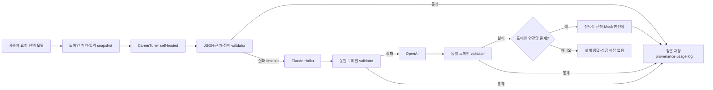

# CareerTuner 자체 AI 모델 종합 기술 보고서

> 기준일: 2026-07-13
> 코드 기준점: `origin/dev` `720a48859210fc0637977e9b75350aa648e376f0`
> 범위: A 프로필, B 공고·OCR, C 커리어 전략, D 면접 텍스트·비언어, E 첨삭, F 커뮤니티·챗봇·검색, 공통 오케스트레이션·검증·서빙
> 문서 성격: 포트폴리오·기술 면접·인수인계용 근거 중심 보고서

## 0. 이 보고서를 읽는 방법

CareerTuner 문서에는 초기 제안, 실험 계획, 학습 완료 기록, 현재 운영 설정이 함께 존재한다. 따라서 이 보고서는 어떤 문장을 발견했다는 이유만으로 그것을 현재 운영 사실로 단정하지 않는다. 각 모델과 기능을 다음 네 상태로 구분한다.

| 상태 | 의미 |
| --- | --- |
| **운영 연결** | 현재 백엔드 provider·모델 태그·배포 설정과 연결되어 사용 가능한 상태 |
| **학습·평가 완료** | adapter, merge, 평가 결과 또는 재현 가능한 완료 기록이 있으나 운영 기본 경로와는 다를 수 있는 상태 |
| **실험·PoC** | 코드·fixture·실험 결과는 있으나 품질 게이트 또는 운영 승격이 끝나지 않은 상태 |
| **계획·후보** | 기획 문서나 스크립트 기본값만 있고 실제 학습·평가 완료를 입증하지 못한 상태 |

또한 여기서 말하는 **자체 AI**를 두 층으로 나눈다.

1. **프로젝트 파인튜닝 모델**: 공개 베이스 모델에 CareerTuner 데이터로 LoRA/QLoRA를 학습한 adapter 또는 그 merge 모델.
2. **자체 호스팅 OSS 모델**: 팀이 직접 파인튜닝하지는 않았지만, 외부 생성 API 대신 팀 장비의 Ollama/Python worker에서 직접 서빙하고 도메인 검증·폴백을 붙인 모델.

두 번째도 제품 아키텍처상 중요한 자체 AI 자산이지만, 면접에서 이를 “직접 학습한 모델”이라고 표현하면 과장이다. PaddleOCR, PP-StructureV3, faster-whisper, BGE-M3, Gemma/Qwen 원본 모델은 **채택·통합·운영한 모델**이고, 별도 학습 근거가 있는 LoRA와 LightGBM만 **직접 학습한 모델**로 설명해야 한다.

프로젝트 규칙상 장문 AI 보고서는 원래 `docs/ai-reports/` 서브모듈이 정본 위치다. 이 파일은 요청된 단일 결과물 경로인 `docs/AI_REPORT/`에 통합본을 두되, raw output·대형 benchmark 결과를 복제하지 않고 기존 artifact와 보고서 경로를 링크한다.

### 목차

1. 경영·면접용 요약
2. 처음부터 사전학습하지 않은 이유
3. LoRA·QLoRA 선택과 공통 parameter
4. RAG-only가 아닌 이유와 실제 적용 범위
5. 전체 모델 inventory
6. A 프로필·이력서
7. B 공고·기업·OCR
8. C 커리어 전략·evidence gate
9. D 면접 text·voice·vision·STT
10. E 원문 보존형 첨삭
11. F 챗봇·검열·embedding·RAG
12. 공통 serving·orchestration·fallback
13. 가설–실험–검증 교차표
14. 실패·한계·과장 금지
15. 재현·승격·rollback
16. 기술 면접 예상 질문
17. source index
18. 최종 결론

---

## 1. 경영·면접용 요약

CareerTuner는 거대한 언어 모델을 처음부터 사전학습한 프로젝트가 아니다. 그렇게 하지 않은 이유는 단순히 “어려워서”가 아니라, **문제·데이터·장비·일정·효용의 크기가 맞지 않기 때문**이다.

- 제품이 해결해야 하는 문제는 일반 언어 능력 전체가 아니라 프로필 구조화, 공고 요건 추출, 적합도 설명, 면접 채점, 원문 보존형 첨삭, 커뮤니티 안전성처럼 범위가 좁은 도메인 task다.
- 범용 LLM 사전학습에는 대규모 말뭉치, 분산 GPU, 장기간의 학습과 데이터 거버넌스가 필요하다. 학생 팀이 확보한 수백~수천 건의 합성·검수 데이터와 단일 RTX 4090/Colab 환경은 사전학습 규모가 아니라 **도메인 적응** 규모다.
- 처음부터 만든 작은 모델은 이미 광범위한 언어·한국어·코딩·JSON 능력을 가진 공개 모델보다 출발점이 훨씬 낮다. 같은 비용이라면 공개 베이스 모델의 지식을 보존하면서 도메인 출력 형식과 판단 습관만 바꾸는 편이 제품 가치가 크다.
- 서비스 안정성 목표는 “자체 모델만 고집”하는 것이 아니라 자체·hosted provider와, 도메인에 존재하는 경우 규칙/Mock 안전망으로 실패를 흡수하는 것이다. E처럼 Mock 없이 정직한 실패로 끝나는 예외도 있다.

따라서 프로젝트가 선택한 핵심 방법은 다음과 같다.

```text
공개 instruction model
  + 도메인 합성·검수 데이터
  + 4-bit QLoRA/LoRA SFT
  + JSON·근거·금지표현 validator
  + 필요 영역의 retrieval/evidence context
  + Ollama/Python 자체 서빙
  + 외부 provider와 규칙 기반 fallback
```

이 설계의 차별점은 “LoRA를 한 번 돌렸다”가 아니다. **파라미터 효율적 학습, 비파라메트릭 근거, 결정론적 규칙, 품질 게이트, 운영 폴백을 각자 잘하는 문제에 배치한 하이브리드 시스템**이라는 데 있다.

---

## 2. 왜 처음부터 자체 LLM을 사전학습하지 않았는가

### 2.1 사전학습과 파인튜닝은 다른 문제다

사전학습은 다음 토큰 예측을 통해 언어·상식·추론의 범용 표현을 만드는 단계다. CareerTuner가 보유한 데이터는 이 단계에 필요한 웹 규모 말뭉치가 아니라, 이미 언어를 이해하는 모델에 “이 입력이면 이 JSON 계약과 도메인 판단 방식을 따르라”고 가르치는 지도 예시다.

프로젝트의 실제 목표는 다음과 같이 좁혀져 있다.

| 모델 영역 | 학습하려는 것 | 처음부터 다시 배울 필요가 없는 것 |
| --- | --- | --- |
| A 프로필 | 기술·경력 근거를 정해진 JSON으로 구조화하는 습관 | 한국어 문법, 일반 직무 상식 |
| C 커리어 | 근거가 있는 gap과 행동 제안을 설명하는 습관 | 범용 문장 생성과 일반 추론 |
| D 면접 | 질문 유형별 생성·답변 채점 rubric·리포트 형식 | 대화 능력과 한국어 생성 |
| E 첨삭 | 원문 사실을 보존하면서 구조·표현을 개선하는 습관 | 일반적인 문장 교정 능력 |

### 2.2 비용만이 아니라 기회비용 문제다

사전학습을 선택하면 팀은 데이터 수집 라이선스, 중복·유해 데이터 정리, tokenizer, 분산 학습 안정화, checkpoint 복구, scaling law, 긴 학습 후의 평가 체계를 모두 새로 떠안는다. 그 기간 동안 실제 제품의 API·DB·UI·검증·배포는 진척되지 않는다. CareerTuner에서는 동일한 시간으로 다음 산출물을 만드는 편이 더 높은 효용을 냈다.

- A~F 도메인별 입력·출력 계약
- 합성 데이터 생성과 validator
- LoRA 학습·merge·Ollama 서빙 재현 경로
- 규칙 점수와 생성 설명을 분리한 뉴로-심볼릭 구조
- 원문·공고·프로필에 없는 사실을 차단하는 evidence gate
- 실제 서비스의 provider, timeout, retry, fallback, usage log

### 2.3 면접에서의 정확한 답변

> “저희가 자체 모델이라고 부르는 것은 범용 LLM을 0부터 사전학습했다는 뜻이 아닙니다. 공개 또는 별도 사용 조건이 있는 base를 영역별로 검토해 채택했고, A/B/C/D/E의 일부 생성 모델에는 CareerTuner 데이터 기반 LoRA/QLoRA를 적용했습니다. F의 Qwen3·Gemma 4·Qwen2.5-VL·BGE-M3는 직접 파인튜닝하지 않고 자체 hosting provider, prompt, tool, RAG와 검증 계층으로 통합했습니다. 직접 만든 핵심은 데이터 계약, adapter가 있는 영역의 학습, 평가·검증, merge·serving과 fallback까지의 전체 pipeline입니다. 상용 가능 여부는 모델별 LICENSE와 실제 serving digest를 따로 확인합니다.”

---

## 3. 왜 전체 파라미터를 전부 튜닝하지 않고 LoRA/QLoRA를 사용했는가

### 3.1 LoRA의 핵심 아이디어

LoRA는 사전학습 가중치 `W`를 직접 갱신하지 않고, 저랭크 행렬의 곱으로 표현한 변화량만 학습한다.

```text
W' = W + ΔW
ΔW = (α / r) · B · A

A ∈ R^(r×k), B ∈ R^(d×r), r << min(d, k)
```

원 모델은 고정되고 `A`, `B`만 optimizer가 갱신한다. 원 논문은 이 방식이 학습 파라미터와 checkpoint 크기를 크게 줄이면서 여러 downstream task에서 full fine-tuning에 근접하거나 앞서는 결과를 보고한다. 참고: [LoRA 원 논문](https://arxiv.org/abs/2106.09685), [공식 구현](https://github.com/microsoft/LoRA).

### 3.2 QLoRA가 추가로 줄인 것

QLoRA는 고정된 베이스 모델을 4-bit로 적재하고, gradient는 LoRA adapter로만 흘린다. 프로젝트 학습 스크립트는 공통적으로 다음 구성을 사용한다.

```text
load_in_4bit = true
quant_type = NF4
double_quant = true
compute_dtype = bfloat16 (A는 GPU 지원에 따라 fp16 fallback)
```

QLoRA 원 논문이 제안한 핵심은 NF4, double quantization, paged optimizer다. CareerTuner의 A/C/D/E 스크립트는 NF4와 double quantization을 사용하고, A는 `paged_adamw_8bit`까지 명시한다. 참고: [QLoRA 논문](https://arxiv.org/abs/2305.14314), [NeurIPS 2023 논문 PDF](https://papers.neurips.cc/paper_files/paper/2023/file/1feb87871436031bdc0f2beaa62a049b-Paper-Conference.pdf).

### 3.3 이 프로젝트에서 full fine-tuning이 불리한 이유

| 판단 축 | Full fine-tuning | CareerTuner의 LoRA/QLoRA |
| --- | --- | --- |
| GPU 메모리 | 모델 가중치·gradient·optimizer state 전체 필요 | 4-bit 고정 베이스 + 소형 adapter |
| 학습 장비 | 다중/고용량 GPU가 유리 | RTX 4090 24GB 또는 Colab T4 범위 |
| 데이터 규모 | 큰 데이터가 없으면 과적합·망각 위험 | 수백~수천 도메인 예시로 출력 습관 적응 |
| 실험 회전 | checkpoint가 크고 느림 | adapter가 작아 재학습·비교가 빠름 |
| 롤백 | 전체 모델 교체 | adapter/tag만 교체 가능 |
| 다중 도메인 | 모델 복사 비용 큼 | C/D/E는 같은 3B, A는 별도 4B base에서 adapter 분리 가능 |

### 3.4 공통 LoRA 구조와 영역별 학습값

실제 A/C/D/E는 같은 adapter 구조를 주로 재사용하지만, E 최종 delivery-s는 단계별 학습률과 긴 sequence를 사용한다. 구조 공통값과 최종 학습값을 구분해야 한다.

| 파라미터 | 실제 값 | 해결하려는 문제와 해석 |
| --- | --- | --- |
| `r` | 16 | 너무 작은 rank의 표현력 부족과 큰 rank의 메모리·과적합 사이의 중간값 |
| `lora_alpha` | 32 | `α/r = 2` 스케일로 adapter 변화량을 충분히 반영 |
| `lora_dropout` | 0.05 | 작은 합성 데이터에 대한 과적합 완화 |
| `bias` | `none` | 추가 학습 파라미터 최소화 |
| target modules | `q/k/v/o_proj`, `gate/up/down_proj` | attention뿐 아니라 MLP 변환까지 도메인 적응 범위 확대 |
| 학습률 | A/C/D `2e-4`; E `1e-4 → 2e-5 → 1.5e-6` | E는 통합 SFT 뒤 특정 실패만 점점 작게 교정 |
| micro batch | 1 | 24GB 이하 VRAM에서 긴 sequence를 수용 |
| gradient accumulation | 8 | micro batch 1의 noisy gradient를 유효 batch 8로 보완 |
| sequence length | A/C/D 2,048; E unified/delivery 3,000 | task 길이와 GPU 안정성의 영역별 타협 |

이 표의 “의도”는 설정값을 보고 재구성한 공학적 해석이다. 모든 값에 대해 독립적인 ablation이 수행됐다는 뜻은 아니다. 실제로 비교 실험이 남은 경우와 단순 공통 기본값을 재사용한 경우를 모델별 장에서 구분한다.

### 3.5 반드시 바로잡아야 하는 Qwen2.5-3B 라이선스

프로젝트의 초기 기획·model card에는 `Qwen/Qwen2.5-3B-Instruct`를 Apache 2.0으로 적은 부분이 있다. 그러나 2026-07-13 현재 공식 Hugging Face metadata는 **`qwen-research`**이고, 공식 LICENSE는 non-commercial을 연구·평가 목적에 한정하며 상업 사용은 별도 라이선스 요청 대상으로 둔다.

- [Qwen2.5-3B-Instruct 공식 모델 카드](https://huggingface.co/Qwen/Qwen2.5-3B-Instruct)
- [Qwen2.5-3B-Instruct 공식 LICENSE](https://huggingface.co/Qwen/Qwen2.5-3B-Instruct/blob/main/LICENSE)

따라서 현재 모델을 포트폴리오·비상업 시연에 쓰는 것과 실제 상용 서비스에 배포하는 것은 같은 판단이 아니다. 상용화 전에는 다음 중 하나가 필요하다.

1. Alibaba Cloud로부터 상업 라이선스를 확보한다.
2. 동일한 task를 Apache 2.0 등 상업 친화 라이선스의 베이스 모델로 재학습하고 회귀 평가한다.
3. 외부 provider 경로만 상용 환경에 남기고 해당 3B 파생 가중치의 배포를 중지한다.

비교 후보였던 Qwen2.5-7B-Instruct와 A의 Qwen3-4B-Instruct-2507은 각각의 공식 metadata가 별도이므로, “Qwen 계열은 모두 같은 라이선스”라고 일반화해서도 안 된다. **모델명·크기별 LICENSE를 따로 확인하는 것**이 배포 게이트다.

---

## 4. 왜 RAG만 사용하지 않았는가 — 그리고 실제로 어디까지 결합했는가

### 4.1 LoRA와 RAG는 대체재가 아니다

LoRA는 **행동과 형식**을 파라미터에 학습한다. 예를 들면 원문 보존, JSON key, APPLY/HOLD 판단 방식, 면접 채점 rubric이다. RAG는 **요청 시점의 외부 사실과 근거**를 context로 공급한다. 예를 들면 현재 공고의 필수 요건, 사용자의 확정 skill, FAQ·공지, 커뮤니티 면접 후기다.

| 질문 | LoRA가 잘하는 것 | RAG가 잘하는 것 |
| --- | --- | --- |
| 어떤 형식으로 답할까? | JSON 구조, task별 출력 습관 | 직접 해결하지 못함 |
| 어떤 판단 기준을 따를까? | 도메인 rubric·금지 습관 | 검색 문서에 기준이 있으면 보조 가능 |
| 최신·사용자별 사실은 무엇인가? | 학습 시점 이후 갱신이 어렵고 개인정보를 가중치에 넣으면 안 됨 | 요청마다 공고·프로필·FAQ를 주입 가능 |
| 근거를 추적할 수 있는가? | 가중치 내부 지식은 provenance가 약함 | chunk/source ID를 보존 가능 |

RAG 원 논문은 parametric memory와 non-parametric memory의 결합을 제안한다. CareerTuner도 이 역할 분리를 채택했다. 참고: [RAG 원 논문](https://arxiv.org/abs/2005.11401).

### 4.2 그러나 “LoRA+RAG를 썼다”는 말도 영역별로 달라야 한다

- **C 커리어 전략**: LoRA-only와 여러 RAG 변형을 비교하는 PoC·hardcase benchmark를 수행했다. 하지만 현재 정본 상태는 단순 RAG가 unsupported claim을 안정적으로 줄인다는 근거가 부족해 `KEEP_RAG_DISABLED`다. 즉 “RAG를 무조건 켰다”가 아니라, **RAG를 실험하고 evidence gate가 없는 검색 증강의 위험을 발견해 fail-closed한 것**이 정확한 설명이다.
- **F 챗봇·검색**: BGE-M3 임베딩과 FAQ·커뮤니티 검색, 미응답 질문 군집화 경로가 있다. 공지는 fast-path URL routing이며 BGE 검색 대상이 아니다. 이는 학습 adapter가 아니라 검색·도구 호출·근거 링크를 결합한 provider 경로다.
- **B 공고·기업 분석**: 공고 원문과 선택적 웹 검색 snippet을 2-source evidence로 사용한다. 일반적인 벡터 RAG라기보다 source-scoped grounding pipeline에 가깝다.
- **D 면접**: 답변 평가에 OpenAI embedding과 Qdrant top-4 RAG를 사용한다. 질문 생성에는 retrieval이 없으며, 자체 LoRA evaluator와의 결합은 `provider=oss`일 때만 성립한다.
- **A/E**: vector RAG가 없고 구조화 request context와 validator가 핵심이다. 모든 영역에 vector database를 넣는 것은 불필요한 복잡성이다.

### 4.3 면접에서의 정확한 답변

> “RAG를 배제하지 않았습니다. LoRA에는 출력 계약과 도메인 판단 습관을, RAG에는 최신 공고·프로필·FAQ 같은 비파라메트릭 근거를 맡겼습니다. 다만 C 영역에서는 RAG를 붙였다는 사실보다 실제 hardcase에서 unsupported claim이 줄었는지를 봤고, 개선이 안정적이지 않아 현재는 단순 RAG를 비활성화했습니다. 검색 결과를 무조건 모델에 넣는 대신 scope filter와 evidence gate를 통과한 근거만 주입하는 방향입니다.”

---

## 5. 전체 모델 인벤토리와 현재 상태

> 아래 표는 모델별 독립 조사 결과를 반영한 최종 요약이다. “직접 학습”과 “자체 호스팅 통합”을 섞지 않는다.

| 영역 | 모델/엔진 | 구분 | 현재 상태 | 핵심 역할 |
| --- | --- | --- | --- | --- |
| A | Qwen3-4B-Instruct-2507 + Profile LoRA v4 | 프로젝트 QLoRA | 학습·비교 완료, 산출물 로컬 제외, 기본 runtime OFF | 프로필 평가·역량 구조화 |
| A | qwen3:8b resume structurer | 자체 호스팅 OSS | 운영 경로 | 이력서 원문 구조화 |
| B | `careertuner-b-jobposting-r1` | Qwen3-4B LoRA | backend 기본 local, 학습 log·checkpoint 일부 유실 | 공고 분석 JSON |
| B | `careertuner-b-jobposting-r2` | Qwen3-4B LoRA | 학습·Ollama 등록, 최종 canonical gate 미완료 | 공고+기업·웹 근거 후보 |
| B | PP-StructureV3 / PaddleOCR | 자체 호스팅 OSS | 운영 worker | PDF·이미지 OCR·레이아웃 복원 |
| C | Qwen2.5-3B-Instruct + Career Strategy LoRA | 프로젝트 QLoRA | 학습·평가·연결 완료, source 기본 provider는 OpenAI | 적합도 설명·지원 전략 |
| C | scoped/evidence-gated RAG variants | retrieval PoC | 현재 단순 RAG 비활성 | 공고·프로필 근거 증강 |
| D | Qwen2.5-3B-Instruct + Interview LoRA | 프로젝트 QLoRA | F16 60-case 평가, AUTO 생성 비활성·eval 기본 OpenAI | 질문·모범답안·채점 |
| D | voice LightGBM | 프로젝트 학습 모델 | 2,000 clips·MAE 12.4 기록, joblib 미추적 | 음성 전달 인상 |
| D | visual LightGBM | 프로젝트 학습 모델 | 2,000 clips·MAE 12.5 기록, joblib 미추적 | 표정·시선·자세 인상 |
| D | faster-whisper | 자체 호스팅 OSS | 로컬 STT 경로 | 음성 답변 전사 |
| E | Qwen2.5-3B + delivery-s Correction LoRA | 프로젝트 QLoRA | F16 model+repair gate 통과, versioned code default | 네 유형 원문 보존 첨삭 |
| E | Qwen3-8B Correction LoRA | 비교 실험 | 초기 39/40·20/20, 현재 레거시·운영 제외 | 3B 비교 |
| F | qwen3:8b | 자체 호스팅 OSS | 챗봇·인테이크 경로 | 대화·도구 호출·슬롯 수집 |
| F | `gemma4` | 자체 호스팅 OSS | 코드 설정 확인, live digest·서빙 미검증 | 텍스트 검열·태깅·후기 추출 |
| F | qwen2.5vl:7b | 자체 호스팅 OSS | vision 코드 경로, 품질 benchmark 부재 | 이미지 광고·유해·PII 검토 |
| F | BGE-M3 | 자체 호스팅 embedding | 검색·군집 경로 | FAQ·커뮤니티 retrieval·미응답 군집 |

---

## 6. A — 프로필·이력서 자체 AI

### 6.1 모델 경계와 현재 상태

A에는 하나가 아니라 성격이 다른 네 층이 있다. 이 구분을 하지 않으면 범용 Ollama 모델을 전용 파인튜닝 모델로 잘못 소개하게 된다.

| 경로 | 모델·엔진 | 역할 | 직접 학습 | 현재 상태 |
| --- | --- | --- | --- | --- |
| 프로필 평가 | `Qwen/Qwen3-4B-Instruct-2507` + `qwen3-profile-lora-v1~v4` | 프로필 요약·역량 추출·6개 기준 원점수·추천 | QLoRA SFT | v4 학습 확인, 런타임 기본 OFF |
| 이력서 구조화 | Ollama `qwen3:8b` | 이력서 원문에서 학력·경력·프로젝트 JSON 추출 | 없음 | 자체 호스팅 운영 경로 |
| 정책·안전망 | `profile-rule-v2`, 직무군 분류, 품질 가드 | 최종 점수·보정·degraded 응답 | 해당 없음 | 결정론 코드 |
| 호스티드 폴백 | Claude → OpenAI | 자체 모델 실패 시 서비스 지속 | 해당 없음 | 키가 있을 때 사용 |

`qwen3-profile-lora-v4`는 계획 문서에만 있는 이름이 아니다. 이 작업 환경의 로컬 산출물에서 3,000개 데이터, 2,400/300/300 분할, 3 epoch trainer log, adapter와 v3/v4 비교 결과를 확인했다. 다만 `docs/ai-training/output/`과 v2~v4 JSONL은 로컬 `.git/info/exclude` 대상이다. 따라서 **학습 완료는 확인되지만 새 clone에서 저장소만으로 v4를 재현할 수는 없다.**

프로필 모델의 입력은 희망 직무·산업, 학력, 경력, 프로젝트, 스킬, 자격증, 언어, 포트폴리오 근거, 이력서 원문, 자기소개와 서버가 먼저 판정한 직무군이다. 출력 계약은 다음 여섯 영역을 포함한다.

- `summary`, `extractedSkills`, `strengths`, `gaps`, `recommendations`
- `criterionScores`
  - `GOAL_CLARITY`
  - `EXPERIENCE_SPECIFICITY`
  - `ACHIEVEMENT_EVIDENCE`
  - `JOB_SKILL_ALIGNMENT`
  - `DOCUMENT_CONSISTENCY`
  - `IMPROVEMENT_READINESS`

학습 계약은 `docs/ai-training/generate_profile_ai_seed_samples.py:14-19,63-94`, 운영 validator는 `backend/src/main/java/com/careertuner/profile/ai/ProfileAiJsonValidator.java:22-69`에서 확인할 수 있다.

### 6.2 베이스 모델 사양과 선택의 의미

프로필 adapter의 base는 `Qwen/Qwen3-4B-Instruct-2507`이다(`docs/ai-training/train_qwen3_profile_qlora.py:34-36`).

| 항목 | 공식 사양 |
| --- | ---: |
| 유형 | Dense decoder-only causal LM |
| 총 파라미터 | 4.0B |
| 임베딩 제외 | 3.6B |
| layer | 36 |
| attention | GQA, Q 32 / KV 8 |
| hidden / FFN | 2,560 / 9,728 |
| head dimension | 128 |
| vocabulary | 151,936 |
| native context | 262,144 tokens |
| 기본 dtype | BF16 |
| 추론 모드 | non-thinking 전용 |
| 라이선스 | Apache 2.0 |

공식 근거는 [Qwen3-4B-Instruct-2507 모델 카드](https://huggingface.co/Qwen/Qwen3-4B-Instruct-2507), [config.json](https://huggingface.co/Qwen/Qwen3-4B-Instruct-2507/blob/main/config.json), [Qwen3 기술 보고서](https://arxiv.org/abs/2505.09388)다.

4B는 단일 RTX 4090에서 QLoRA 반복 학습이 가능한 크기이고 non-thinking instruct 모델이라 구조화 API 앞뒤에 불필요한 추론 텍스트가 섞일 위험이 낮다. 다만 저장소에는 1B/4B/8B를 동일 조건으로 비교한 선정 benchmark가 없다. 따라서 “모든 후보 중 실험으로 최적을 증명했다”가 아니라 “장비·지연·구조화 task에 맞춘 현실적 선택”이라고 설명해야 한다.

### 6.3 실제로 바꾼 파라미터

학습 로그에 기록된 수치는 다음과 같다.

- 전체 파라미터: `4,055,498,240`
- trainable: `33,030,144`
- trainable 비율: `0.8145%`
- 최종 adapter: `132,187,888 bytes`, 약 126 MiB

4B 전체를 BF16 full fine-tuning하면 가중치만 약 8GB이고, gradient·Adam state·activation까지 더해 단일 24GB GPU 예산을 넘기기 쉽다. A는 전체의 1% 미만만 학습해 이 문제를 피했다.

| 설정 | 값 | 의미 | 검증 수준 |
| --- | ---: | --- | --- |
| `r` | 16 | 저랭크 update 차원 | rank sweep 없음 |
| `lora_alpha` | 32 | `alpha/r=2` scaling | alpha sweep 없음 |
| `lora_dropout` | 0.05 | 소규모 합성 데이터 과적합 완화 | 단독 ablation 없음 |
| `bias` | none | 학습 parameter 최소화 | 설정 사실 |
| attention targets | q/k/v/o | 주목·전달·통합 방식 적응 | attention-only 비교 없음 |
| MLP targets | gate/up/down | 직무 특징·문장·JSON 표현 적응 | MLP 제외 비교 없음 |
| quantization | NF4 4-bit | base VRAM 절감 | 학습 완주 |
| double quantization | true | quantization metadata 절감 | 단독 비교 없음 |
| optimizer | `paged_adamw_8bit` | optimizer memory spike 완화 | 코드 명시 |

실제 위치는 `docs/ai-training/train_qwen3_profile_qlora.py:175-210`이다. 가장 중요한 정직성 원칙은 이 값을 “탐색으로 찾은 최적값”이라고 부르지 않는 것이다.

### 6.4 v4 전체 학습 설정

| 항목 | 값 |
| --- | --- |
| 데이터 | `profile_ai_training_samples_v4_3000.jsonl` |
| 전체 / train / eval / test | 3,000 / 2,400 / 300 / 300 |
| split | 80/10/10, seed 42 |
| epoch | 3 |
| max sequence | 2,048 |
| physical batch / eval batch | 1 / 1 |
| gradient accumulation | 8, 유효 batch 8 |
| optimizer steps | epoch당 300, 총 900 |
| learning rate | `2e-4` |
| scheduler / warmup | cosine / 0.03 |
| Adam beta / epsilon | 0.9·0.999 / `1e-8` |
| weight decay / max grad norm | 0 / 1.0 |
| precision | BF16, 미지원 GPU는 FP16 |
| gradient checkpointing | true |
| eval / save | epoch마다 |
| best model 자동 복구 | false |

CLI·split·training arguments·LoRA·metadata는 `train_qwen3_profile_qlora.py:39-52,91-145,194-254`에 있다.

#### 손실값 해석의 함정

각 예시의 system+user+assistant를 하나의 text로 만들고 `DataCollatorForLanguageModeling(mlm=false)`을 쓴다(`train_qwen3_profile_qlora.py:161-167,213-233`). Assistant token만 남기도록 system/user label을 `-100`으로 masking하지 않는다. 따라서 모델은 반복되는 system prompt와 user JSON까지 예측하고, 낮은 eval loss에는 template 예측 용이성이 포함될 수 있다. **eval loss 0.038을 정확도 96.2%로 환산하면 안 된다.**

### 6.5 데이터 버전과 무엇을 개선했는가

각 버전은 이전 데이터를 포함하는 누적 계보다.

| 버전 | 샘플 | 분할 | 핵심 변화 |
| --- | ---: | --- | --- |
| v1 | 500 | 400/50/50 | 초기 8개 직무군, 공학·기술 0 |
| v2 | 800 | 640/80/80 | 낮은 점수·불완전 사례 300개 추가 |
| v3 | 1,100 | 880/110/110 | 공학·기술 150개 등 300개 추가 |
| v4 | 3,000 | 2,400/300/300 | hard/calibration 1,900개 추가 |

v4 추가분은 좋은 프로필 505, 성과 수치 없음 480, 직무 불일치 350, 도메인 용어 285, sparse 280건이다. 목적은 무작정 loss를 낮추는 것이 아니라 다음 실패를 교정하는 것이었다.

- 빈약한 입력인데 유창함 때문에 고득점하는 문제
- 실제 경험과 희망 직무가 다른데 정렬 점수가 높은 문제
- 정량 성과가 없는데 성과 근거 점수를 높게 주는 문제
- 공학·의료·교육·물류 용어가 약한 문제
- 충분한 프로필까지 과도하게 감점하는 문제

최종 직무군 분포는 개발·데이터 322, 영업·마케팅 335, 디자인·콘텐츠 331, 경영·사무 332, 의료·서비스 335, 교육·공공 335, 생산·물류 335, 공학·기술 375, 일반 300이다.

`docs/ai-training/validate_profile_ai_dataset.py:10-251`은 JSONL, message·assistant schema, 정확한 6개 criterion, 점수 범위, evidence·improvement, profile signature 중복, 직무군 분포, 점수 극단, 추천 구체성과 PII 의심 패턴을 검사한다. 로컬 v4 재검증은 3,000개 구조 통과, signature 중복 0, 9개 직무군, warning 0이었다. 그러나 PII는 warning이고 의미상 template 중복을 검출하지 않으며, 문서로 확인되는 수동 검수는 초기 seed 30개뿐이다(`profile_ai_dataset_manual_review.md:3-14,238-273`).

### 6.6 학습 수치

| 버전 | train loss | eval epoch 1 | epoch 2 | epoch 3 | 학습 시간 |
| --- | ---: | ---: | ---: | ---: | ---: |
| v1 | 0.2315 | 0.11618 | 0.06500 | 0.05897 | 1,316초 |
| v2 | 0.1854 | 0.09207 | 0.05874 | 0.05598 | 2,112초 |
| v3 | 0.1613 | 0.09294 | 0.06587 | 0.06417 | 2,786초 |
| v4 | 0.09251 | 0.05193 | 0.03921 | 0.03825 | 8,484초 |

v4 마지막 step loss는 0.02055다. 각 버전 안에서는 eval loss가 감소했지만 v3 final은 v2보다 높다. validation 분포가 달라졌으므로 버전 간 loss를 곧바로 품질 순위로 해석할 수 없다.

### 6.7 실제로 확인된 두 개선 실험

#### JSON truncation 교정

v3 초기 32-case를 `max_new_tokens=900`, temperature 0.2 sampling으로 평가했을 때 parse 30/32, schema 29/32, JSON-only 30/32였다. 공학 2건은 tail truncation, mismatch 1건은 criterion을 3개만 출력했다. 이를 1,400 tokens·deterministic generation으로 바꾸자 실패 3건 모두 parse/schema/JSON-only를 통과했다.

이것은 A에서 분명한 generation parameter 개선 근거다. 반대로 추적된 `serve_profile_ai_model.py:32-35` 기본값은 아직 900·0.2이므로 환경변수가 없으면 검증 전 조건으로 돌아간다.

#### v3와 v4의 동일 25-case 비교

| 지표 | v3 | v4 |
| --- | ---: | ---: |
| parse/schema/range/json-only | 25/25 | 25/25 |
| domain hit | 24/25 | 24/25 |
| 전체 평균 score | 69.98 | 68.35 |
| sparse 평균 | 63.34 | 52.66 |
| mismatch JSA | 47.00 | 44.67 |
| no-metric AE | 48.67 | 47.00 |
| engineering 평균 | 75.56 | 77.22 |
| good-profile 평균 | 79.84 | 80.33 |

v4는 schema 안정성을 유지하면서 sparse·불일치·성과수치 없음은 더 보수적으로, 공학·좋은 프로필은 유지 또는 소폭 높게 평가했다. 사람 gold label이 없으므로 “정확도 향상”보다 **의도한 calibration 방향 개선**이라고 표현하는 것이 맞다.

### 6.8 최종 점수와 생성 모델의 책임 분리

모델은 6개 raw score와 설명을 만들지만 총점을 독점하지 않는다.

1. `JobFamily.java:9-30,54-86`이 희망 직무·산업·스킬·경력·프로젝트를 키워드로 직무군에 분류한다.
2. `JobFamilyWeightPolicy.java:13-24`가 직무군별 criterion weight를 정한다.
3. `ProfileScoreCalculator.java:12-39`가 `rawScore × weight / 100`을 합산·반올림·clamp한다.
4. `ProfileQualityGuard.java:19-140`이 핵심 section 부족, 무의미 직무, 반복·테스트 문구, 경험 설명 부족, 정량 근거 없음, 직무 불일치를 감지해 점수와 메시지를 보정한다.

이 구조 덕분에 생성 모델이 빈 프로필에 그럴듯한 고득점을 내도 서버 정책이 제어한다. 모델은 자연어·근거 정리를, 코드가 재현 가능한 정책 계산을 맡는다.

### 6.9 추론·폴백·데이터 연결

전용 `serve_profile_ai_model.py:71-144`는 base를 NF4 4-bit로 적재하고 adapter를 결합한 뒤 `/health`, `/analyze-profile`을 제공하며 응답에서 JSON 객체를 추출한다. Spring Boot는 다음 조건에서만 이 경로를 사용한다.

- 사용자가 `AUTO` 또는 `CAREERTUNER` 선택
- `PROFILE_AI_FINETUNED_ENABLED=true`
- base URL 설정

실패하면 Claude → OpenAI → 규칙 엔진으로 진행한다(`FineTunedProfileAiService.java:53-90`, `FallbackProfileAiService.java:44-71`). 현재 `application.yaml:122-129` 기본은 enabled false, 빈 URL, model label `qwen3-profile-lora-v4`, timeout 240초다. 조사 시 로컬 8000 포트는 응답하지 않았다. **학습 완료와 현재 실행 중은 다른 상태**다.

프로필 분석 전 동의를 확인하고 실제 입력을 version snapshot으로 고정한다(`ProfileServiceImpl.java:312-327`). 성공 결과는 `profile_ai_analysis`에 저장되어 C 적합도 설명도 같은 시점의 분석을 읽을 수 있다(`backend/src/main/resources/db/patches/20260711_profile_ai_analysis.sql:1-23`). `ai_usage_log`도 남지만 자체 모델 token 수는 tokenizer 실측이 아니라 문자열 길이/4 추정이다(`FineTunedProfileAiService.java:133-148`).

#### 이력서 구조화 `qwen3:8b`

이 경로는 A 전용 LoRA가 아니다. 원문 최대 12,000자, temperature 0, `num_ctx=8192`, `num_predict=2048`, `think=false`, JSON Schema로 education/career/projects를 추출하고 skill·URL은 결정론 코드가 처리한다(`ProfileResumeStructurer.java:33-43,53-149,191-240,305-365`). Ollama endpoint 재시도 후 Claude → OpenAI → skill·URL-only degraded draft로 이어진다.

공식 [Qwen3-8B 모델 카드](https://huggingface.co/Qwen/Qwen3-8B) 기준 8.2B, 36 layer, Q/KV head 32/8, native 32,768 context다. 이 프로젝트가 이 가중치를 추가 학습했다는 근거는 없다.

### 6.10 RAG 여부

A 프로필에는 embedding, vector DB, retriever, top-k, retrieved provenance가 없다. 최신 사용자 프로필·포트폴리오를 직접 DB에서 읽어 prompt에 넣는 것은 direct context injection이지 RAG가 아니다. 외부 지식보다 방금 사용자가 입력한 사적 데이터를 rubric으로 평가하는 task라 retriever의 효용도 낮다.

### 6.11 재현 절차

```powershell
python docs/ai-training/validate_profile_ai_dataset.py `
  docs/ai-training/profile_ai_training_samples_v4_3000.jsonl

python docs/ai-training/train_qwen3_profile_qlora.py `
  --model-name Qwen/Qwen3-4B-Instruct-2507 `
  --dataset docs/ai-training/profile_ai_training_samples_v4_3000.jsonl `
  --output-dir docs/ai-training/output/qwen3-profile-lora-v4 `
  --epochs 3 --max-seq-length 2048 --batch-size 1 `
  --gradient-accumulation-steps 8 --learning-rate 0.0002 `
  --eval-ratio 0.1 --test-ratio 0.1 --seed 42

$env:PROFILE_AI_BASE_MODEL = "Qwen/Qwen3-4B-Instruct-2507"
$env:PROFILE_AI_ADAPTER_DIR = "docs/ai-training/output/qwen3-profile-lora-v4"
$env:PROFILE_AI_MAX_NEW_TOKENS = "1400"
$env:PROFILE_AI_TEMPERATURE = "0"
$env:PORT = "8000"
python docs/ai-training/serve_profile_ai_model.py
```

이 명령은 v4 data와 adapter가 정본화됐다는 전제다. 현재 repo만으로는 첫 입력 파일부터 존재하지 않는다.

### 6.12 A 영역에서 과장하면 안 되는 것

- Qwen3-4B가 비교 실험으로 절대 최적이었다.
- r=16·alpha=32가 sweep으로 찾은 최적값이다.
- eval loss 0.038이 실제 정확도 96.2%다.
- v4가 실제 사용자 성공률을 높였다고 입증했다.
- 3,000개를 전부 사람이 검수했다.
- A는 LoRA+RAG다.
- v4가 항상 운영 활성이다.
- 저장소 clone만으로 학습을 완전히 재현할 수 있다.
- held-out 300개 전체에 대한 사람 gold 평가가 끝났다.
- `qwen3:8b`도 A 전용 파인튜닝 모델이다.
- backend의 v4 label과 FastAPI가 적재한 adapter identity가 항상 일치한다. 현재 backend는 서버의 `adapterDir`를 강제 검증하지 않는다.

---

## 7. B — 공고 분석·기업 분석·OCR 자체 AI

### 7.1 무엇을 직접 학습했고 무엇을 통합했는가

| 구성 | 성격 | 직접 파인튜닝 | 현재 상태 |
| --- | --- | --- | --- |
| `careertuner-b-jobposting-r1` | Qwen3-4B 공고 구조화 LoRA | 있음. checkpoint·trainer log는 유실 | backend 기본 local model |
| `careertuner-b-jobposting-r2` | 공고 + 기업·웹 근거 후속 LoRA | 있음. adapter·merged·GGUF·trainer state 확인 | Ollama 등록, 기본값은 아직 R1 |
| `self-rules-v1` | 정규식·키워드 결정론 생성기 | 해당 없음 | 모든 provider 실패 시 안전망 |
| `BJobSentenceClassifier` | 공고 문장 규칙 분류기 | 해당 없음 | 입력 hint와 self-rules에 사용 |
| PP-StructureV3 | layout/table/OCR 사전학습 pipeline | 없음 | 스캔 문서 OCR 1순위 |
| PaddleOCR | line OCR 사전학습 pipeline | 없음 | PP-Structure 실패 시 폴백 |

정확한 소개는 “Qwen3-4B 기반 R1/R2를 LoRA SFT했고, PaddleOCR·PP-StructureV3는 파인튜닝하지 않은 공개 모델을 자체 worker에서 운영했다”다.

### 7.2 Qwen3-4B 원형과 실제 적재본

공식 [Qwen3-4B 모델 카드](https://huggingface.co/Qwen/Qwen3-4B) 기준 총 4.0B, 비임베딩 3.6B, 36 layer, GQA Q 32/KV 8, native 32,768·YaRN 131,072 context, Apache 2.0이다. R2 merged config에서 hidden 2,560, FFN 9,728, head dimension 128, vocabulary 151,936, BF16을 확인했다.

현재 Ollama API 실측에서 R1/R2는 모두 qwen3 family, 4,022,468,096 parameters, Q4_K_M, 약 2.497GB다. capability에 thinking·tools가 포함되지만 실제 B 요청에서는 thinking을 끈다.

### 7.3 B LoRA와 QLoRA의 정확한 설정

학습 package는 `unsloth/Qwen3-4B`를 4-bit로 불러온다. 즉 4-bit base+LoRA인 QLoRA 계열이다. 그러나 `train_qwen3_4b_lora.py`는 NF4를 직접 명시하지 않으므로 “B도 NF4를 코드로 지정했다”고 쓰면 안 된다.

| 항목 | 값 |
| --- | ---: |
| base | `unsloth/Qwen3-4B`, adapter base는 bnb-4bit variant |
| rank | 16 |
| alpha | 16, scaling 1 |
| dropout | 0 |
| bias | none |
| target | q/k/v/o + gate/up/down projection |
| gradient checkpointing | `unsloth` |
| seed | 42 |
| trainable parameters | 33,030,144 |
| base 대비 | 0.8211% |
| adapter tensor | 504 F32 tensors |
| adapter file | 132,187,888 bytes |

근거는 인접 학습 package의 `scripts/train_qwen3_4b_lora.py:25-62`, `scripts/outputs/checkpoint-250/adapter_config.json:5-51`이다. 이 package는 현재 main repo 밖 `<workspace>/projects/ct-b-train-package/`에 있고 자체 Git history가 없어 provenance가 약하다.

4.02B BF16 weight만 약 8GB다. Full FT에 gradient, Adam moments, master weight, activation을 더하면 24GB에서 긴 8K sequence를 다루기 어렵다. 실제 R2 4-bit LoRA도 약 5,060-token sample 때문에 batch 2에서 CUDA OOM이 나 batch 1+accumulation 8로 바꿨다(`scripts/README_R2_TRAINING.md:25-38`). 이것은 B에서 full FT 대신 QLoRA를 택한 추상적 이유가 아니라 실제 장비 실패와 연결된 근거다.

### 7.4 R1 공고 구조화 모델

#### 데이터

| 항목 | 기록 |
| --- | ---: |
| final train / validation | 109 / 12 |
| final total | 121 |
| source real / synthetic | 41 / 100, dedup 전 |
| dedup removed | 20 |
| teacher | Claude Sonnet 4.6 + GPT-5.4 cross-validation 기록 |
| grounding threshold | 80, 계산식 미보존 |
| truncated samples | 3 |
| 공고 상한 | 4,000 chars |
| 생성 시각 | 2026-06-24 12:16 |

근거: `ct-b-train-package/data/r1_final_meta.json:1-17`, `scripts/README_R1_TRAINING.md:3-37`.

`41+100=141`에서 20건을 제거해 121건이 됐다. 최종 JSONL에는 source label이 없어 dedup 후 실제/합성 수를 다시 계산할 수 없다. teacher 합의식·탈락 기준·생성 prompt가 보존되지 않았고 비용 `1.254`의 화폐 단위도 적히지 않았다.

R1 assistant output은 정확히 8개 field다.

1. `employmentType`
2. `experienceLevel`
3. `requiredSkills`
4. `preferredSkills`
5. `duties`
6. `qualifications`
7. `difficulty`
8. `summary`

현재 runtime은 `evidence`, `ambiguousConditions`까지 10개를 요구하고 parser도 누락 시 실패한다(`BAnalysisGenerationService.java:658-683,1405-1419,1783-1802`). R1은 10-field 계약을 학습한 것이 아니라 Ollama structured output과 base 능력으로 새 field를 생성한다.

#### 학습 설정

| 파라미터 | R1 |
| --- | ---: |
| max sequence | 8,192 |
| epochs | 5 |
| micro batch | 2 |
| grad accumulation | 4 |
| effective batch | 8 |
| learning rate | `1e-4` |
| warmup ratio | 0.05 |
| scheduler | cosine |
| optimizer | `adamw_8bit` |
| weight decay | 0.01 |
| eval | epoch |
| seed | 42 |
| GGUF | Q4_K_M |

스크립트 근거는 `train_qwen3_4b_lora.py:25-37,74-124`다. 4090에서 30분 예상치는 있으나 실제 R1 timing·loss log, adapter directory, checkpoint, trainer state, base/R1 정식 A/B artifact가 없다. 즉 운영 tag가 파인튜닝 모델이라는 정황은 강하지만 동일 checkpoint 재현 package는 아니다.

### 7.5 R2 기업·웹 근거 확장

R1은 공고 8-field만 배웠기 때문에 기업 분석에 그대로 쓰면 공고 밖 사실과 WEB provenance를 안정적으로 분리하지 못했다. R2는 R1 job sample을 유지하고 company/web evidence task를 추가했다.

| split | R1 job | company | 합계 |
| --- | ---: | ---: | ---: |
| train | 109 | 288 | 397 |
| validation | 12 | 31 | 43 |
| 합계 | 121 | 319 | 440 |

split seed는 13이다(`data/r2_final_meta.json:1-14`). Company 319개 중 239개에 웹 block이 있고 80개는 posting-only다. WEB verified fact 정답을 포함한 것은 79개이며, 나머지는 웹 block이 있어도 채택하면 안 되는 negative 계열을 포함한다. R2 v1이 동명·무관 회사 fact를 생성해 negative example을 강화했다(`README_R2_TRAINING.md:74-77`).

학습 명령은 batch를 1, accumulation을 8로 바꿔 effective batch 8을 보존한다.

```bash
python train_qwen3_4b_lora.py \
  --prefix r2_final \
  --out-dir careertuner-b-jobposting-r2 \
  --epochs 5 --batch 1 --grad-accum 8
```

#### 실제 R2 학습 로그

| 항목 | 값 |
| --- | ---: |
| global step | 250 |
| epoch | 5.0 |
| train batch | 1 |
| total FLOPs | `1.567142e17` |
| epoch 1 eval loss | 0.567335 |
| epoch 2 | 0.306269 |
| epoch 3 | 0.233489 |
| epoch 4 | 0.215765 |
| step 250 train loss | 0.189734 |

`checkpoint-250/trainer_state.json`에는 epoch 5 eval record가 없으므로 0.215765는 마지막 기록이지 확정 final eval loss가 아니다.

#### R2 평가와 승격 보류 이유

Held-out evaluator는 positive web 4, negative web 2, posting-only 2의 8 case를 검사한다. JSON parse, 입력에 evidence·URL 포함, positive의 WEB fact≥1, negative/posting-only의 WEB fact=0을 본다(`scripts/eval_r2.py:2-159`).

기록된 R2 v1은 positive 4/4를 통과했지만 negative 2/2에서 무관 회사 WEB fact를 만들었다. 이후 negative 강화 학습을 했지만 **최종 v2/v3의 canonical 8-case 결과 artifact가 없다.** README도 raw output보다 backend `BCompanyAnalysisCanonicalizer`를 거친 결과를 정본으로 보라고 한다. 따라서 R2를 “R1보다 검증 완료된 운영 모델”이라고 승격할 근거가 부족하다.

또한 현재 company prompt는 `unknowns` 최대 5개를 요구하지만 R2 319개 중 160개가 6개를 출력한다(`CompanyAnalysisPromptCatalog.java:20-27,162-166`). 데이터 절반이 현재 상한과 어긋난다.

모델 registry는 R2 active라고 적었지만 런타임이 읽지 않는 inventory이고 base를 `qwen2.5-family`라고 잘못 기록했다. 실제 adapter는 Qwen3-4B이며 backend 기본은 R1이다(`application.yaml:232-239`, `BAnalysisProperties.java:50-62`).

### 7.6 운영 생성 파라미터와 context budgeting

| 항목 | 값 |
| --- | ---: |
| endpoint | `/api/chat` |
| stream / think | false / false |
| temperature | 0 |
| `num_ctx` | 8,192 |
| `num_predict` | 2,048 |
| format | JSON Schema |
| connect timeout | 5s |
| configured read timeout | 480s |
| per-attempt budget | 180s |
| max retries | 1, 최대 local 2회 |

근거: `BLocalLlmClient.java:36-87`, `BAnalysisProperties.java:50-75`. Temperature 0은 창작이 아니라 schema·enum 재현성을, `think=false`는 reasoning text가 JSON을 오염시키지 않음을 목표로 한다. 학습 chat template도 thinking을 끈다.

입력 budget은 대략 다음 휴리스틱이다.

```text
contentTokens = 8192 - 2048 - 1000 = 5144
charBudget ≈ 5144 × 1.4 ≈ 7201 chars
```

분류 hint 최대 2,000 chars를 먼저 배정하고 나머지를 공고 원문에 쓴다(`BAnalysisGenerationService.java:66-77,1390-1403`). `1.4 chars/token`은 tokenizer 실측이 아니므로 한글·기호 분포에 따라 잘릴 수 있다.

### 7.7 LoRA 단독이 아닌 하이브리드 공고 pipeline

`BJobSentenceClassifier.java:15-120`은 RESPONSIBILITY, REQUIRED, PREFERRED, QUALIFICATION, TECH_STACK, EMPLOYMENT_CONDITION, BENEFIT, APPLICATION_INFO, COMPANY_INFO, OTHER로 문장을 규칙 분류한다.

LLM 출력 후 `BAnalysisGenerationService`는 다음을 검사·보정한다.

- requiredSkills 비어 있지 않음
- summary 20자 이상
- duties·qualifications 존재
- 전체 skill의 grounded 비율 0.6 이상
- 2024년을 경력으로 오인하지 않음
- 설립 10년차·경력 무관 제외, 최대 경력 30년
- 업무 문장을 skill에서 제거
- OCR 깨진 자모·역할명·연차 token 제거
- 묶음 skill 분리
- duty/qualification 오배치 이동
- evidence 중복 제거

핵심 근거: `BAnalysisGenerationService.java:50-118,1069-1277,1734-1760`. Skill grounding은 1~2 token이면 하나 hit, 3개 이상이면 50% hit라 의미 동일성 검사는 아니다. 예를 들어 Spring이 있다고 Spring Security를 부분 통과시킬 수 있다.

```text
규칙 문장 분류
→ R1/R2 LoRA
→ Ollama JSON Schema
→ parser validation
→ lexical grounding
→ 후처리
→ canonical persistence
```

따라서 B 성능은 adapter 단독 점수가 아니라 pipeline 전체 결과다.

### 7.8 공고·기업 provider 체인

공고 분석 기본 체인:

```text
Local R1 → Claude Haiku → OpenAI → self-rules-v1
```

Local은 두 번 시도하며 실제 provider, model, fallback 여부와 attempt path를 저장한다(`BAnalysisGenerationService.java:148-229`).

기업 분석 기본은 현재 다음과 같다.

```text
OpenAI gpt-5.4-mini → Claude → Local R1 → self-rules-v1
```

기업 정보는 R1 학습 범위 밖이라 hosted를 먼저 둔 것이다(`application.yaml:222-239`, `BAnalysisGenerationService.java:499-554`). 실제 공고 10건에서 Claude/OpenAI의 verified fact·풍부함·면접 포인트·환각을 사람이 비교하는 harness는 있지만 결과 artifact는 보존되지 않았다.

### 7.9 B의 RAG는 무엇인가

공고 분석에는 vector RAG가 없고 원문 자체가 근거다. 기업 분석은 최대 6개 웹 evidence와 snippet당 최대 200 chars를 `[웹 검색 근거]`로 prompt에 넣는다(`BAnalysisGenerationService.java:43-48,1345-1377`). Embedding·vector DB·semantic top-k가 없으므로 **bounded web evidence injection**이라고 부르는 것이 정확하다.

모든 provider 결과는 `BCompanyAnalysisCanonicalizer.java:30-55,127-219,288-383,489-551`을 통과한다.

- evidence 원문 일치
- 공고 또는 web snippet grounding
- 미접지 fact 제거 또는 inference LOW 강등
- required/preferred 강도 왜곡 차단
- 중복 fact 제거
- WEB URL 검증
- 없는 factId를 가리키는 inference 제거

WEB fact는 실제 snippet과 URL을 확인했을 때만 sourceKind와 sourceRef를 유지한다. 이는 RAG가 retrieval로 사실을 주더라도 생성 출력을 그대로 신뢰하지 않는 이유다.

### 7.10 OCR worker의 실제 범위

PP-StructureV3·PaddleOCR는 공개 사전학습 모델이다. 이 저장소에는 OCR training script, label dataset, checkpoint, fine-tuning config, CER/WER ground truth가 없다. 자체성은 모델 학습이 아니라 worker·전처리·layout 우선·품질 gate·fallback을 구축한 데 있다. 공식 자료: [PaddleOCR](https://github.com/PaddlePaddle/PaddleOCR), [PP-StructureV3](https://github.com/PaddlePaddle/PaddleOCR/blob/main/ppstructure/README.md).

의존성은 PaddleOCR `>=3.7,<4`, PaddlePaddle `>=3.3.1,<4`, `paddlex[ocr]==3.7.2`, PyMuPDF `>=1.28,<1.29`다(`ml/job-posting-worker/requirements-ocr.txt:1-16`). 하위 모델 revision·checksum은 고정하지 않았다.

추출 순서:

```text
TXT/MD direct
HTML tag strip
text PDF embedded text
scan PDF/image existing OCR text
→ PP-StructureV3
→ PaddleOCR line OCR
→ fail closed
```

`scripts/14_extract_document_text.py:204-258,407-452,704-752`에서 확인할 수 있다. Formula·seal·chart recognition은 끄고 layout·table·text를 쓴다.

Windows CP949, oneDNN crash, cold load, Python 3.14 wheel 부재, PaddleX dependency 누락을 피하기 위해 UTF-8 환경변수, MKLDNN off, persistent cache·warmup, Python 3.12 image, OCR global lock을 적용했다(`README.md:9-64`, worker API `42-90,168-210,288-307`). Global lock 때문에 한 process의 OCR throughput은 사실상 1건이다.

#### OCR 품질 점수

```text
score = length + section + structure - noise
```

- length: 0/10/25/35
- section: `min(35, hits×12)`
- structure: `max(0, 25 - singleCharRatio×30 - repeatRatio×20)`
- noise: `min(25, noiseHits×3)`

PASS는 score≥70·text≥500·section hit≥2, REVIEW_REQUIRED는 text≥200·score≥40, 나머지는 FAILED다(`14_extract_document_text.py:507-540,627-697`). 중요 업무 section이 깨지면 PASS도 REVIEW_REQUIRED로 낮춘다.

Release gate의 PASS+REVIEW≥90%, FAILED≤10%, PASS section missing≤5%, 파일당 180초, 실제 파일 43개는 **문자 정확도 90%가 아니라 downstream usability 기준**이다. 저장소에는 43개 실제 파일·실행 summary·CER/WER가 없으므로 “실파일 OCR 정확도 90%”라고 발표할 수 없다.

또한 높이 4,000px 또는 세로/가로≥3이면 `LONG_IMAGE_TILING`으로 분류하지만 실제 crop/tile loop는 없다. 현재는 긴 이미지 감지 strategy일 뿐 명시적 tiling 구현이 아니다.

### 7.11 재현 명령

```bash
# 인접 학습 package에서 R1
python train_qwen3_4b_lora.py \
  --data-dir ../data --prefix r1_final \
  --out-dir careertuner-b-jobposting-r1 --epochs 5

# R2
python train_qwen3_4b_lora.py \
  --data-dir ../data --prefix r2_final \
  --out-dir careertuner-b-jobposting-r2 \
  --epochs 5 --batch 1 --grad-accum 8

ollama create careertuner-b-jobposting-r2 \
  -f Modelfile.careertuner-b-jobposting-r2
```

```powershell
cd ml/job-posting-worker
python -m pip install -r requirements.txt
python -m pip install -r requirements-ocr.txt
$env:PYTHONUTF8="1"
$env:PYTHONIOENCODING="utf-8"
$env:FLAGS_use_mkldnn="0"
python scripts\15_job_posting_worker_api.py --host 127.0.0.1 --port 8091
python scripts\24_run_ocr_runtime_smoke.py --output ..\..\.tmp\job_posting_worker_ocr_runtime.json
```

### 7.12 B 영역에서 과장하면 안 되는 것

- B LLM을 처음부터 사전학습했다.
- OCR도 팀이 파인튜닝했다.
- R1을 현재 10-field schema로 학습했다. 실제 데이터는 8-field다.
- R1 loss·checkpoint를 완전히 보존했다.
- R2가 최종 검증을 통과해 R1보다 우수하다.
- B가 vector RAG를 사용한다.
- B 스크립트가 NF4를 직접 지정한다.
- rank 16이 ablation으로 최적이다.
- OCR 문자 정확도 90% 또는 실제 43개 gate 통과를 입증했다.
- 긴 이미지에 실제 tile crop을 구현했다.
- inventory registry가 runtime 정본이다.
- R2가 `unknowns≤5`를 모두 지킨다.
- company hosted 우위가 정량 artifact로 보존됐다.

---

## 8. C — 커리어 전략 QLoRA와 evidence-aware retrieval

### 8.1 자체 모델을 활성화했을 때의 production 구조

```text
Qwen2.5-3B-Instruct
→ 416건 합성 데이터 QLoRA SFT
→ LoRA adapter merge
→ GGUF Q4_K_M
→ Ollama
→ 규칙엔진이 fit score·지원 판단 계산
→ LLM은 설명 JSON만 생성
→ E1 grounding hard guard
→ R3 review-first evidence gate
→ Claude Haiku → OpenAI → Mock fallback
```

이 체인은 `CAREERTUNER_ANALYSIS_AI_PROVIDER=oss`와 OSS base URL을 설정했을 때의 자체 모델 경로다. 현재 source 기본은 `provider=openai`, OSS base URL은 빈 값이므로 환경 설정이나 적절한 사용자 선택 없이 자체 모델이 자동으로 1순위가 되지 않는다(`backend/src/main/resources/application.yaml:142-158`, `CareerAnalysisAiProviderProperties.java:14-22,38-39,64-79`). 학습 완료·서비스 연결 가능과 운영 default를 구분해야 한다.

현재 구조를 단순히 “LoRA+RAG”라고 부르는 것은 부정확하다. Production 기본은 **3B LoRA + 규칙엔진 + E1 + R3**다. 외부 검색을 하는 true RAG는 아직 구현·평가되지 않았다. 과거 RAG 명칭 실험은 입력에 이미 있던 프로필·공고·합성 catalog 사실을 evidence bucket으로 재구성해 prompt에 넣은 경우가 대부분이며, 근거 소유권 혼동을 늘려 runtime 연결이 보류됐다(`ml/career-strategy-llm/CURRENT_STATE.md:8-26,76-100`).

### 8.2 모델 계보와 라이선스

| 구분 | 이름 | 실제 상태 |
| --- | --- | --- |
| 3B base | `Qwen/Qwen2.5-3B-Instruct` | 학습 원형 |
| 3B comparison | `qwen2.5:3b-instruct` | 미파인튜닝 Ollama 비교군 |
| 3B adapter | `career-strategy-lora-3b` | 학습 완료, 약 59.9MB |
| merged HF | `career-strategy-merged-3b` | 약 6.17GB |
| GGUF f16 | `career-strategy-3b-f16.gguf` | 5.75GiB |
| GGUF Q4_K_M | `career-strategy-3b-q4_k_m.gguf` | 1.80GiB 운영본 |
| Ollama | `careertuner-c-career-strategy-3b:latest` | 자체모델 tag |
| 7B base | `qwen2.5:7b-instruct` | 4.7GB 비교군, 미파인튜닝 |
| 7B LoRA | 이름·명령만 존재 | 실제 학습 안 함 |
| IT-only 3B adapter | 예시 이름만 존재 | 운영본 아님 |

근거: `ml/career-strategy-llm/HANDOFF_SERVE_TO_CODEX.md:31-103`, `ml/career-strategy-llm/model-card.md:105-128`, `docs/ai-reports/areas/c-career-strategy/reports/49_7b_smoke_benchmark_result.md:13-21`.

#### 원형 3B 사양

| 항목 | Qwen2.5-3B-Instruct |
| --- | ---: |
| 구조 | Dense decoder-only Transformer |
| 총 / 비임베딩 파라미터 | 3.09B / 2.77B |
| layer | 36 |
| hidden / FFN | 2,048 / 11,008 |
| Q / KV head | 16 / 2, GQA |
| vocabulary | 151,936 |
| 기본 context / generation 상한 | 32,768 / 8,192 |
| RoPE theta | 1,000,000 |
| embedding·LM head | tied |
| 라이선스 | Qwen Research License |

공식 근거: [모델 카드](https://huggingface.co/Qwen/Qwen2.5-3B-Instruct), [config](https://huggingface.co/Qwen/Qwen2.5-3B-Instruct/blob/main/config.json), [LICENSE](https://huggingface.co/Qwen/Qwen2.5-3B-Instruct/blob/main/LICENSE), [Qwen2.5 기술 보고서](https://arxiv.org/abs/2412.15115).

기존 프로젝트 문서 여러 곳의 Apache 2.0 표기는 틀렸다. 이 LICENSE는 비상업 연구·평가를 허용하고 상업 사용에 별도 요청을 요구한다. 교육·포트폴리오 시연과 상용 배포를 구분해야 하며, 상용 전에는 허가 확보 또는 상업 친화 base로 재학습·회귀검증이 필요하다.

### 8.3 C QLoRA 파라미터

`ml/career-strategy-llm/scripts/finetune_lora.py:52-100`은 4-bit NF4, double quantization, BF16 compute와 다음 adapter를 구성한다.

| 항목 | 값 |
| --- | ---: |
| rank / alpha / scaling | 16 / 32 / 2 |
| dropout / bias | 0.05 / none |
| attention targets | q/k/v/o |
| MLP targets | gate/up/down |
| trainable 계산값 | 29,933,568 |
| 총 3.09B 대비 | 약 0.97% |
| BF16 단순 크기 | 약 59.87MB |

공식 config로 모듈별 LoRA A/B를 합산한 파생값이며 실제 adapter 약 59.9MB와 일치한다. 학습 로그가 이 비율을 직접 출력한 것은 아니다.

| 설정 | 문제와 의도 | 근거 수준 |
| --- | --- | --- |
| r=16 | 표현력과 VRAM 절충 | C rank sweep 없음 |
| alpha=32 | update scaling 2 | alpha ablation 없음 |
| dropout .05 | 작은 train set 과적합 완화 | 단독 비교 없음 |
| attention+FFN | 형식과 설명 모두 적응 | base 비교로 간접 확인 |
| NF4·double quant | 4090 학습 메모리 절감 | 실제 완주 |
| packing false | sample 경계 유지 | throughput 비교 없음 |

C 스크립트 주석은 D 설정을 재사용했다고 밝힌다. “C에서 r=16이 최적이라고 찾았다”가 아니라 “공유 설정으로 학습을 완주하고 task 평가로 충분성을 봤다”가 정확하다.

### 8.4 전체 학습 설정과 재현성

| 항목 | 값 |
| --- | --- |
| base | `Qwen/Qwen2.5-3B-Instruct` |
| 방식 | QLoRA SFT |
| epochs | 3 |
| batch / accumulation | 1 / 8 |
| learning rate | `2e-4` |
| max sequence | 2,048 |
| eval / save | epoch |
| logging | 10 steps |
| packing | false |
| device map | auto |
| tokenizer padding | pad 없으면 EOS |

스크립트는 optimizer, scheduler, warmup, weight decay, max grad norm, gradient checkpointing, training seed를 명시하지 않아 library default에 의존한다. `requirements.txt:4-10`도 exact lock이 아닌 최소 version 범위다. Early stopping·best checkpoint 자동 복구도 없다.

더 중요한 재현성 문제는 당시 SHA manifest의 `ml/career-strategy-llm/scripts/finetune_lora.py`, merge·test·requirements checksum이 현재 HEAD와 일치하지 않는다는 점이다. 학습 JSONL도 gitignore되고 30건 human review 문서의 checkbox가 비어 있다. 현재 repo만으로 원 checkpoint를 byte-identical 재현하거나 “사람 검수 완료”를 주장할 수 없다.

### 8.5 학습 task와 규칙 라벨

실제로 학습한 task는 `C_FIT_EXPLAIN` 하나다. `C_STRATEGY`, `C_LEARNING_ROADMAP`, `C_TREND_SUMMARY`는 placeholder다(`scripts/synth_prompts.py:40-60`).

입력에는 회사·직무·희망 직무·경력, 필수/우대 역량·업무, 프로필 skill·자격증과 **규칙엔진이 이미 계산한** fitScore, applyDecision, matchedSkills, missingRequiredSkills, missingPreferredSkills가 들어간다. 출력은 다음이다.

```json
{
  "fitSummary": "...",
  "strengths": ["..."],
  "risks": ["..."],
  "strategyActions": ["..."],
  "learningTaskReasons": [{"skill": "...", "why": "..."}]
}
```

`fitScore`, `score`, `applyDecision`, `decision`은 출력 금지다(`scripts/assemble_dataset.py:30-80`).

규칙 label은 다음과 같다(`scripts/seed_profiles.py:180-208`).

```text
score = round(70×requiredRatio
            + 15×preferredRatio
            + certificateBonus
            + experienceBonus)
```

- 관련 자격증 +6, 기타 +2, 없음 0
- 신입 0, 주니어 +3, 미들 +5
- 80 이상 APPLY
- 60 이상 COMPLEMENT_BEFORE_APPLY
- 나머지 HOLD

LLM은 채용 판단 정책을 새로 만들지 않고 결정론 결과를 설명한다. 이는 재현성과 감사 가능성을 위해 핵심 결정을 생성 모델에서 분리한 것이다.

### 8.6 합성 데이터 생성·검증

Teacher는 Claude Sonnet이었다. Workflow는 기본 15개 batch로 seed를 나눠 JSON 설명을 병렬 생성했다(`scripts/generate_dataset.workflow.js:70-118`). Prompt는 입력 밖 사실 금지, matched/missing 역전 금지, strength·risk 근거 제한, learning skill을 missing 집합으로 제한, 점수·판단 key 금지, 합격 보장·차별 표현 금지를 요구했다.

| 구분 | 생성 | 필터 후 |
| --- | ---: | ---: |
| IT/SW | 300 | 297 |
| 비IT | 120 | 119 |
| 합계 | 420 | 416 |
| train / validation | - | 375 / 41 |

IT 3건은 추상 skill 날조, 비IT 1건은 부족 역량을 강점으로 쓴 모순 때문에 제거됐다. 최종 9 domain group, IT/비IT 297/119, APPLY 137, COMPLEMENT 140, HOLD 139, 평균 score 63.6, 범위 2~96이다(`reports/02_dataset_quality_report.md`, `03_dataset_quality_report.mixed.md`).

`scripts/validate_dataset.py:52-127`은 구조, 필수·금지 key, 규칙엔진 재계산, 학습 skill 허용 집합, missing을 보유 strength로 쓰는 모순, 비IT의 IT 표현 누출을 검사한다. 중복 필터는 seed ID와 정규화 fitSummary exact duplicate만 제거하고 semantic near-duplicate는 잡지 않는다. Split도 seed 42 random shuffle라 직군·회사·문장 유사도 group split이 아니다.

### 8.7 학습·변환·서빙 수치

| 항목 | 값 |
| --- | ---: |
| 장비 | RTX 4090 24GB |
| 학습 시각 | 2026-06-21 01:14:05~01:26:25 |
| 시간 | 약 12분 |
| final train loss | 0.6267 |
| last logged loss | 0.4601 |
| eval loss epoch 1/2/3 | 0.589 / 0.529 / 0.515456 |
| eval token accuracy | 0.864 |
| grad norm | 약 0.35~0.44 |
| adapter / merged | 59.9MB / 6.17GB |

명백한 발산은 없지만 41건 합성 validation으로 실제 사용자 일반화를 입증한 것은 아니다.

변환은 `merge_and_unload` → HF safetensors/tokenizer → llama.cpp f16 GGUF → Q4_K_M → Ollama 등록 순서다(`scripts/merge_and_export.py:20-42`). F16 5.75GiB를 Q4 1.80GiB로 줄였지만 동일 golden set의 f16↔Q4 품질 비교는 없다.

운영값:

| 설정 | 값 |
| --- | --- |
| model | `careertuner-c-career-strategy-3b` |
| temperature | 0.2 |
| max tokens | 1,280 |
| retries | 2, 총 3시도 |
| backoff | 400ms 선형 증가 |
| grounding retries | 1 |
| timeout / OSS budget | 60s / 90s |
| chain budget | 120s |

512 tokens에서 JSON truncation이 났고 1,024에서 통과해 운영 여유를 1,280으로 뒀다. Properties는 1,024 미만을 부팅 오류로 막는다(`CareerAnalysisAiProviderProperties.java:24-106`). Temperature 0.2는 구조 변동을 낮추면서 소량 다양성을 남긴 값이지만 정식 sweep 결과는 아니다.

### 8.8 LoRA가 개선한 것과 악화한 것

Golden36, 모델당 108응답:

| 지표 | 3B LoRA | 3B base |
| --- | ---: | ---: |
| 계약 success | **0.944** | 0.889 |
| 범위 밖 skill flag | **0.009** | 0.046 |
| CJK 누출 | **0.019** | 0.028 |
| JSON parse | 0.991 | **1.000** |
| E1 grounding 위반 | 0.194 | **0.139** |

LoRA는 계약·field 규율을 개선했지만 근거 없는 보유 단정은 늘었다(`reports/36_golden36_eval_results.md:1-23`). 더 유창하고 구체적인 모델이 더 자신 있게 틀릴 수 있다는 실험 결과다. 같은 합성 데이터로 즉시 재학습하면 conflation을 더 학습할 수 있어 보류했다(`C_MODEL_IMPROVEMENT_NOTE.md:7-22`).

초기 pairwise 10개 중 base는 5개에서 matched/missing을 역전했고 LoRA가 더 구체적이었다. Blind 재판정 12/12는 LoRA를 골랐지만 완전한 인간 패널은 아니었다.

### 8.9 7B가 자동 해답이 아니었던 이유

Golden60×repeat2:

| 지표 | 3B LoRA | 3B base | 7B base |
| --- | ---: | ---: | ---: |
| contract success | **0.892** | 0.875 | 0.867 |
| JSON parse | 0.992 | 1.000 | 1.000 |
| CJK leak | 0.050 | 0.017 | 0.017 |
| E1 grounding | 0.233 | 0.100 | **0.067** |
| avg latency | 2,263ms | 1,782ms | 3,403ms |
| p95 | 2,738ms | 2,599ms | 4,638ms |
| VRAM | 2.2GB | 2.2GB | 4.7GB |

7B base는 grounding과 CJK에 유리했지만 contract success가 가장 낮고 latency는 약 50% 높고 VRAM은 두 배였다(`reports/49_7b_smoke_benchmark_result.md:23-57`). 7B LoRA를 학습한 비교가 아니므로 잠재력을 부정한 것이 아니라, 추가 투자 전 사전 신호가 충분하지 않았다는 결론이다.

### 8.10 평가 체계가 진화한 과정

Golden set은 12→36→60으로 늘어 APPLY 10, COMPLEMENT 21, HOLD 29, IT 31, 비IT 29를 포함한다. 긴 입력·parse fail, 비IT 다양성, 인접 기술 bait, 가짜 제품명, APPLY-with-risk, HOLD tone, 자격증·기술 gap을 추가했다(`reports/37_golden60_expansion.md`).

평가는 JSON parse, required/forbidden key, CJK, must/must-not, forbidden claim, raw hallucinated skill, normalized residual, semantic valid error, E1/E2, latency·fallback, R3 state를 분리한다. Exact string detector 오탐 때문에 다음 세 층을 뒀다.

1. raw flag
2. deterministic normalizer
3. semantic judge

“10 judge”도 독립된 10개 조직이 아니라 Anthropic·OpenAI·Google 3 vendor 아래 동일 모델의 여러 lens와 같은 계열 모델을 포함한다. 평가 분산을 줄이려는 시도이지 10명 인간 패널로 소개하면 안 된다.

### 8.11 RAG·evidence 실험 전체 타임라인

#### R1 lexical scope PoC

Synthetic 9 chunks에 token-overlap search, global/user/application scope를 적용해 scope filter를 검색 전에 두었다. Cross-user/application 누출은 0이었지만 backend 미통합이었다(`reports/51_rag_offline_poc_result.md`).

#### R1b vector 구조 PoC

실제 BGE-M3/e5가 아니라 token+character 2~3 gram hash와 cosine을 쓰는 pure Python `HashEmbedder`였다. 외부 다운로드 없는 구조·격리 검증이지 semantic retrieval 품질 증명이 아니다(`reports/52_rag_local_embedding_poc_result.md`).

#### R2 쉬운 8건

A LoRA-only와 B context 모두 contract·JSON 1.0, E1 0, hallucination 0이었다. A부터 완벽해 context 이득을 볼 headroom이 없었다.

#### R2b hard 16건

| 지표 | A | B context |
| --- | ---: | ---: |
| contract | 0.938 | 1.000 |
| CJK | 0.062 | 0 |
| E1 | **3** | 5 |
| 개선/악화/중립 | 3/3/10 | net wash |

Job requirement·catalog 정의를 사용자 보유 사실로 혼동했다(`reports/54_rag_r2b_hardcase_eval.md`).

#### R2c role·ownership·claimPolicy

| 지표 | A no context | flat | scoped |
| --- | ---: | ---: | ---: |
| contract | 0.938 | 0.969 | 0.969 |
| E1 | 12 | 8 | 10 |
| catalog conflation | **0** | 8 | 8 |

Role label만으로 소유권 혼동을 막지 못했다.

#### R2d evidence bucket

| 지표 | A | flat | scoped | bucket |
| --- | ---: | ---: | ---: | ---: |
| E1 | **4** | 8 | 11 | 7 |
| catalog conflation | **0** | 5 | 6 | 4 |
| gate violation | **10** | 15 | 22 | 14 |
| gate pass | **0.697** | 0.625 | 0.569 | 0.650 |

Bucket은 context variant 중 나았지만 no-context를 이기지 못했다.

#### R2e/f post-filter

같은 detector가 찾은 위반을 같은 detector로 지워 violation 0이 된 것은 구성상 당연하다. 실제 출력 32건에서는 8건(25%)을 flag했고 reject/review/rewrite 각각 8, 점수·판단 mutation 0이었다. 자동 rewrite는 문장 전체 치환으로 정보 손실·malformed를 만들어 **review-first**로 방향을 바꿨다.

#### R3 backend gate

R3는 retrieval 통합이 아니라 PASSED/REVIEW_REQUIRED/REJECTED, evidence snapshot, 관리자 queue를 구현한 provider 공통 gate다. RAG runtime과 rewrite는 false다(`reports/61_rag_r3_review_first_gate_implementation.md`).

### 8.12 E1과 R3의 실제 안전 효과

R3의 user-owned evidence는 `profileSkills + profileCertificates`다. `ai.matchedSkills`는 파생값이라 포함하지 않는다. 초기 구현은 이를 포함하는 순환 오류가 있었고 hotfix했다. Job requirements, missing skills, catalog/company context는 사용자 보유 근거가 아니다(`EvidenceGateService.java:19-128`).

Alias·boundary는 JavaScript≠Java, MSSQL≠SQL, Spring≠Spring Boot, React≠React Native처럼 더 강한 표현이 약한 token으로 통과하는 것을 막는다.

Model-only 60×2=120관측에서는 Redis·Spring Boot·PowerShell true unsupported possession 3건, 2.5%가 확인됐다. Production E2E 60건은 HTTP 200 60/60, R3 PASSED 59, REVIEW 1, Mock fallback 3, **보호되지 않은 unsupported claim 0**이었다. E1이 retry/fallback으로 대부분 흡수하고 남은 Redis를 R3가 review로 잡았다.

그러나 gate는 완벽하지 않다.

- 미래 코칭의 “강점으로 활용하세요”를 현재 보유로 오탐하는 FP
- 같은 문장에 다른 skill의 “없어”가 있으면 보유 단정을 억제하는 FN

테스트로 고정했지만 heuristic 수정은 아직이다(`EvidenceGateServiceTest.java:419-463`).

### 8.13 Train/serve skew와 provider 체인

현재 runtime system prompt에는 학습 당시 없던 기업 맥락 규칙이 추가됐다. 기업 정보를 사용자 보유 skill로 쓰지 않고 지원 전략에만 쓰며 없으면 공고 기반으로 답한다(`FitAnalysisPromptCatalog.java:43-61,121-157`). Core contract는 같지만 byte-identical은 아니다. 다만 2026-07-10 기업맥락 함정 8 fixture×유/무 16생성에서는 두 판정이 일치했고 conflation 0/8이었다.

Provider chain은 자체 → Claude → OpenAI → Mock이다(`FallbackFitAnalysisAiService.java:68-115`). 사용자가 Claude나 OpenAI를 고르면 해당 tier부터 아래로 진행한다. 어느 provider를 써도 점수·판단은 규칙엔진이 소유한다.

자체 client는 JSON object mode, code fence 제거, JSON span 추출, network/5xx/빈 응답/JSON 오류 재시도, 4xx 즉시 폴백, 제한적 truncated repair, 금지 key 무시, GPU permit, 총 시간예산을 적용한다(`CareerAnalysisOssClient.java:79-300`). Whitelist merge라 모델이 score·decision을 출력해도 채택하지 않는다.

### 8.14 재현 명령의 개념적 순서

```bash
cd ml/career-strategy-llm
python scripts/validate_dataset.py
python scripts/prepare_data.py
python scripts/finetune_lora.py
python scripts/merge_and_export.py
python scripts/test_infer.py
```

그 뒤 llama.cpp 변환·Q4_K_M quantization·Ollama Modelfile 등록·Golden evaluation·Spring backend E2E 순서다. 하지만 현재 학습 JSONL과 당시 dependency freeze, manifest와 일치하는 script revision이 없어 이 명령만으로 원 checkpoint를 재현할 수 없다.

### 8.15 C 영역에서 과장하면 안 되는 것

- Qwen2.5-3B가 Apache 2.0이다.
- 3B 전체를 튜닝했다. 실제 LoRA는 약 0.97%다.
- r=16이 C sweep으로 최적이었다.
- 7B LoRA도 학습했다.
- 현재 true external RAG가 운영 중이다.
- RAG가 정확성을 안정적으로 높였다고 입증했다.
- R3가 모든 환각을 막는다.
- 자동 rewrite가 안전하다.
- 30건 사람 검수가 완료됐다. Checkbox 증거가 없다.
- 현재 repo로 원 학습을 완전 재현한다.
- train·serve prompt가 byte-identical이다.
- eval loss가 실사용 일반화 증명이다.
- Q4가 품질에 영향이 없다고 검증했다.
- Mock 포함 성공을 자체모델 성공률이라고 부른다.

---

## 9. D — 면접 텍스트 LoRA·음성/영상 LightGBM·로컬 STT

### 9.1 다섯 구성요소를 분리해서 봐야 한다

| 구성 | 성격 | 직접 학습 | 현재 판정 |
| --- | --- | --- | --- |
| Qwen2.5-3B Interview QLoRA | 질문·모범답안·채점 LLM | 예 | 학습·Ollama·60-case 평가 완료, 기본 eval은 OpenAI |
| Voice LightGBM | 음성 전달 인상 회귀 | 예 | 2,000 clips·MAE 12.4 기록, joblib 미추적 |
| Visual LightGBM | 표정·시선·자세 인상 회귀 | 예 | 2,000 clips·MAE 12.5 기록, joblib 미추적 |
| faster-whisper `small` | 한국어 STT | 아니오 | CPU INT8 자체 호스팅, WER/CER 근거 없음 |
| MediaPipe Face/Pose | 영상 feature extractor | 아니오 | 공개 `.task` 모델 통합 |

따라서 “Qwen adapter와 LightGBM 회귀기는 직접 학습했고, Whisper와 MediaPipe는 공개 사전학습 모델을 자체 서버에서 운영했다”가 정확하다.

### 9.2 텍스트 모델의 원형·실제 계보

Qwen2.5-3B 원형 사양과 라이선스는 C 장과 같다. 3.09B, 36 layers, hidden 2,048, FFN 11,008, GQA 16Q/2KV, 32,768 context이며 공식 license는 `qwen-research`다. 상용 전 별도 허가 또는 다른 base로 재학습해야 한다.

초기 `ml/interview-finetune/README.md:3-47`은 Qwen2.5-7B+A100+vLLM 계획을 담지만 실제 학습 정본은 3B+공유 RTX 4090+Ollama다(`ml/interview-finetune/finetune_lora.py:23`, `ml/interview-finetune/TRAINING.md:1-55`). 3B QLoRA가 4090 24GB에서 약 6~8GB VRAM으로 돌아 GPU 임대와 7B 운영비를 피할 수 있었기 때문이다. 다만 `ml/interview-finetune/serve_vllm.sh:14-25` 기본 base가 아직 7B라 3B adapter와 불일치하는 stale 경로가 남아 있다.

### 9.3 실제 학습 데이터

확인 가능한 실행 계보:

- 파일럿: Opus teacher 12 seed, 300 rows
- 확대: Sonnet teacher 30 seed
- 합계: 42 seed, 1,050 rows
- train 945 / validation 105
- QGEN 42, MODEL_ANSWER 252, EVAL 756
- 비율 4% / 24% / 72%

커밋 근거는 `a0e8d213`, `f2cabbdf`, 실제 학습 완료 `c8a1ba68`이다. 현재 workflow는 QGEN을 seed당 6 mode로 확대하고 PROBE·REPORT도 만들지만 그 변경 후 다시 학습했다는 증거는 없다(`generate_dataset.workflow.js:31-61,168-243`). 따라서 배포 adapter의 확인 범위는 QGEN·MODEL_ANSWER·EVAL이고 PLAN·Critic 학습은 확인되지 않는다.

Teacher는 가상 회사·직무·경력·모드 seed, 질문 6개, 질문별 모범답안, good/fair/poor 답변과 점수·feedback을 생성했다. Score band는 good 90~98, fair 50~70, poor 10~35다. Seed 42로 행을 shuffle해 90/10으로 나눈다(`assemble_dataset.py:21-60`, `prepare_data.py:42-59`).

행 단위 split이라 같은 seed의 QGEN·모범답안·good/fair/poor가 train과 validation 양쪽에 갈 수 있다. 조립 후 seed id도 남지 않아 완전히 새로운 회사·질문 일반화를 측정하지 못한다. `BRIEFING_CONTRACT.md`의 실사용 EVAL 59건 결합 계획도 실제 adapter manifest로 확인되지 않는다.

### 9.4 텍스트 QLoRA 전체 parameter

| 항목 | 값 |
| --- | --- |
| base | `Qwen/Qwen2.5-3B-Instruct` |
| epochs | 3 |
| micro batch / accumulation | 1 / 8 |
| effective batch | 8 sequences |
| LR | `2e-4` |
| max sequence | 2,048 |
| packing | false |
| logging / save / eval | 10 step / epoch / epoch |
| dtype | BF16 |
| base load | 4-bit NF4, double quantization |
| rank / alpha / scaling | 16 / 32 / 2 |
| dropout / bias | 0.05 / none |
| target | q/k/v/o + gate/up/down |
| pad token | 없으면 EOS |

근거: `ml/interview-finetune/finetune_lora.py:23-105`. 공식 config 기준 trainable은 29,933,568, 약 0.97%다. Optimizer·scheduler·warmup·weight decay·gradient clipping·trainer seed는 명시하지 않았고 requirements도 최소 version이라 과거 library default까지 완전 재현되지 않는다.

학습 4-bit와 배포 Q4는 다르다.

- QLoRA 학습: 고정 base만 NF4, adapter 계산 BF16
- F16 운영: adapter를 BF16 base에 merge한 뒤 f16 GGUF
- Q4 실험: 병합된 운영 weight 자체를 Q4_K_M으로 다시 양자화

### 9.5 학습·서빙 결과와 F16/Q4 비교

커밋 `c8a1ba68` 기록은 train loss 1.4→0.71, QGEN 6개 생성, 명백히 틀린 DI 답변 EVAL 15점 smoke다. `TRAINING.md:59-91`은 adapter merge, tokenizer, llama.cpp F16 GGUF, Ollama `interview-3b`, stop token·temperature .2, 질문 6개 확인을 기록한다. 중국어·일본어 token 누출과 JSON 파손이 관찰돼 AUTO 생성에서 자체모델을 열지 않았다.

2026-07-07 60-case는 TECH 30, PERSONALITY 15, SITUATION 15, HIGH 23, MID_HIGH 6, MID 17, LOW 14다. Claude Opus 4.8과 Codex GPT-5.5 판정단은 평균 차이 5.07, 10점 이내 58/60이었다.

| 비교 | MAE | 10점 이내 일치 |
| --- | ---: | ---: |
| Q4 vs F16 | 3.47 | 0.917 |
| F16 vs 판정단 | 8.30 | 0.700 |
| Q4 vs 판정단 | 9.53 | 0.617 |

| band | n | F16 MAE | Q4 MAE |
| --- | ---: | ---: | ---: |
| HIGH | 23 | 2.9 | 3.1 |
| MID_HIGH | 6 | 13.3 | 17.0 |
| MID | 17 | 13.0 | 13.8 |
| LOW | 14 | 9.2 | 11.8 |

Q4는 6.18GB→1.93GB 약 3.2배 축소됐지만 부분 정답 구간 오차를 더 키워 배포를 거부했다(`eval/LIVE_AB_RESULT.md:1-53`). 이 결정은 “양자화가 늘 좋다”는 가정 대신 task calibration을 본 사례다. `eval/README.md`의 20건 문구는 stale하고 실제 fixture는 60건이다.

### 9.6 현재 runtime에서 자체 모델이 쓰이는 조건

기본 `application.yaml:260-267`은 eval provider `openai`, 빈 base URL·model이다. 생성 체인은 CAREERTUNER→CLAUDE→OPENAI→Mock이지만 `FallbackInterviewLlmGateway.java:37-52`의 AUTO 자체생성 whitelist는 `Set.of()`로 비어 있다.

- AUTO 질문·모범답안·꼬리질문·report: 자체 skip, Claude→OpenAI→Mock
- 사용자가 CAREERTUNER 명시: whitelist 우회, 자체 시도
- 채점: 사용자 선택과 별개인 서버 `INTERVIEW_EVAL_PROVIDER`
- provider `oss`+URL/model일 때 자체 우선
- 자체 채점 실패: Claude→OpenAI→Mock

즉 “면접 기능의 모든 요청이 기본적으로 자체 3B를 쓴다”는 주장은 틀리다.

### 9.7 LoRA+RAG의 실제 범위

D는 RAG를 채택했지만 현재 중심은 답변 평가다.

```text
질문 + 지원자 답변
→ OpenAI text-embedding-3-small
→ Qdrant interview_knowledge top-4
→ C 적합도 snapshot과 context 결합
→ evaluator prompt
```

기본 enabled true, top-k 4이며 Qdrant 장애·API key 부재·결과 0이면 빈 context로 계속한다(`backend/src/main/resources/application.yaml:277-285`, `backend/src/main/java/com/careertuner/interview/service/InterviewAgentOrchestrator.java:161-179,272-287,427-435`). QGEN 경로에서 retrieval을 호출하지 않는다. 정확한 표현은 “D 답변 평가는 RAG를 사용하며, `INTERVIEW_EVAL_PROVIDER=oss`와 자체 endpoint가 구성된 경우 LoRA evaluator+RAG 조합을 지원한다”다. Source default는 OpenAI evaluator+RAG이고 embedding도 OpenAI라 완전한 자체화는 아니다.

### 9.8 학습·평가·runtime 계약 drift

1. 학습 EVAL은 `{score, feedback}`이다(`assemble_dataset.py:55-60`).
2. Backend user prompt는 `improvedAnswer`도 요구한다(`OssAnswerEvaluator.java:73`).
3. 같은 system prompt는 개선 답변을 생성하지 말라고 한다(`InterviewPromptCatalog.java:43-50`).
4. Runtime Critic은 모든 정상 평가에 쓰이지만 adapter Critic 학습 증거가 없다.
5. Eval runner에는 현재 prompt-injection·fit context 문장이 빠져 있어 backend와 byte-identical하지 않다.
6. Runner temperature는 0, runtime OSS evaluator는 0.2다.
7. vLLM script는 7B base라 3B adapter와 맞지 않는다.

따라서 60-case 품질은 **2026-07-07 runner 조건**의 결과이지 현재 runtime과 완전히 동일한 검증이 아니다.

### 9.9 Voice LightGBM

ChaLearn First Impressions V2 2,000 clips의 `interview` 0~1 label을 ×100해 80/20 seed42로 나누고 MAE를 측정했다(`prepare_chalearn.py:68-121`, `train_nonverbal.py:29-66`). 초기 6개 feature MAE 11.8에서 한국어 distribution shift를 줄이기 위해 speechRateSpm·fillerPerMin을 빼고 다음 4개로 MAE 12.4를 택했다.

- avgPitchHz
- pitchStdevHz
- avgVolume
- speakingSec

```python
LGBMRegressor(
    n_estimators=300,
    learning_rate=0.05,
    num_leaves=31,
    min_child_samples=20,
    random_state=42,
)
```

Feature extraction은 16kHz mono 권장, 100ms frame, RMS speech threshold .015, ACF pitch 60~400Hz, correlation .5다(`extract_features.py:21-124`). NaN은 LightGBM native branch에 맡기며 early stopping·CV·hyperparameter search는 없다.

Model file이 없으면 규칙 fallback을 쓴다. Pace ideal 250~400 chars/min, filler당 10점 감점, pitch variation ideal .1~.35, RMS ideal .03~.15, 응답 지연 1.5초 이후 초당 10.8점 감점 후 pace20·fluency25·stability20·confidence20·responsiveness15%로 합친다. 이것은 학습 parameter가 아니라 business rule이다.

### 9.10 Visual LightGBM와 MediaPipe

FaceLandmarker/PoseLandmarker Lite float16 공개 모델을 400ms frame마다 실행해 다음을 만든다.

- avgSmile
- avgBrowTension
- gazeOffRatio, look blendshape max≥.55
- avgShoulderTilt, pose landmark 11/12 y차
- movementLevel, 양 어깨 중점 이동
- faceDetectedRatio

동일 LightGBM 설정·2,000 clips·80/20 split으로 MAE 12.5, joblib 836KB 기록이 있다(`README.md:22-23`, commit `a6abf9a5`). Rule fallback은 expression 30, gaze 30, posture 25, presence 15%다.

Python server late fusion은 voice 50%+visual 50%, 영상 실패 시 voice만 쓴다(`serve.py:163-186`). Web Avatar는 여기에 content 50%, voice 25%, visual 25%로 다시 합친다.

### 9.11 faster-whisper `small`

OpenAI Whisper small은 244M multilingual model이고, 프로젝트는 CTranslate2 기반 faster-whisper를 CPU INT8로 lazy-load한다. `STT_MODEL_SIZE` 기본 `small`, request language `ko`, ffmpeg 16kHz mono WAV 변환, text·detected language·duration 반환이다(`serve.py:191-224`). Beam·VAD·temperature는 코드가 고정하지 않아 library default다. 프로젝트 자체 fine-tuning, 한국어 WER/CER, 잡음·사투리·혼합언어 benchmark는 없다.

### 9.12 실제 배포·플랫폼 통합 불일치

`ml/interview-nonverbal/.gitignore:5-12`는 data, models, joblib, pkl, csv를 제외한다. `serve.py:36-87`은 joblib가 있을 때만 LightGBM을 로드하고 없으면 rule이다. 현재 clean clone에는 joblib가 없어 historical 학습은 확인돼도 배포는 rule fallback이다.

더 큰 문제는 플랫폼별 score 소비가 다르다는 점이다.

- Python `score`·`voice.score`·`visual.score`·`combined`: LightGBM prediction
- Python `detail.overall`: 항상 rule score
- Realtime web: `server.score`를 버리고 `detail.overall` 저장
- Avatar web·desktop: model score/combined를 버리고 detail rule 사용
- Mobile immersive voice/avatar: 실제 model score 사용
- LocalVoice web: 실제 model score 사용

근거: `RealtimeInterviewTab.tsx:318-353`, `AvatarTab.tsx:372-445`, `LocalAvatarTab.tsx:350-427`, `ImmersiveVoiceOverlay.tsx:277-305`, `ImmersiveAvatarOverlay.tsx:346-367`, `LocalVoiceInterviewTab.tsx:354-382`.

따라서 같은 입력이 플랫폼에 따라 learned score 또는 rule score로 저장될 수 있다. 이 보고서는 발견 사실을 남기며, 제품 release 전 소비 계약 통일이 필요하다.

### 9.13 비언어 모델의 윤리·통계 한계

- ChaLearn은 실제 면접 역량이 아니라 YouTube first-impression crowd label이다.
- 외형·억양·문화·장애·조명·camera 편향 가능성이 크다.
- 저장소 `ml/interview-nonverbal/README.md`는 ChaLearn을 CC BY-NC 4.0·비상업 포트폴리오용으로 기록한다. 상용 전에는 공식 원천 license와 학습된 derivative model의 배포 권리를 별도로 확인해야 한다.
- Clip random split이라 동일 인물이 양쪽에 있을 identity leakage 가능성이 있다.
- 단일 MAE만 있고 demographic slice·confidence interval·calibration·robustness가 없다.
- “train/serve skew 0”은 feature 정의가 같다는 뜻이지 수치 parity 0을 실측한 것이 아니다.
- 점수는 채용 의사결정이 아니라 연습용 전달 인상 signal로만 보여야 한다.

### 9.14 재현 진입점

```bash
cd ml/interview-finetune
python assemble_dataset.py --input raw_generated.json --out dataset.jsonl
python prepare_data.py --input dataset.jsonl --out-dir data --val-ratio 0.1 --seed 42
python finetune_lora.py --train data/train.jsonl --eval data/val.jsonl \
  --output out/interview-lora --epochs 3 --batch-size 1 \
  --grad-accum 8 --lr 2e-4 --max-seq-len 2048
python merge_and_export.py --adapter out/interview-lora --out out/interview-merged
```

```bash
cd ml/interview-nonverbal
python prepare_chalearn.py --features voice --video-dir <mp4> \
  --annotation annotation_training.pkl --transcription transcription_training.pkl \
  --out data/voice.csv
python train_nonverbal.py --features voice --csv data/voice.csv --out model.joblib
python prepare_chalearn.py --features visual --video-dir <mp4> \
  --annotation annotation_training.pkl --out data/visual.csv
python train_nonverbal.py --features visual --csv data/visual.csv --out visual_model.joblib
python -m uvicorn serve:app --host 127.0.0.1 --port 8500
```

Raw data·adapter·joblib·resolved lock이 없어 historical bitwise reproduction은 불가능하다.

### 9.15 D에서 과장하면 안 되는 것

- 7B를 실제 학습·운영했다. 실제 정본은 3B다.
- AUTO가 자체 3B를 기본 사용한다. Generation whitelist는 비어 있다.
- Current default evaluator가 자체다. 기본은 OpenAI다.
- PLAN·PROBE·REPORT·Critic을 모두 배포 adapter가 학습했다.
- 실사용 59건이 실제 train에 포함됐다.
- 60-case runner와 current runtime prompt·temperature가 동일하다.
- Q4가 F16과 동등하다. Release가 거부됐다.
- RAG embedding도 자체 모델이다. 현재 OpenAI embedding이다.
- Whisper·MediaPipe를 직접 학습했다.
- LightGBM joblib가 clone에 포함돼 모든 플랫폼에서 쓰인다.
- 웹·모바일·desktop이 같은 score를 저장한다.
- MAE 12점 모델을 실제 채용 판단에 쓸 수 있다.

---

## 10. E — 원문 보존형 통합 첨삭 QLoRA

### 10.1 정본 모델과 네 task

현재 정본은 Qwen2.5-3B-Instruct 기반 `careertuner-e-correction-3b:delivery-s-f16-20260708`이다. 하나의 LoRA가 다음을 `task_type`으로 구분한다.

| task | 제품 기능 |
| --- | --- |
| `SELF_INTRO_CORRECTION` | 자기소개서 첨삭 |
| `INTERVIEW_ANSWER_CORRECTION` | 면접 답변 첨삭 |
| `RESUME_EXPRESSION_IMPROVEMENT` | 이력서 표현 개선 |
| `PORTFOLIO_DESCRIPTION_IMPROVEMENT` | 포트폴리오 설명 개선 |

목표는 글을 무조건 화려하게 만드는 것이 아니라 원문·`user_profile_facts` 밖의 경력·기술·수치·성과를 추가하지 않고, `job_context`를 지원자 경험으로 바꾸지 않으며, 길이·문단·변경 근거를 구조화하는 것이다(`ml/correction-llm/model-card.md:3-21`, `backend/src/main/java/com/careertuner/correction/ai/prompt/CorrectionPromptCatalog.java:18-46`).

현재 Qwen3-8B/4B는 운영·fallback·신규 학습 후보에서 제외된 레거시다. E에는 vector RAG가 없고 request의 facts·job context를 직접 주입한다.

### 10.2 3B base와 8B 레거시 비교

최종 3B 원형 사양·Research License는 C/D와 같다. 24GB에서 QLoRA와 F16 serving이 가능하고, E task는 세계지식보다 원문 보존·JSON·repair가 중요해 3B가 현실적이었다. 상업 사용 전 license 해결은 P0다.

초기 seed360 비교:

| 모델 | train/val | 전체 | hardcase |
| --- | ---: | ---: | ---: |
| Qwen2.5-3B | 320/40 | 39/40 | 19/20 |
| Qwen3-8B | 320/40 | 39/40 | 20/20 |

8B task별 전체는 자기소개서·면접·이력서 10/10, 포트폴리오 9/10이다. 실패는 내용보다 root extra key schema 위반이었고 `preserved_meaning` 경고도 있었다(`reports/evaluation-summary.md:7-41`). 당시 8B 주력 결론은 2026-06-27 구 결론이다. 7월 8일 정본은 장문·repair·Ollama·latency·VRAM까지 본 delivery-s 3B다.

확인된 8B 레거시 설정은 epoch1, batch1, accumulation8, LR2e-4, sequence2048, r16/alpha32/dropout.05, NF4/double quant/BF16, 40 steps, eval loss .318999, token accuracy .920719다. 로컬 제외 trainer state에서 확인된 값이라 main repo clone만으로 검증할 수 없다.

### 10.3 QLoRA 파라미터와 학습 parameter 수

`ml/correction-llm/scripts/finetune_lora.py:43-75`의 공통 구성:

| 항목 | 값 |
| --- | --- |
| base load | 4-bit NF4 |
| double quant / compute | true / BF16 |
| LoRA r / alpha / scale | 16 / 32 / 2 |
| dropout / bias | .05 / none |
| target | q/k/v/o + gate/up/down |
| task | CAUSAL_LM |

공식 3B config 기준 trainable은 29,933,568, 약 0.97%, adapter 약 59.9MB다. Full FT와 성능 대조를 한 것은 아니므로 “성능은 같고 비용만 줄었다”가 아니라 단일 4090에서 장문 반복·adapter resume·rollback이 가능한 선택이라고 설명한다.

### 10.4 데이터 계보

#### Seed360

- Raw 360
- Train messages 320
- Validation 40
- 별도 hardcase 20
- GPT 합성·local schema validation
- 실사용자 개인정보 미포함
- `preserved_meaning=false`는 초기 train target에서 제외하고 hardcase로 분리

근거 파일은 `data/raw.seed.360.jsonl`, `train.seed360.hardfailfix.messages.jsonl`, `val.seed360.mixed40.messages.jsonl`, `raw.hardcase.val.20.jsonl`이다.

#### Unified-v2/stage100 확장

생성기는 실제 인물·개인정보 없이 가상 사례만 쓰도록 한다(`generate_unified_data.py:34-39`). 권장 원문은 자기소개서 750~1,100자, 면접 350~550자, 이력서 220~400자, 포트폴리오 450~750자다.

확장 raw 299건은 면접75, 포트폴리오75, 이력서85, 자기소개64이며 validator 오류·warning 0으로 기록됐다. Seed train320+확장 train253=573, validation40+46=86이다. Train 분포는 면접135, 포트폴리오152, 이력서161, 자기소개125다.

#### Delivery-s curriculum

- 균형 anchor 64, task별 16
- 장문 면접 direct 24
- 같은 24 repair 표본을 두 번 노출, 48
- 합계 136
- seed42
- gate8/unseen24 ID overlap 0

Repair sample은 runtime과 같은 “검증 실패 사유+이전 출력→전체 JSON 재작성”을 학습한다. 근거는 `docs/ai-artifacts`의 `2026-07-08-expedited-followup/results/` summary들이다.

### 10.5 3단계 학습과 실패에서 나온 수정

#### Stage 1: 통합 SFT

| 설정 | 값 |
| --- | --- |
| train / validation | 573 / 86 |
| epochs | 2 |
| batch / accumulation | 1 / 8 |
| LR / scheduler | `1e-4` / linear |
| max sequence | 3,000 |
| optimizer | AdamW |
| weight decay / max grad norm | 0 / 1 |
| seed / packing | 42 / false |

Eval loss .4827169, token accuracy .8814665였지만 product gate는 direct 4/8, repair 0/4, Ollama Q4 strict 2/8, F16 strict 1/8이었다. `risk_flags` 누락, 장문 축약, changes<3, schema 편차가 남았다. Token accuracy가 product contract를 대표하지 못한 사례다.

#### Stage 2: `risk_flags` selective loss

Prompt-only와 balanced calibration이 위험 flag 누락을 못 고쳐 assistant JSON의 `risk_flags` 값 span만 label로 남기고 나머지는 `-100` masking했다(`finetune_selective_lora.py:20-90`).

| 설정 | 값 |
| --- | --- |
| resume | stage100 adapter |
| source / retained | 160 / 153 |
| epochs / LR | 3 / `2e-5` |
| batch / accumulation | 1 / 8 |
| sequence | 3,000 |
| gradient checkpoint / BF16 | true / true |
| train loss | .6495 |

결과는 risky direct 3/4, clean 4/4, 합계 7/8이다. 남은 실패는 resume 295자가 max 260을 넘은 길이 문제였다. 실패 대안은 prompt-only 0/4, balanced risk 0/4, repair length calibration 0/1이다.

#### Stage 3: delivery-s 장문·repair 보정

| 설정 | 값 |
| --- | --- |
| resume | risk-only adapter |
| train | 136 |
| epochs / LR | 1 / `1.5e-6` |
| batch / accumulation | 1 / 8 |
| optimizer steps | 17 |
| max sequence | 3,000 |

학습률을 `1e-4→2e-5→1.5e-6`으로 줄인 것은 전체 능력을 다시 배우지 않고 특정 실패만 교정해 catastrophic forgetting을 줄이기 위해서다. 이 단계식 접근이 “파라미터를 어떤 문제를 위해 어떻게 바꿨는가”에 대한 E의 가장 명확한 답이다.

### 10.6 왜 sequence 3,000인가

Seed 단계 2,048에서는 장문 원문+큰 changes JSON이 잘렸다. 3,051-token batch는 Windows RTX4090에서 hang했고 3,000이 학습 안정 상한이었다. Pilot unified-v2 387 train rows 중 13개가 3,000을 넘었다는 기록은 있으나, 최종 stage100 573건에서의 초과 건수는 이 기록으로 확인할 수 없다(`ml/correction-llm/README.md:187-213`). Native context 32K를 몰라서가 아니라 activation memory·안정성 tradeoff다. Ollama runtime context는 8,192다.

### 10.7 최종 평가와 정확한 성공률 해석

HF controller:

- Gate8 8/8: direct6, same-model repair2
- Unseen24 24/24: direct19, repair1, repair 후 server paragraph restore4

Ollama F16:

- tag `careertuner-e-correction-3b:delivery-s-f16-20260708`
- `json_object` mode
- 8/8: direct7, repair1

따라서 “모델 단독 100%”가 아니라 **F16 model+strict validator+동일 model repair가 8/8**이다.

Backend E2E 자체-only:

| task | latency |
| --- | ---: |
| 면접 | 12.644s |
| 자기소개서 | 16.228s |
| 이력서 | 8.934s |
| 포트폴리오 | 14.427s |

Versioned tag usage log, request 저장, credit, 문단, per-attempt20s/total30s, Tailscale HTTPS login/readback을 확인했다. 이 E2E는 hosted fallback을 꺼 자체 경로만 검증했다.

Resource:

- F16 GGUF 6,178,316,800 bytes
- Q4_K_M 1,929,902,592 bytes
- 4090 F16 VRAM 약 8.7GiB, 여유 약 13.8GiB
- `OLLAMA_MAX_LOADED_MODELS=1`, `OLLAMA_NUM_PARALLEL=1`

Q4 direct 3/8과 F16 controller 8/8은 response mode·controller 조건도 달라 양자화 단독 인과로 해석할 수 없다.

### 10.8 출력 계약

Root는 정확히 status, task_type, corrected_text, summary, changes, risk_flags, preserved_meaning, added_facts, recommended_keywords, confidence 10개다.

```json
{
  "status": "ok",
  "task_type": "SELF_INTRO_CORRECTION",
  "corrected_text": "...",
  "summary": "...",
  "changes": [{
    "before": "...", "after": "...", "reason": "...",
    "evidence_source": "original_text"
  }],
  "risk_flags": [],
  "preserved_meaning": true,
  "added_facts": [],
  "recommended_keywords": [],
  "confidence": 0.82
}
```

Parser는 root/change extra·missing key, status, task 일치, changes≥3, evidence enum, preserved true, added_facts empty, confidence 0~1, length와 paragraph를 검증한다(`SelfCorrectionOutputParser.java:16-109`, `SelfLlmCorrectionProvider.java:177-205`).

### 10.9 Repair·fallback·runtime parameter

아래는 self provider가 활성화됐거나 사용자가 `CAREERTUNER`를 명시하고 endpoint가 설정된 경우의 전체 체인이다. Source default `provider=openai`와 빈 self URL에서는 self를 건너뛰고, AUTO는 설정된 Claude가 있으면 Claude부터, 그다음 OpenAI를 시도한다(`CorrectionAiProperties.java:17-45`, `CorrectionAiClient.java:61-105`).

```text
Qwen2.5-3B direct
→ 계약 실패 시 동일 3B repair
→ Anthropic
→ OpenAI
→ AI_UNAVAILABLE
```

| 설정 | 값 |
| --- | ---: |
| model | delivery-s F16 versioned tag |
| max tokens | 3,072 |
| temperature | 0.0 |
| connect / attempt / total | 3s / 20s / 30s |
| max attempts | 2 |
| backoff | 400ms |
| keep-alive | 10분 |

Repair는 이전 출력 최대 4,000자와 failure reason을 주고 temperature 0으로 전체 JSON을 다시 쓴다(`SelfLlmCorrectionProvider.java:35,105-175`). 실제 .2 실패가 같은 input .0에서 통과했다. 당시 Ollama 0.31.1 strict grammar는 반복 field를 만들어 generation은 `json_object`, 정확한 contract는 server validator가 담당한다.

Repair 후 paragraph가 부족하면 새로운 내용을 만들지 않고 기존 문장을 원문 paragraph 수에 맞게 재그룹한다(`CorrectionParagraphPreserver.java:11-40`). Min length보다 1~3자 짧으면 마침표를 붙이는 patch도 있는데 의미 개선이 아니라 boundary workaround이고 부자연스러운 연속 마침표 위험이 있다.

### 10.10 RAG 여부

E에는 embedding, vector DB, chunk, top-k, reranker가 없다. `job_context`와 `user_profile_facts`는 request grounding이지 retrieval RAG가 아니다. 이 task의 핵심은 JSON·length·paragraph·changes·사실 보존·repair라 RAG만으로 해결되지 않는다. 향후 기업 문체 가이드 retrieval을 넣더라도 검색 요구사항을 지원자 경험으로 바꾸지 않는 ownership gate가 필요하다.

### 10.11 재현 명령 요약

```powershell
Push-Location ../..
git submodule update --init docs/ai-artifacts
Pop-Location

$expandedRun = "../../docs/ai-artifacts/benchmarks/e-correction-unified-v2/runs/2026-07-05-expanded-300"
$deliveryRun = "../../docs/ai-artifacts/benchmarks/e-correction-unified-v2/runs/2026-07-08-expedited-followup"
$riskSelectiveTrain = $env:CAREERTUNER_E_RISK_SELECTIVE_DATASET

# Stage100
python scripts/finetune_lora.py `
  --base-model Qwen/Qwen2.5-3B-Instruct `
  --train "$expandedRun/requests/unified-stage100.train.messages.jsonl" `
  --eval "$expandedRun/requests/unified-stage100.val.messages.jsonl" `
  --output out/correction-stage100-3b-20260706 `
  --epochs 2 --batch-size 1 --grad-accum 8 --lr 1e-4 --max-seq-len 3000

# Risk-only selective
if ([string]::IsNullOrWhiteSpace($riskSelectiveTrain) -or -not (Test-Path $riskSelectiveTrain)) {
  throw "CAREERTUNER_E_RISK_SELECTIVE_DATASET에 보존된 160-row 선택 데이터 경로를 지정해야 합니다. 현재 manifest에는 원본 경로가 없습니다."
}
python scripts/finetune_selective_lora.py `
  --resume-adapter out/correction-stage100-3b-20260706 `
  --train $riskSelectiveTrain --loss-json-key risk_flags `
  --output out/correction-stage100-riskonly-3b-20260706 `
  --epochs 3 --batch-size 1 --grad-accum 8 --lr 2e-5 --max-seq-len 3000

# Delivery-s
python scripts/finetune_lora.py `
  --resume-adapter out/correction-stage100-riskonly-3b-20260706 `
  --train "$deliveryRun/requests/delivery-s.train.messages.jsonl" `
  --output out/correction-delivery-s-3b-20260708 `
  --epochs 1 --batch-size 1 --grad-accum 8 --lr 1.5e-6 --max-seq-len 3000
```

Risk-only source 160/retained153은 summary에 남았지만 원본 160-row path manifest가 빠져 bitwise reproduction 공백이 있다.

### 10.12 E에서 과장하면 안 되는 것

- 기반 LLM을 처음부터 만들었다.
- 8B가 현재 운영 정본이다.
- 3B가 초기 모든 지표에서 8B보다 우수했다.
- Rank16이 sweep 최적이다.
- Full FT와 동등 성능을 증명했다.
- Actual user data로 학습했다.
- 8/8·24/24가 사람 문장 품질 100%다.
- 모델 단독 direct가 100%다.
- `added_facts=[]`이면 의미상 환각도 완전히 없다.
- Q4/F16이 통제된 양자화 ablation이다.
- E가 RAG를 사용한다.
- 7월8일 code default와 실제 live deployment를 동일시한다. 당시 summary는 latest 교체를 수행하지 않았다고 기록한다.
- Qwen2.5-3B가 Apache 2.0이다.

---

## 11. F — 커뮤니티 검열·챗봇·임베딩·RAG

### 11.1 F에는 파인튜닝 모델이 없다

F는 공개 가중치 모델을 자체 Ollama provider 경로에 연결하도록 구성하고 프롬프트·tool·RAG·schema·code guard·hosted fallback을 결합한 서비스 특화 AI다. F 전용 dataset split, optimizer, LoRA rank, adapter, merge, GGUF, loss log는 없다. 누락 parameter를 추측할 것이 아니라 **파인튜닝하지 않았다**고 써야 한다. 조사 시 live Ollama model digest는 확인하지 못했으므로 코드 연결과 현재 배포 실행 상태도 구분한다.

| 역할 | 모델 | 프로젝트 적용 | 직접 학습 |
| --- | --- | --- | --- |
| 챗봇·인테이크·후속질문·요약·화행 | `qwen3:8b` | prompt, tool, memory, guard, fallback | 없음 |
| 텍스트 검열·tag·면접후기 추출 | `gemma4` | JSON schema, threshold, review queue | 없음 |
| 이미지 광고·유해·PII | `qwen2.5vl:7b` | image JSON, blur/hide, vision fallback | 없음 |
| FAQ·커뮤니티 의미검색 | `bge-m3` | 1024d dense cosine | 없음 |
| 개인화 feed | 별도 model 없음 | token match+7:3 규칙 | 해당 없음 |

### 11.2 Qwen3 8B 챗봇·인테이크

공식 [Qwen3-8B](https://huggingface.co/Qwen/Qwen3-8B)는 8.2B, 비임베딩 6.95B, 36 layer, GQA 32Q/8KV, native 32,768·YaRN 131,072 context, Apache 2.0이다. 프로젝트는 Ollama base를 그대로 쓰며 F adapter가 없다.

운영 설정:

| 항목 | 값 |
| --- | ---: |
| temperature | 0 |
| think / return-thinking | false / false |
| timeout | 120s |
| community memory | 최근 20 messages |
| intake memory | 최근 40 messages |
| 연속 tool call | 최대 3 |
| speech act output | `num_predict=8` |
| classifier timeout | connect10s/read30s |

근거: `application.yaml:327-346`, `CommunityAgentConfig.java:18-46`, `IntakeAgentConfig.java:27-48`, `SpeechActClassifier.java:23-95`. Temperature 0은 동일 라우팅, tool argument, 짧은 label, 자동 test 재현성을 위한 운영 선택이지만 공식 sampling과의 A/B 최적화는 없다.

Qwen3 사용 범위:

1. 커뮤니티 통합 챗봇
2. 지원 건·상담 mode 인테이크
3. 예상 후속 질문 button
4. 게시글 묶음 요약
5. 질문/답변/인사/긍정·부정 화행 분류

System prompt는 없는 기능·정책을 추측하지 않고 FAQ·게시글 tool을 쓰며 URL을 직접 만들지 않고 prompt injection을 data로 취급하도록 한다(`prompts/community-chat-system.txt`, `intake-chat-system.txt`).

#### 왜 DTO 대신 String을 반환하는가

Ollama에서 response schema를 강제하면 tool call 정보가 누락되는 호환 문제가 있어 agent는 String을 반환한다(`CommunityChatAgent.java:8-18`, `IntakeChatAgent.java:13-21`). 대신 중요한 상태는 server가 통제한다.

- 실제 post link는 실행 tool `SearchTrace`에서 server가 조립
- case ID는 현재 user 소유 목록과 대조
- UI에서 직접 고른 case/mode가 모델 판단보다 우선
- slot은 별도 DB 저장
- quick reply JSON은 별도 parser가 fence·malformed를 방어
- Community tool은 `PUBLISHED`와 차단 관계를 검사하고 본문 최대 2,000자만 전달

이는 언어 output과 권한 있는 action을 분리한 보안 설계다.

#### 사용자 선택과 fallback

```text
AUTO/CAREERTUNER: Qwen3 → Claude → OpenAI → Mock
CLAUDE: Claude → OpenAI → Mock
OPENAI: OpenAI → Mock
```

명시한 hosted tier에서 자체로 역방향 이동하지 않는다(`FallbackChatModel.java:42-109`).

단, 이 체인이 모든 Qwen3 helper에 적용되는 것은 아니다. `SpeechActClassifier.java:61-95`는 Ollama Qwen3를 직접 호출하고 실패하면 Claude/OpenAI가 아니라 결정론 `QUESTION` 값으로 fallback한다. 역할별 provider 경로를 구분해 집계해야 한다.

#### 코드 주석에 보존된 2026-06-24 과거 실측

화행 경계 30문장을 각 5회 호출해 결정성 30/30, 정확도 29/30을 기록했다. FAQ/인테이크 분리 주석에는 비FAQ 최대 .45, 실제 FAQ 최소 .57, 물음표 제거 FAQ40 .668~.734, 유효 slot answer 최대 .609, 낮은 FAQ .511이 기록돼 있다. 그러나 fixture·raw output·실행 script·당시 model digest가 없고 이번 기준점에서 live 재실행하지 않았다. 작은 historical calibration note이며 precision/recall/F1·confusion matrix·다중 seed도 없다.

### 11.3 Gemma 4 텍스트 검열·추출

2026-07 현재 `gemma4`는 임의 local 이름만이 아니라 공식 모델이다. [Google Gemma 4 model card](https://ai.google.dev/gemma/docs/core/model_card_4)와 [Ollama Gemma 4](https://ollama.com/library/gemma4/tags)가 존재한다. 현재 Ollama `gemma4:latest`는 E4B를 가리키며 약 9.6GB, 128K context, Apache 2.0이다. E4B는 effective 4.5B, embedding 포함 총 8B, 42 layers, 512 sliding attention, vocabulary 262K다.

그러나 프로젝트는 `gemma4:e4b`나 digest가 아닌 `gemma4` shorthand만 쓴다(`application.yaml:309-314`). Registry latest 또는 private tag가 바뀌면 실제 weight도 바뀐다. 조사 시 원격 Ollama `/api/show`·`/api/tags`가 timeout됐고 local에도 F model이 없었으며 2026-07-06 GPU artifact에는 gemma4가 아직 pull되지 않았다고 적혔다. **코드 설정은 확인됐지만 실제 운영 digest·서빙 상태는 미검증**이다.

Gemma의 현재 업무는 주 chatbot이 아니라 다음이다.

- 게시글 toxic/abuse/spam/ad 분류
- 자동 tag
- 면접 후기에서 company·position·date·result·questions 추출
- 미응답 질문을 바탕으로 관리자 FAQ answer draft 생성
- 상담 ticket answer draft 생성
- 상담사용 회원·과거 문의 history 요약

과거 `ChatbotService.ask()` Gemma FAQ RAG method는 남아 있지만 현재 호출 지점이 없다. 주 chatbot·quick reply·summary는 Qwen3다.

구조화 검열·tag·후기 추출은 temperature0, think false, `num_ctx=8192`, stream false, task JSON Schema, connect10s/read60s, 총 3회, backoff1s/3s다. 4xx는 즉시 실패하고 5xx·connection만 retry한다(`backend/src/main/java/com/careertuner/community/moderation/client/OllamaClient.java:39-176`).

관리자 운영지원 자유생성은 별도 경로다. FAQ·ticket answer draft는 temperature .4, 회원·문의 history 요약은 .3, `num_ctx=4096`을 사용한다(`backend/src/main/java/com/careertuner/admin/chatbot/ai/FaqDraftAiClient.java:62-79`, `backend/src/main/java/com/careertuner/admin/ticket/ai/TicketDraftAiClient.java:62-79,109-140`). 이 체인은 Gemma/Ollama→Claude Haiku→Mock이며 OpenAI 단계가 없다(`backend/src/main/java/com/careertuner/support/chatbot/SupportTextFallbackGenerator.java:16-76`). 따라서 moderation 체인과 같은 것으로 일반화하지 않는다.

Schema:

```json
{"toxic": true, "category": "normal|abuse|spam|ad", "confidence": 0.0}
```

```json
{"tags": ["태그1", "태그2"], "confidence": 0.0}
```

후기 추출은 company, position, interviewDate, result, questions[{question,type,context,followUps}], overallNote를 반환한다. Prompt는 대상 공격 vs 감탄, 명시 근거 없는 tag 금지, 2~5개 한국어 tag, 질문 normalization, 본문 밖 company/question 금지와 injection fence를 둔다.

#### 임계·후처리·fallback

- 게시글 입력 최대 8,000 chars
- auto tag confidence≥.70
- auto hide 기본 confidence≥.80, admin .50~.95
- low-confidence toxic은 review queue
- Mock/confidence null은 정상 확정이 아니라 `UNMODERATED`
- AI 추출이 비어도 기존 interview knowledge 삭제 안 함
- user가 직접 입력한 질문이 AI보다 우선

Text moderation 체인은 Gemma4→Claude→OpenAI→Mock이다. Mock `toxic=false`만 보고 정상 처리하지 않는 것이 중요하다.

### 11.4 Qwen2.5-VL 7B 이미지 검열

[Qwen2.5-VL-7B-Instruct](https://huggingface.co/Qwen/Qwen2.5-VL-7B-Instruct)는 이름은 7B지만 공식 metadata 약 8B, Apache 2.0이며 image·text·video, OCR·document·object grounding, dynamic resolution/frame rate, mRoPE를 지원한다. Project는 Ollama `qwen2.5vl:7b`, temperature0, `num_ctx=8192`로 공식 모델·Ollama package가 지원하는 상한보다 낮게 요청 비용을 제한하고 별도 tuning은 하지 않는다. 실제 운영 quantization·digest는 `/api/show`를 받지 못해 미확인이다.

분류 category는 normal, abuse, spam, ad, pii, gross다.

- 게시글당 최대 6 images
- image당 최대 8MB
- 한 장씩 순차 호출
- abuse confidence≥.85면 post hide
- 그 외 abuse·gross·pii·ad·spam은 confidence≥`blurThreshold`일 때만 blur, 미만이면 allow
- Mock·parse failure·confidence null·download failure는 해당 image를 fail-open으로 건너뜀

Vision chain은 Qwen2.5-VL→Claude Vision→OpenAI Vision→Mock이다(`backend/src/main/java/com/careertuner/community/moderation/client/ModerationLlmGateway.java:98-132`). 6장 초과는 검사하지 않는다. Mock·parse/confidence/download 실패로 모든 image가 건너뛰어져도 현재 구현은 빈 images·`flagged=[]`·`hidden=false`·`model=none`으로 IMAGE_MODERATION을 완료할 수 있고 자동 review 대기로 남기지 않는다(`PostImageModerationService.java:153-191`). 8MB 원본은 base64 후 hosted provider limit을 넘을 수 있다. 한국어 meme·OCR 욕설·PII·광고 precision/recall benchmark가 없으며, 이 fail-open 완료 처리는 시연·운영 전 보완해야 할 안전 공백이다.

### 11.5 BGE-M3 dense retrieval

[BGE-M3](https://huggingface.co/BAAI/bge-m3)는 약 567M, 1024d dense, max sequence 8,192, 100+ languages, MIT이며 dense·sparse·ColBERT multi-vector를 지원한다([논문](https://arxiv.org/abs/2402.03216)). 프로젝트는 Ollama dense vector와 cosine만 사용하고 sparse·ColBERT·reranker·adapter는 쓰지 않는다(`backend/src/main/java/com/careertuner/support/chatbot/OllamaEmbeddingClient.java:18-91`).

#### FAQ

```text
question + " " + stripHtml(answer)
→ 하나의 1024d vector
→ MySQL JSON
→ 모든 FAQ Java cosine
→ threshold .35, top3
```

Chunking 없이 FAQ 전체를 한 vector로 만든다. 수십 건에는 단순하지만 수천 건이면 전체 scan·JSON deserialize가 병목이다.

#### Community post

```text
title + "\n" + content
→ 하나의 vector
→ PUBLISHED SQL LIKE 후보 최대 300
→ block user 제외
→ cosine .50
→ 0건이면 .35 재시도
→ top3, snippet 120 chars
```

SQL LIKE는 후보 최적화이지 BGE sparse를 쓴 hybrid model은 아니다.

#### 미응답 질문 군집화

FAQ miss가 나면 question embedding, 최고 FAQ similarity, best FAQ ID를 함께 저장한다(`ChatbotService.java:204-234`, `ChatbotController.java:1438-1453`). Admin clusterer는 cosine threshold .80의 greedy single-pass를 사용한다. 코드에서 centroid라고 부르는 벡터는 실제로 첫 member embedding이며 새 member가 들어와도 갱신하지 않는다. Embedding이 없으면 `question_norm` exact match로 fallback한다(`QuestionClusterer.java:19-103`). 따라서 입력 순서에 따라 cluster가 달라질 수 있고 cluster purity·stability 평가도 없다.

#### 현재 RAG의 정확한 형태

FAQ 빠른 경로는 semantic retrieval 뒤 원문 answer를 그대로 반환하므로 생성형 RAG보다 retrieval+source return에 가깝다. Community chatbot은 Qwen3가 search tool을 고르고 SQL+BGE rerank 결과를 받아 요약하며 server가 trace에서 검증 link를 붙이는 tool-augmented RAG다.

FAQ·post를 weight에 학습하지 않는 이유는 수정·삭제·최신성·출처·개인정보 때문이다. Model은 query interpretation·tool selection·summary에 집중한다.

현재 한계는 chunk 없음, multi-topic dilution, reranker 없음, sparse/ColBERT 미사용, 작은 sample threshold, order-dependent question cluster, Recall@K/MRR/nDCG/groundedness·cluster purity 없음, embedding version/digest 미저장이다.

### 11.6 개인화 추천은 AI model이 아니다

희망 직무·보유 skill token을 title·tag·company·job 문자열과 부분 match하고 2자 미만 token을 버린 뒤 personalized와 popular를 7:3으로 섞는다(`RecommendationTokenMatcher.java`, `PersonalizedFeedService.java`). “AI 추천”보다 설명 가능한 규칙 기반 추천이라고 불러야 한다.

### 11.7 왜 F에는 LoRA가 없는가

- FAQ·policy는 검색으로 최신성을 유지하는 편이 낫다.
- Intake ID는 모델 학습보다 server ownership 검증이 안전하다.
- Moderation은 승인·반려 label이 충분히 쌓이기 전 tuning하면 품질을 입증하기 어렵다.
- Vision tuning에는 개인정보·license가 정리된 image dataset이 필요하다.
- Retrieval tuning에는 positive pair와 hard negative가 필요하다.

“Base가 이미 최고라 tuning이 필요 없다”가 아니라 **튜닝을 정당화할 data·evaluation이 아직 부족해 reversible prompt/RAG/guard를 먼저 택했다**가 정확하다.

### 11.8 과거 audit와 현재 상태

`docs/F_CHATBOT_AUDIT.md`는 2026-07-03 snapshot이다. 이후 없는 모의면접 hallucination 방어, 사용자 model 선택, intake code validation, search trace link grounding, retry model selection, summary injection 방어, quick reply parse 복구가 반영됐다. Audit 모든 항목을 현재 bug로 간주하면 안 된다. 다만 없는 기능 안내와 짧은 긍정 발화 오라우팅 같은 failure class는 평가 set에 계속 남겨야 한다.

### 11.9 저장소에서 확인한 평가 기록·test 자산과 공백

Historical measured note, 현재 기준점에서 재실행하지 않음:

- speech act 30×5, 결정성30/30·정확29/30
- FAQ40 score range
- intake/community routing range

Automated test source가 존재하지만 이번 보고서 기준점에서 전체 실행하지 않음:

- fallback model selection unit test
- quick reply malformed JSON recovery
- summary prompt injection output gate
- user interview question merge
- vision image size/call contract

Live model quality는 실제 runtime digest와 원격 응답을 확보하지 못해 미검증이다.

부족:

- moderation precision/recall/F1·confusion matrix
- confidence ECE/Brier
- OCR 욕설·meme·PII image benchmark
- RAG Recall@1/3/5·MRR·nDCG
- answer faithfulness·citation accuracy
- Qwen3/Gemma/hosted latency·cost A/B
- VRAM·throughput·concurrency
- temperature/context/threshold ablation
- model update regression gate

따라서 workflow·failure recovery test는 상당하지만 model 품질 검증이 끝났다고 말할 수 없다.

### 11.10 재현·운영 확인

```powershell
ollama pull qwen3:8b
ollama pull gemma4:e4b
ollama pull qwen2.5vl:7b
ollama pull bge-m3

Invoke-RestMethod -Uri http://localhost:11434/api/show -Method Post `
  -ContentType application/json -Body '{"model":"gemma4:e4b"}'

$env:AI_OLLAMA_BASE_URL='http://localhost:11434'
$env:AI_AGENT_MODEL='qwen3:8b'
$env:AI_OLLAMA_MODEL='gemma4:e4b'
$env:AI_OLLAMA_VISION_MODEL='qwen2.5vl:7b'
$env:AI_CHATBOT_EMBEDDING_MODEL='bge-m3'
```

Model tag뿐 아니라 `/api/show` digest·size·capabilities를 release manifest에 저장해야 한다. Model 변경 시 FAQ·community 전체를 재embedding하고 row에 embedding model version을 기록해야 stale vector를 식별할 수 있다.

### 11.11 F에서 과장하면 안 되는 것

- F가 Qwen/Gemma/BGE를 처음부터 학습했다.
- F LoRA가 있다.
- BGE dense·sparse·ColBERT를 모두 쓴다.
- 문서를 chunk 검색한다.
- 개인화 feed가 neural recommendation이다.
- FAQ가 항상 Gemma 생성형 RAG다.
- Runtime `gemma4` digest가 E4B로 확인됐다.
- Model 품질 평가가 완성됐다.
- 장애 시 유해 image가 반드시 차단된다.
- Code setting이 곧 현재 live model up 상태다.

---

## 12. 공통 서빙·오케스트레이션·fallback

### 12.1 모델 하나가 아니라 계층형 제품 시스템이다



이는 가능한 대표 체인이다. E는 Mock·원문 복제 성공 없이 `AI_UNAVAILABLE`로 끝나고, B 기업은 hosted-first이며, F 검열의 Mock은 정상 확정이 아니라 review/fail-open 정책과 결합한다.

실서비스 품질은 adapter 하나가 아니라 다음의 곱이다.

```text
데이터 계약 × 학습 adapter × prompt/schema × parser
× grounding/정책 gate × timeout/retry × fallback × 저장 provenance
```

그래서 이 보고서는 model loss만으로 제품을 평가하지 않는다. A의 최종 점수, C의 fit decision, B의 company fact, E의 원문 사실 보존처럼 결정적 정책은 가능한 한 서버 코드와 validator가 소유한다.

### 12.2 사용자 모델 선택과 하향 폴백

`backend/src/main/java/com/careertuner/ai/common/model/AiProviderChain.java:5-34`는 기본 `[CAREERTUNER, CLAUDE, OPENAI]`에서 다음 규칙을 계산한다.

| 사용자 선택 | 시도 순서 |
| --- | --- |
| `AUTO` 또는 null | CareerTuner → Claude → OpenAI |
| `CAREERTUNER` | CareerTuner → Claude → OpenAI |
| `CLAUDE` | Claude → OpenAI |
| `OPENAI` | OpenAI만 |

선택한 tier 위쪽으로 되돌아가지 않고 아래쪽 안전망만 남긴다. 재시도 때 최초 선택이 기본값이되 사용자가 다른 모델을 다시 고를 수 있는 UI 요구와도 일치한다. 다만 모든 도메인이 이 공통 helper를 완전히 같은 순서로 쓰지는 않는다. B 기업분석은 hosted 우선이고, F moderation은 별도 gateway, A 전용 FastAPI는 활성 flag가 필요하다.

### 12.3 도메인별 자체 후보와 source 기본 경로

| 영역 | 자체 후보 | source 기본·주 fallback | 마지막 안전망 |
| --- | --- | --- | --- |
| A 프로필 | Qwen3-4B Profile LoRA, 기본 disabled | 자체 비활성 시 Claude → OpenAI | `profile-rule-v2` |
| A 이력서 구조화 | qwen3:8b | endpoint retry → Claude → OpenAI | skill/URL-only draft |
| B 공고 | R1 Qwen3-4B | Claude → OpenAI | `self-rules-v1` |
| B 기업 | 기본 OpenAI | Claude → Local R1 | `self-rules-v1` |
| C 적합도 | Qwen2.5-3B LoRA, provider=oss일 때 | source 기본 OpenAI, OSS 시 Claude → OpenAI | Mock |
| D 면접 | 명시 CAREERTUNER 또는 eval provider=oss | AUTO 생성 Claude → OpenAI, eval 기본 OpenAI | Mock |
| E 첨삭 | delivery-s 3B, 단 source 기본 provider는 OpenAI·self URL은 빈 값 | Claude(키가 있을 때) → OpenAI | `AI_UNAVAILABLE`, 성공 결과·과금·첨삭 이력 저장 없음 |
| F 챗봇 | qwen3:8b | Claude → OpenAI | Mock chat model |
| F 검열 | gemma local tag / qwen2.5vl | Claude·OpenAI | fail-safe rule/review |

이 표에서 “기본”은 소스 default를 의미한다. 운영 환경변수·DB runtime setting·사용자 선택으로 달라질 수 있다.

### 12.4 총 시간예산

Per-attempt timeout만 있으면 retry와 provider chain이 곱해져 사용자가 수분 동안 기다릴 수 있다. `AiTotalTimeBudget.java:5-97`은 재시도·backoff 포함 전체 상한을 제공한다.

- total이 null/0/음수면 무제한 OFF, 기존 동작 유지
- 양수면 남은 시간으로 attempt timeout을 절삭
- budget 소진 후 새 retry를 막음
- backoff도 남은 budget 이하로 줄임
- 이미 소진되면 최소 1ms로 사실상 즉시 실패

도메인별 숫자는 다르지만 공통 목적은 self-hosted 장애가 hosted fallback까지 막지 않게 하는 것이다. “timeout 60초”만 보고 전체 응답이 60초 이내라고 단정하면 안 되고, **attempt timeout·local retry·tier chain budget을 함께 봐야 한다.**

### 12.5 공유 GPU 동시성 gate

`GpuPermitGate.java:14-158`은 단일 4090을 공유하는 fair semaphore다.

- DB `application_runtime_setting`을 호출마다 읽어 재시작 없이 ON/OFF·permits·acquire timeout 변경
- 전역 OFF 또는 domain override OFF면 즉시 no-op
- ON이면 fair queue로 starvation을 줄임
- 대기 timeout이면 exception을 던져 기존 fallback으로 이동
- runtime permits resize 지원

현재 기본 OFF다. 운영 tuning에서는 `OLLAMA_NUM_PARALLEL=2`, `OLLAMA_MAX_LOADED_MODELS=8`이 대화형 latency와 상주 model 수의 균형점이었다. NP=8은 KV cache가 VRAM을 포화시켜 throughput이 6.9→1.3 rps로 무너졌다. GPU가 빠르다고 무제한 병렬성이 빠른 것은 아니다.

### 12.6 공유 4090과 로컬 Ollama endpoint 전환

`OllamaEndpointResolver.java:15-170`은 설정된 공유 endpoint와 fallback endpoint를 순서대로 `/api/tags`로 1.5초 probe하고 살아 있는 첫 후보를 60초 cache한다. 호출 실패를 보고하면 cache를 무효화해 다음 후보를 재탐색한다.

모든 후보가 죽어도 설정 primary를 반환해 기존 실패·provider fallback 경로를 유지한다. 즉 resolver 자체가 synthetic success를 만들지 않는다. 다만 모든 client가 이 resolver를 쓰는지 도메인별로 확인해야 하고, localhost fallback에 동일 tag가 없으면 endpoint가 살아 있어도 model-not-found가 날 수 있다.

### 12.7 동일 validator를 provider 공통 경계로 둔 이유

Provider가 달라져도 도메인 계약은 바뀌지 않아야 한다.

- B: JSON schema·skill grounding·company canonicalizer
- C: score/decision whitelist, E1·R3
- D: question/evaluation/report schema와 score clamp
- E: 원문 보존·추가 사실·과도한 삭제·schema 검사, repair 1회
- F: tool call allowlist, citation/search scope, moderation decision normalization

Hosted 모델이 더 크다고 validator를 건너뛰면 “자체 모델에는 안전장치가 있지만 외부 모델에는 없다”는 역전이 생긴다. C의 R3처럼 provider 공통 gate가 필요한 이유다.

### 12.8 provenance와 관측성

가능한 경우 저장해야 하는 최소 provenance는 다음이다.

```json
{
  "requestedModel": "AUTO",
  "actualProvider": "CAREERTUNER",
  "actualModel": "careertuner-c-career-strategy-3b",
  "attemptPath": ["CAREERTUNER"],
  "fallbackUsed": false,
  "promptVersion": "...",
  "adapterVersion": "...",
  "inputSnapshotId": "...",
  "validatorVersion": "...",
  "latencyMs": 0,
  "inputTokens": 0,
  "outputTokens": 0
}
```

현재 모든 필드가 모든 domain에 완전히 동일하지는 않다. A FastAPI가 반환한 adapterDir를 backend model label과 대조하지 않는 identity drift, 자체 모델 token을 문자열 길이/4로 추정하는 오차, B registry가 runtime과 다른 문제가 남아 있다. 이 보고서의 “운영 model” 판정은 이름표가 아니라 source default·실제 artifact·runtime route를 함께 본 결과다.

### 12.9 개인정보와 데이터 경계

- 실제 사용자 프로필·지원 건은 학습 데이터에 자동 편입하지 않는다.
- User/application scope retrieval은 검색 전에 hard filter해야 한다.
- Snapshot을 남겨 같은 결과가 어떤 입력 기준인지 재현한다.
- Hosted fallback을 사용할 때는 사용자 동의와 데이터 전송 정책이 필요하다.
- Raw document·AI output·대형 benchmark artifact는 main repo에 커밋하지 않는다.
- 합성 데이터라도 실제 이메일·전화·주민번호 패턴을 validator가 확인한다.

합성 데이터는 개인정보 cold-start를 피하지만 teacher bias·template bias를 새로 만든다. “개인정보를 쓰지 않았다”와 “데이터 품질이 높다”는 별도 명제다.

---

## 13. 파라미터 변경의 가설–실험–검증–결론

### 13.1 모델·데이터·추론 파라미터를 구분한다

이 프로젝트에서 실제 품질을 바꾼 것은 항상 LoRA rank 같은 학습 parameter만은 아니었다.

| 분류 | 예 | 영향을 주는 것 |
| --- | --- | --- |
| Adapter parameter | rank, alpha, dropout, target module | 학습 가능한 표현 범위·VRAM |
| Optimizer parameter | LR, batch, accumulation, warmup | 수렴 안정성·OOM·학습 시간 |
| Data parameter | 직무 분포, hard negative, curriculum | 어떤 실패 행동을 학습하는가 |
| Generation parameter | temperature, max token, think | JSON 안정성·truncation·변동성 |
| Retrieval parameter | scope, top-k, evidence role | 최신성·근거 혼동·누출 |
| System parameter | Q4, NP, loaded models, timeout | latency·VRAM·가용성 |
| Validator parameter | grounding threshold, repair, review | 사용자 노출 안전성·false positive |

### 13.2 교차 실험표

| 영역 | 관찰한 문제 | 가설 | 변경 | 검증 | 결론 |
| --- | --- | --- | --- | --- | --- |
| A | 900 tokens에서 JSON tail 절단 | 출력 budget 부족 | 1,400, deterministic | 실패 3/3 재통과 | generation parameter 효과 확인 |
| A | sparse·직무 불일치 고평가 | hard case 부족 | 1,100→3,000, 1,900 calibration 추가 | 동일 25 case | 정확도 아닌 calibration 방향 개선 |
| A | 공학·기술 coverage 0 | 직무군 불균형 | v3 150→v4 375 | domain hit 24/25 유지 | coverage 확대 |
| B | R2 long sample batch2 OOM | activation peak 과다 | batch1, accum8 | 5 epoch·250 step 완료 | effective batch 유지·완주 |
| B | R2 v1 무관 WEB fact | positive bias | negative evidence 강화 | 최종 canonical artifact 없음 | 가설 타당, 승격 근거 부족 |
| B | 긴 공고가 8K 초과 | input이 output reserve 침범 | token/char 휴리스틱 절단 | overflow 방어 코드 | tokenizer 실측 아닌 한계 |
| B | 공고 밖 skill | lexical grounding 필요 | grounded ratio 0.6 | fallback 경로 | 빠르지만 semantic 약함 |
| B OCR | table/layout 순서 깨짐 | line OCR보다 layout 우선 | PP-StructureV3 우선 | fake/harness만 있음 | 실파일 CER 증거 필요 |
| C | LoRA contract는 좋지만 grounding 악화 | SFT가 소유권을 못 배움 | E1·R3 계층 | 120 model-only·60 E2E | model-only 2.5%, 노출 0/60 |
| C | 7B면 자동 개선? | 용량이 grounding에 유리 | 7B base smoke | Golden60×2 | grounding↑, contract·latency·VRAM tradeoff |
| C | context가 정확성을 높일까 | evidence 역할 표기로 혼동 감소 | flat→scoped→bucket | R2b~R2d | no-context보다 안정적이지 않음 |
| C | 자동 rewrite가 안전할까 | 위반 문장 치환 | R2e/f | 32 outputs | 정보손실로 review-first 채택 |
| D | 7B 계획이 현실적인가 | 3B도 면접 task를 학습 가능 | 3B QLoRA 1,050행 | loss 1.4→.71, smoke | 4090 직접 학습·서빙 확보 |
| D | Q4가 F16을 대체할까 | 3.2배 축소로 공존성 향상 | F16/Q4 60-case | MAE 8.30→9.53 | 중간 점수 악화로 Q4 거부 |
| D | 영어 feature를 한국어에 쓸까 | 말속도·filler shift 큼 | voice 6→4 features | MAE 11.8→12.4 | 수치 손해를 감수하고 shift 축소 |
| E | token accuracy면 충분할까 | contract가 별도 문제 | stage100 통합 SFT | token .881, direct4/8 | product gate로 기각 |
| E | prompt로 risk flag를 고칠까 | 특정 JSON span 학습 필요 | selective loss | prompt0/4→risky3/4 | `risk_flags`만 mask 학습 |
| E | 작은 후속 학습이 기존 능력을 지킬까 | 저LR repair curriculum | LR 1e-4→2e-5→1.5e-6 | F16 direct7/8, repair8/8 | delivery-s 정본 |
| F | 자유 sampling이 필요한가 | 라우팅·tool은 결정성이 우선 | temp0·think false | 화행 30×5 | 결정성30/30·정확29/30 |
| F | FAQ·post를 weight에 넣을까 | 최신성·삭제·출처에 retrieval 유리 | BGE dense+tool RAG | 소규모 score range | 파인튜닝보다 검색 우선, 표준 IR평가는 남음 |
| 공통 | GPU 병렬성 부족 | parallel을 높이면 throughput↑ | NP1/2/4/8, MLM 조정 | load benchmark | NP2·MLM8 균형, NP8 붕괴 |

D·E·F의 세부 실험은 각 장에 수치와 함께 기록하며, 이 표에는 release 판단을 바꾼 대표 실험만 요약한다.

### 13.3 수행하지 않은 ablation도 결과의 일부다

대부분의 A/C/D/E LoRA는 r=16, alpha=32, dropout .05, q/k/v/o+MLP targets를 공유한다. 공통 설정 재사용은 합리적이지만 다음을 하지 않았다.

- r 8/16/32 sweep
- alpha independent sweep
- attention-only vs all-linear
- full fine-tuning baseline
- 동일 base의 prompt-only vs LoRA vs RAG-only 전체 교차
- f16 vs Q4_K_M 동일 golden 품질 비교

따라서 parameter 설명은 “왜 이 값이 공학적으로 합리적인가”와 “실제로 이 값이 최적임을 실험했는가”를 분리해야 한다.

### 13.4 loss, contract, semantic, product metric의 계층

```text
train/eval loss
  ↓ 필요조건이나 충분조건 아님
JSON·schema contract
  ↓ 구조가 맞아도 내용이 틀릴 수 있음
grounding·semantic correctness
  ↓ offline fixture가 실제 사용자 분포와 다를 수 있음
end-to-end 노출 안전성·fallback·latency
  ↓ 최종적으로 사람 task 성공·채용 효용 검증 필요
```

C에서 contract가 개선됐지만 grounding이 악화됐고, A의 낮은 loss에는 prompt token 예측이 섞였으며, B OCR의 90% gate는 CER가 아니다. 이 세 사례가 지표를 층별로 분리해야 하는 이유다.

---

## 14. 실패 실험·현재 한계·과장하면 안 되는 주장

### 14.1 release blocker와 기술부채

| 우선순위 | 항목 | 영향 | 필요한 조치 |
| --- | --- | --- | --- |
| P0 | Qwen2.5-3B Research License | C/D/E 상용 배포 법적 불확실성 | 상업 허가 또는 다른 base 재학습 |
| P0 | A v4 data·adapter local exclude | 새 clone 재현·감사 불가 | approved artifact repo에 checksum과 보존 |
| P0 | B R1 8-field vs runtime 10-field | 학습/서빙 schema drift | 데이터 재생성 또는 runtime contract 고정 |
| P0 | B R2 unknowns 160/319 상한 위반 | 승격 시 parse/validation 위험 | 정제·재학습·canonical 평가 |
| P1 | C 당시 manifest와 현재 script SHA 불일치 | 원 학습 재현 불가 | historical revision·package freeze 복원 |
| P1 | A server default 900/.2 vs 검증 1400/0 | 환경 누락 시 회귀 | 검증값을 코드 default로 승격 |
| P1 | Provider/model identity drift | 어떤 adapter가 답했는지 불명 | runtime health identity 강제 대조 |
| P1 | 실제 사람 gold·실사용 분포 부족 | 품질 주장 범위 제한 | blind human/domain expert test |
| P1 | D 플랫폼별 비언어 score 소비 불일치 | 웹·desktop은 rule, mobile은 learned score 가능 | 응답 DTO와 저장 score 계약 통일 |
| P1 | D/E train·runtime prompt/schema drift | offline 수치가 live 동작과 달라짐 | current prompt·temperature로 재평가 |
| P1 | F runtime model provenance | upstream license는 확인했지만 qwen3/gemma4/qwen2.5vl/bge-m3의 운영 base·quantization·digest 미확인 | versioned tag와 `/api/show` digest 정본화 |
| P2 | GPU gate 기본 OFF | burst 시 latency 증폭 | 운영 부하 기준으로 permits 검증 후 ON |

### 14.2 실패가 가치 있는 이유

- C RAG context가 E1을 악화시킨 결과는 “RAG를 붙였다”는 이력보다 더 중요하다. Retrieval은 source를 찾는 것과 그 source가 누구 소유인지 해석하는 문제가 다르다.
- C 7B가 contract·latency 면에서 불리했던 결과는 무조건 parameter를 키우는 대신 전체 제품 metric을 보게 했다.
- B R2 positive 4/4와 negative 0/2는 positive-only 평가가 얼마나 위험한지 보여준다.
- A의 JSON truncation은 학습을 다시 하지 않고 generation budget으로 고칠 수 있는 문제를 구분하게 했다.
- E의 repair 경로와 원문 보존 validator는 작은 모델의 첫 출력 실패를 재학습 없이 흡수하는 운영 계층의 가치를 보여준다.

### 14.3 전 프로젝트 과장 금지 체크리스트

- “자체 LLM을 처음부터 만들었다.” — 공개 base를 도메인 적응했다.
- “모든 AI가 파인튜닝됐다.” — OCR, STT, embedding, F 챗·검열 base는 통합 모델이다.
- “전체 파라미터를 튜닝했다.” — 주요 LLM은 약 0.8~1% LoRA다.
- “LoRA가 full FT보다 항상 낫다.” — 비용 선택이며 full FT 대조는 없다.
- “r=16이 최적이다.” — 정식 rank sweep이 없다.
- “RAG가 정확성을 높였다.” — 영역별로 다르며 C에서는 운영 보류다.
- “DB에서 문서를 읽어 prompt에 넣으면 RAG다.” — direct context와 retrieval을 구분한다.
- “JSON parse 성공=정답.” — schema, grounding, semantics를 따로 본다.
- “eval loss 감소=실사용 정확도 증가.” — 합성/template·split bias가 있다.
- “Q4 양자화는 품질 손실이 없다.” — 동일 golden 비교가 없다.
- “fallback 성공=자체 모델 성공.” — actual provider를 분리 집계한다.
- “Mock도 AI 품질 성공.” — 가용성 안전망이지 모델 품질이 아니다.
- “10 judges가 독립적인 10명 평가.” — C는 3 vendor·여러 lens다.
- “OCR 90% 정확도.” — usability gate이며 CER/WER가 없다.
- “A v4는 Git만으로 재현.” — local artifact가 필요하다.
- “B R2가 운영 정본.” — backend default는 R1이다.
- “C/D/E 3B는 Apache 2.0.” — 모델별 공식 LICENSE를 다시 확인한다.
- “모든 사람 데이터가 검수됐다.” — 합성·자동검증과 human review를 구분한다.
- “Gate가 환각을 100% 차단.” — 알려진 FP/FN이 있다.
- “현재 실행 중”과 “학습 완료”를 혼용하지 않는다.

### 14.4 현재 증거의 등급

| 등급 | 예 |
| --- | --- |
| 강함 | Git source + trainer state + artifact checksum + 동일 fixture 결과 |
| 중간 | source + model card + 실행 보고서, raw artifact 일부 없음 |
| 약함 | 기획·README 예상치·주석만 존재 |
| 부재 | 명칭만 있고 checkpoint·코드·평가 모두 없음 |

보고서의 상태 표시는 이 등급을 바탕으로 한다. 문서에 “완료”라고 써 있어도 runtime default·artifact·test를 확인하지 못하면 운영 연결로 올리지 않았다.

---

## 15. 재현 절차

### 15.1 재현의 정의

명령이 실행된다는 것만으로 재현이 아니다. 최소 다음이 고정돼야 한다.

- source commit SHA와 submodule SHA
- base model repo·revision·license·digest
- train/validation/test JSONL SHA256
- Python, CUDA, driver, PyTorch, Transformers, PEFT, TRL, bitsandbytes version
- seed, split logic, chat template
- 모든 TrainingArguments와 library default snapshot
- adapter·merged·GGUF checksum
- quantization tool revision과 command
- Modelfile·Ollama tag·digest
- prompt/schema/validator version
- golden fixture·raw output·aggregate script

현재 A/B/C 일부는 이 조건을 모두 충족하지 못한다. 따라서 아래는 **목표 재현 절차**이자 현재 누락을 찾는 checklist다.

### 15.2 공통 학습 pipeline

```text
1. 라이선스·base revision 확인
2. 원천 데이터와 합성 teacher provenance 기록
3. schema·PII·중복·grounding validator
4. group-aware train/validation/test split
5. QLoRA SFT + trainer state + package freeze
6. held-out generation 평가
7. adapter를 base에 merge
8. f16 GGUF 변환
9. Q4_K_M 변환 및 f16 회귀 비교
10. Ollama 등록·/api/show digest 확인
11. backend validator·fallback E2E
12. latency·GPU contention·failure injection
13. release manifest와 rollback tag 고정
```

### 15.3 영역별 진입점

| 영역 | 데이터·검증 | 학습 | merge·export | 평가·서빙 |
| --- | --- | --- | --- | --- |
| A | `docs/ai-training/validate_profile_ai_dataset.py` | `train_qwen3_profile_qlora.py` | PEFT adapter 직접 서빙 | `serve_profile_ai_model.py` |
| B | 외부 train package meta/JSONL | `train_qwen3_4b_lora.py` | Unsloth GGUF export | `eval_r2.py`, Ollama |
| C | `scripts/validate_dataset.py`, `prepare_data.py` | `finetune_lora.py` | `merge_and_export.py` | `test_infer.py`, eval harness |
| D | `ml/interview-finetune` validators | D 학습 script | `merge_and_export.py` | eval API·backend gateway |
| D 비언어 | feature CSV validator | `train_nonverbal.py` | `joblib` | worker/API smoke |
| E | lane merge·schema validators | E QLoRA script | `merge_and_export.py` | controller/Ollama/repair evaluators |
| F | 파인튜닝 없음 | 해당 없음 | Ollama pull/alias manifest | chat/tool/RAG/moderation test |

### 15.4 배포 전 필수 smoke

```text
GET Ollama /api/tags
GET/POST domain health
정상 JSON fixture
긴 입력·max token boundary
잘못된 JSON·code fence·truncation
근거 없는 skill/fact
timeout·5xx·model-not-found
공유 4090 down → local endpoint
CAREERTUNER 실패 → 도메인별 configured hosted chain
Mock·규칙 안전망이 있는 도메인은 최종 결과 검증
E처럼 안전망이 없는 도메인은 AI_UNAVAILABLE·성공 미저장 검증
사용자별 scope 교차 누출 0
actual provider/model/attempt path 저장
```

### 15.5 운영 승격과 rollback

새 adapter를 만들었다고 바로 default tag를 덮어쓰지 않는다.

1. Immutable candidate tag 생성
2. Base vs current vs candidate 동일 fixture 비교
3. Contract·grounding·latency·VRAM·fallback rate gate
4. Canary model 선택으로 제한 노출
5. Actual model provenance 확인
6. 정본 tag 승격
7. 이전 tag·adapter·schema rollback 보존

B R2가 학습됐어도 R1 default를 유지하고, C가 RAG experiment를 했어도 disabled한 것은 이 승격 원칙과 일치한다.

---

## 16. 기술 면접 예상 질문과 모범 답변

### 16.1 전략·아키텍처

#### Q1. “자체 AI”인데 왜 처음부터 모델을 만들지 않았습니까?

제품 문제는 범용 언어 능력 전체가 아니라 프로필·공고·면접·첨삭의 구조화 행동이다. 수백~수천 예시와 단일 4090은 사전학습 규모가 아니다. 공개 instruction model의 언어 능력을 보존하고 약 0.8~1% LoRA parameter만 학습해 제품 기능에 투자하는 편이 비용·기간·효용이 높았다.

#### Q2. 그렇다면 단순히 공개 모델을 가져다 쓴 것과 무엇이 다릅니까?

직접 만든 부분은 domain schema, 합성·검증 데이터, LoRA adapter, 규칙엔진과 생성 모델의 책임 분리, merge·GGUF·Ollama, validator, evidence gate, provider fallback, provenance, E2E 평가다. Base model 자체를 만들었다고 주장하지 않는다.

#### Q3. 왜 full fine-tuning하지 않았습니까?

3~4B 전체 weight·gradient·Adam state·activation은 24GB 단일 GPU 예산을 넘기기 쉽다. 데이터도 수백~수천 건이라 full FT는 과적합·망각 위험이 크다. LoRA로 adapter만 학습하면 반복 실험·버전·rollback이 쉬워진다.

#### Q4. LoRA와 QLoRA 차이는 무엇입니까?

LoRA는 base weight를 고정하고 저랭크 A/B만 학습한다. QLoRA는 base를 4-bit로 적재해 VRAM을 더 줄인다. A/C/D/E는 NF4·double quantization을 명시하며, B는 4-bit Unsloth base지만 NF4를 직접 명시하지 않는다.

#### Q5. 왜 RAG로만 하지 않았습니까?

RAG는 최신·사용자별 사실을 공급하지만 JSON contract, 문체, rubric, 원문 보존 행동을 학습하지 않는다. LoRA는 행동, retrieval은 사실, 규칙엔진은 결정, validator는 노출 안전성을 맡긴다.

#### Q6. 프로젝트는 실제로 LoRA+RAG입니까?

영역별로 다르다. F 검색·챗봇에는 embedding retrieval이 있고 B는 bounded web evidence injection을 쓴다. D는 답변 평가에서 Qdrant RAG를 사용하며 자체 LoRA와의 결합은 eval provider=oss일 때만 성립한다. A는 RAG가 없고 C의 RAG 실험은 현재 disabled다. 프로젝트 전체 하이브리드라는 말과 각 모델이 모두 RAG를 쓴다는 말은 다르다.

#### Q7. 왜 자체 모델 뒤에 유료 API를 둡니까?

자체 모델은 비용·통제·offline 장점이 있지만 단일 GPU 장애와 작은 모델 한계가 있다. 외부 provider는 가용성과 품질을 보완한다. 목표는 자체 모델만 고집하는 것이 아니라 사용자 task를 끝내는 것이다.

#### Q8. 사용자가 Claude나 OpenAI를 직접 고를 수 있습니까?

공통 selector는 AUTO/CAREERTUNER/CLAUDE/OPENAI를 지원한다. 선택 tier에서 시작해 아래 tier만 fallback한다. 재시도 UI에서는 최초 선택을 기본으로 유지하되 사용자가 다른 모델로 바꿀 수 있어야 한다.

#### Q9. 모델이 점수나 지원 판단을 바꾸면 어떡합니까?

A 총점과 C fit decision처럼 정책 값은 서버가 계산하고 모델 output에서 금지하거나 whitelist merge로 무시한다. 생성 모델은 설명에 집중한다.

#### Q10. 가장 어려웠던 문제는 모델 크기였습니까?

아니다. 근거가 누구의 사실인지 구분하는 ownership, train/serve schema drift, 실제 사용자 노출을 막는 validation, 공유 GPU latency가 더 어려웠다.

### 16.2 학습 파라미터와 데이터

#### Q11. rank 16은 왜 선택했습니까?

Attention과 MLP를 모두 적응시키면서 수천만 parameter 수준에 머무는 중간값이다. 다만 rank sweep으로 최적을 입증하지 않았으므로 공통 검증 설정을 재사용했다고 설명한다.

#### Q12. alpha는 무엇을 합니까?

LoRA update `BA`의 scale을 `alpha/r`로 조절한다. A/C/D/E는 32/16=2, B는 16/16=1이다. Alpha가 높다고 항상 좋은 것은 아니며 본 프로젝트에 독립 ablation은 없다.

#### Q13. 왜 attention뿐 아니라 MLP도 target으로 했습니까?

어떤 근거에 주목할지뿐 아니라 직무 표현·JSON field·설명 문장을 변환하는 feed-forward 표현도 적응시키기 위해서다. Attention-only 대조는 없다는 한계도 함께 말한다.

#### Q14. 왜 learning rate가 주로 2e-4입니까?

LoRA adapter가 base보다 적은 parameter라 비교적 큰 LR로 빠르게 적응시키는 관행을 따랐다. 발산 없이 학습은 완주했지만 LR sweep으로 최적을 증명한 것은 아니다.

#### Q15. batch 1은 너무 작지 않습니까?

긴 2K~8K sequence를 24GB에 넣기 위한 micro batch다. Gradient accumulation 8로 유효 batch 8을 만든다. B R2는 실제 batch2 OOM 후 이 설정으로 바꿨다.

#### Q16. 합성 데이터를 왜 사용했습니까?

동의된 실사용 데이터가 없고 개인정보를 weight에 넣지 않으면서 cold-start하기 위해서다. 규칙 seed·teacher 생성·validator로 품질을 통제했지만 teacher 문체·오류·분포 bias가 남는다.

#### Q17. 합성 데이터 label은 누가 만들었습니까?

정책 score·decision은 규칙엔진이 만들고 teacher는 주로 설명을 생성한다. B/E 등 task에 따라 teacher cross-validation과 lane 생성이 다르므로 한 방식으로 일반화하지 않는다.

#### Q18. 데이터 누수를 어떻게 막았습니까?

Exact signature·ID dedup과 random split은 있지만 semantic near-duplicate·template family group split이 부족한 영역이 있다. 그래서 낮은 eval loss를 실제 일반화로 해석하지 않는다.

#### Q19. 모델 loss가 낮으면 성공 아닌가요?

아니다. A는 assistant-only masking이 없어 prompt 예측이 loss를 낮추고, C는 contract가 좋아져도 grounding이 악화됐다. Held-out generation·semantic·E2E를 따로 봐야 한다.

#### Q20. 왜 3B/4B처럼 작은 모델을 썼습니까?

여러 도메인 모델을 한 4090에 상주시키고 interactive latency를 유지해야 했다. C 7B는 grounding은 좋았지만 p95·VRAM·contract tradeoff가 커 투자 우위를 입증하지 못했다.

### 16.3 평가·안전·운영

#### Q21. JSON이 깨지면 어떻게 합니까?

JSON mode/schema, code fence 제거, object span 추출, 제한 repair, retry, provider fallback 순서다. Domain validator를 통과하지 않으면 성공으로 저장하지 않는다.

#### Q22. 환각을 어떻게 평가합니까?

입력 밖 skill/fact, required↔preferred 역전, 보유하지 않은 역량 단정, 원문에 없는 첨삭 사실을 task별로 검사한다. Raw detector, normalization, semantic judge를 분리해 false positive도 측정한다.

#### Q23. Gate가 모든 환각을 막습니까?

아니다. C에는 미래 코칭을 현재 보유로 보는 FP와 같은 문장 부정 표현으로 놓치는 FN이 있다. 알려진 실패를 test에 고정하고 review/fallback으로 노출을 줄인다.

#### Q24. C LoRA가 base보다 좋았습니까?

Golden36에서 contract 0.889→0.944, 범위 밖 skill 0.046→0.009로 좋아졌지만 E1 grounding 위반 0.139→0.194로 악화됐다. “모든 지표 개선”이 아니라 형식과 사실성의 tradeoff다.

#### Q25. C 7B는 왜 채택하지 않았습니까?

Grounding 0.067로 좋았지만 contract 0.867, avg 3.4초, p95 4.6초, VRAM 4.7GB였다. 3B LoRA 대비 운영비를 정당화할 종합 우위가 없었다. 단, 7B LoRA는 학습하지 않았다.

#### Q26. RAG 실험은 왜 실패했습니까?

검색 문서의 내용보다 그 사실이 사용자 소유인지 공고 요구인지가 중요했다. 3B는 role label·bucket을 줘도 catalog/job fact를 보유 skill로 혼동했고 no-context가 더 안전했다.

#### Q27. 왜 자동 rewrite 대신 review입니까?

C R2f에서 detector 기준 violation은 지웠지만 문장 전체를 치환해 정당한 정보가 사라지고 malformed 출력이 생겼다. 안전 판정과 좋은 재작성은 다른 task다.

#### Q28. OCR 정확도는 몇 퍼센트입니까?

현재 CER/WER는 없다. 90% gate는 PASS+REVIEW_REQUIRED라는 downstream usability 비율이다. 실제 43개 raw set·summary도 repo에 없어 문자 정확도를 주장하지 않는다.

#### Q29. 장애 시 가용성은 어떻게 보장합니까?

Ollama endpoint probe·local fallback, per-attempt timeout, total budget, GPU permit timeout과 도메인별 hosted chain으로 보장한다. 규칙/Mock은 제공하는 도메인만 사용하며 E는 모든 provider 실패 시 AI_UNAVAILABLE다. Actual provider path를 저장해야 자체 모델 성공률과 가용성을 분리할 수 있다.

#### Q30. 공유 GPU의 최적 동시성은 어떻게 찾았습니까?

NP1/2/4/8과 loaded model 수를 실측했다. NP2가 latency·p95 균형이었고 NP8은 KV cache 포화로 throughput이 붕괴했다. 현재 permits gate는 구현됐지만 기본 OFF다.

### 16.4 냉정한 프로젝트 질문

#### Q31. 지금 상용 배포해도 됩니까?

기술적으로는 일부 경로가 동작하지만 C/D/E가 쓰는 Qwen2.5-3B의 Research License를 먼저 해결해야 한다. 상업 허가 또는 다른 base 재학습이 P0다.

#### Q32. 가장 재현성이 약한 곳은 어디입니까?

A v4가 local exclude이고, B 학습 package가 main repo 밖 비Git package이며 R1 checkpoint가 없고, C historical SHA가 현재 script와 다르다. Artifact manifest와 package freeze가 필요하다.

#### Q33. 왜 이 한계를 보고서에 공개합니까?

면접에서 강한 답변은 모든 것이 완벽하다고 주장하는 것이 아니라 증거 수준, 실패, 다음 실험을 구분하는 것이다. 잘못된 라이선스·평가 수치를 숨기면 기술 판단 전체의 신뢰를 잃는다.

#### Q34. 가장 성과가 컸던 수정은 무엇입니까?

영역마다 다르다. A는 hard/calibration data와 1,400-token deterministic, B는 structured schema+grounding+canonicalizer, C는 규칙엔진·E1·R3, E는 원문 보존·repair, F는 tool/RAG scope와 fallback이다.

#### Q35. 다음 우선순위는 무엇입니까?

라이선스, artifact 정본화, train/serve schema 정합, 실제 사람 gold·실문서 benchmark, known FP/FN hard-negative, candidate canary·provenance 강제 순이다.

---

## 17. 근거 파일·외부 1차 출처 색인

### 17.1 공통·기획·운영

| 근거 | 내용 |
| --- | --- |
| `docs/planning/자체LLM_팀_도입안.md` | 사전학습 대신 공개 base+LoRA 도입 판단 |
| `docs/planning/담당별_자체LLM_운영안.md` | A~F 책임·모델 초기 운영안 |
| `docs/AI_ORCHESTRATOR.md` | 공통 provider·GPU·time budget 구조 |
| `backend/src/main/java/com/careertuner/ai/common/` | provider chain, GPU permit, endpoint, budget |
| `docs/ai-artifacts/docs/ops/4090_OLLAMA_CONCURRENCY_TUNING.md` | NP·loaded model 실측 |

### 17.2 A 근거

- `docs/ai-training/train_qwen3_profile_qlora.py`
- `docs/ai-training/serve_profile_ai_model.py`
- `docs/ai-training/validate_profile_ai_dataset.py`
- `docs/ai-training/profile_ai_dataset_schema.md`
- `backend/src/main/java/com/careertuner/profile/ai/`
- `backend/src/main/java/com/careertuner/profile/service/`
- `backend/src/main/resources/db/patches/20260711_profile_ai_analysis.sql`

### 17.3 B 근거

- `<workspace>/projects/ct-b-train-package/data/*_meta.json`
- `<workspace>/projects/ct-b-train-package/scripts/train_qwen3_4b_lora.py`
- `<workspace>/projects/ct-b-train-package/scripts/outputs/checkpoint-250/`
- `backend/src/main/java/com/careertuner/applicationcase/service/BAnalysisGenerationService.java`
- `backend/src/main/java/com/careertuner/companyanalysis/service/BCompanyAnalysisCanonicalizer.java`
- `ml/job-posting-worker/scripts/14_extract_document_text.py`
- `ml/job-posting-worker/scripts/15_job_posting_worker_api.py`
- `ml/job-posting-worker/data/real_validation/README.md`

### 17.4 C 근거

- `ml/career-strategy-llm/CURRENT_STATE.md`
- `ml/career-strategy-llm/model-card.md`
- `ml/career-strategy-llm/scripts/finetune_lora.py`
- `ml/career-strategy-llm/eval/README.md`
- `ml/career-strategy-llm/rag_poc/`
- `docs/ai-reports/areas/c-career-strategy/reports/`
- `backend/src/main/java/com/careertuner/analysis/ai/provider/`
- `backend/src/main/java/com/careertuner/fitanalysis/service/EvidenceGateService.java`

### 17.5 D·E·F 근거

- D: `ml/interview-finetune/`, `ml/interview-nonverbal/`, `backend/src/main/java/com/careertuner/interview/`
- E: `ml/correction-llm/`, `backend/src/main/java/com/careertuner/correction/`
- F: `docs/F_CHATBOT_AUDIT.md`, `backend/src/main/java/com/careertuner/ai/chat/`, `backend/src/main/java/com/careertuner/ai/intake/`, `backend/src/main/java/com/careertuner/support/chatbot/`, `backend/src/main/java/com/careertuner/community/moderation/`

### 17.6 외부 1차 출처

| 주제 | 출처 |
| --- | --- |
| LoRA | [LoRA 논문](https://arxiv.org/abs/2106.09685), [공식 구현](https://github.com/microsoft/LoRA) |
| QLoRA | [QLoRA 논문](https://arxiv.org/abs/2305.14314), [NeurIPS PDF](https://papers.neurips.cc/paper_files/paper/2023/file/1feb87871436031bdc0f2beaa62a049b-Paper-Conference.pdf) |
| RAG | [Retrieval-Augmented Generation 논문](https://arxiv.org/abs/2005.11401) |
| Qwen3 4B | [Qwen3-4B-Instruct-2507](https://huggingface.co/Qwen/Qwen3-4B-Instruct-2507) |
| Qwen3 8B | [Qwen3-8B](https://huggingface.co/Qwen/Qwen3-8B) |
| Qwen2.5 3B | [모델 카드](https://huggingface.co/Qwen/Qwen2.5-3B-Instruct), [LICENSE](https://huggingface.co/Qwen/Qwen2.5-3B-Instruct/blob/main/LICENSE) |
| Qwen2.5 7B | [Qwen2.5-7B-Instruct](https://huggingface.co/Qwen/Qwen2.5-7B-Instruct) |
| Qwen2.5-VL 7B | [Qwen2.5-VL-7B-Instruct](https://huggingface.co/Qwen/Qwen2.5-VL-7B-Instruct) |
| BGE-M3 | [논문](https://arxiv.org/abs/2402.03216), [모델 카드](https://huggingface.co/BAAI/bge-m3) |
| PaddleOCR | [공식 저장소](https://github.com/PaddlePaddle/PaddleOCR), [PP-Structure](https://github.com/PaddlePaddle/PaddleOCR/blob/main/ppstructure/README.md) |
| LightGBM | [NeurIPS 논문](https://proceedings.neurips.cc/paper_files/paper/2017/hash/6449f44a102fde848669bdd9eb6b76fa-Abstract.html) |
| Whisper·faster-whisper | [Whisper 공식 저장소](https://github.com/openai/whisper), [faster-whisper 공식 저장소](https://github.com/SYSTRAN/faster-whisper) |
| MediaPipe Landmarker | [MediaPipe Solutions Guide](https://ai.google.dev/edge/mediapipe/solutions/guide) |

---

## 18. 최종 결론

CareerTuner의 자체 AI 성과는 foundation model을 새로 발명한 데 있지 않다. 공개 모델의 능력을 장비에 맞게 적응시키고, 데이터 계약·규칙엔진·retrieval·validator·fallback을 결합해 실제 제품 흐름으로 만든 데 있다.

가장 강한 사실은 성공 수치만이 아니다.

- A는 데이터 분포와 generation budget이 calibration·JSON 안정성에 미치는 영향을 확인했다.
- B는 LoRA 출력만 믿지 않고 공고 grounding·기업 fact canonicalizer·OCR usability gate를 만들었다.
- C는 LoRA가 contract를 높이면서 grounding을 악화시킬 수 있음을 측정하고 RAG 자동 승격 대신 E1·R3를 선택했다.
- D는 생성형 text 평가와 비언어 tabular score를 서로 다른 모델 계열로 분리한다.
- E는 첨삭에서 유창함보다 원문 사실 보존과 repair 가능성을 release gate로 둔다.
- F는 파인튜닝되지 않은 OSS 모델도 tool·retrieval·scope·moderation 정책과 결합해 제품 자산으로 운영한다.

동시에 상용 전 해결해야 할 문제가 명확하다. Qwen2.5-3B 라이선스, 누락 artifact·dependency freeze, B schema drift, 실제 사용자·실문서 gold set, known gate FP/FN, runtime model identity를 해결해야 한다. 이 제한을 숨기지 않는 것이 오히려 면접과 인수인계에서 프로젝트의 공학적 성숙도를 보여준다.
