# CareerTuner · C 파트 DB 설계서

C 파트(적합도 분석 / 추천 / 장기 경향 / 대시보드·홈)가 소유하는 테이블의 설계서다. 이미 구축된 운영 DB(개발: `team1_db`)에 적용된 in-repo DDL을 역으로 정리했다.

- **출처(근거):** `backend/src/main/resources/db/schema.sql`(전체 스키마, C 테이블 base 정의 포함) + `backend/src/main/resources/db/patches/*c*.sql`(C 영역 점진 적용 패치). schema.sql의 base 정의와 patches의 ALTER/CREATE는 동일한 최종 상태를 만든다(멱등 적용).
- **공통 규격:** 모든 테이블 `ENGINE=InnoDB`, `CHARSET=utf8mb4`, `COLLATE=utf8mb4_0900_ai_ci`. PK는 `BIGINT AUTO_INCREMENT id`(일부 예외 명시).
- **범위:** C 소유 테이블만 상세 명세한다. `application_case`, `job_analysis`, `company_analysis`, `interview_session`, `user_profile` 등 타 영역(A/B/D) 테이블은 "참조(읽기 전용)"로만 표기한다.
- DDL에 적힌 컬럼/타입/제약/기본값/코멘트만 기재했다. 코멘트가 없는 컬럼은 설명에 "(주석 없음)"으로 둔다.

---

## 테이블 한눈에

C 소유 테이블 목록이다.

| 테이블명 | 한글 용도 | 핵심 PK·FK |
| --- | --- | --- |
| `fit_analysis` | 지원 건별 적합도 분석 결과(점수·매칭·전략·근거) | PK `id` / FK `application_case_id → application_case` |
| `fit_analysis_learning_task` | 적합도 결과에서 생성한 학습 로드맵 체크리스트 | PK `id` / FK `fit_analysis_id → fit_analysis` |
| `fit_analysis_history` | 적합도 재분석 시 점수 변화 이력(성장 추적) | PK `id` / FK `fit_analysis_id → fit_analysis`, `application_case_id → application_case` |
| `fit_analysis_condition_match` | 요구조건-스펙 비교 매트릭스(정규화 행 단위) | PK `id` / FK `fit_analysis_id → fit_analysis` |
| `admin_fit_analysis_memo` | 적합도 결과에 대한 관리자 운영 메모 | PK `id` / FK `fit_analysis_id → fit_analysis`, `admin_user_id → users` |
| `career_analysis_run` | 장기 경향/대시보드 요약 AI 실행 이력(+캐시 키) | PK `id` / FK `user_id → users` |
| `admin_career_run_memo` | 장기 경향/대시보드 실행 이력에 대한 관리자 운영 메모 | PK `id` / FK `career_analysis_run_id → career_analysis_run`, `admin_user_id → users` |
| `dashboard_todo` | 대시보드 "오늘의 할 일"(파생 완료 오버라이드 + 사용자 추가) | PK `id` / FK `user_id → users` |
| `dashboard_insight` | 대시보드 인사이트 요약 캐시(실행 이력 연결) | PK `id` / FK `user_id → users`, `career_analysis_run_id → career_analysis_run` |
| `career_goal` | 사용자 경력 목표(사용자별 1행) | PK `id` / FK `user_id → users` |
| `learning_plan` | 사용자 학습 계획 | PK `id` / FK `user_id → users` |
| `learning_plan_task` | 학습 계획 하위 태스크 | PK `id` / FK `learning_plan_id → learning_plan` |
| `analysis_quality_flag` | 분석 품질 플래그(과추천/오분석 등, 타깃 다형) | PK `id` / FK 없음(다형 참조) |

---

## ERD

```mermaid
erDiagram
    users ||--o{ fit_analysis_owner : "분석 주체(간접)"
    application_case ||--o{ fit_analysis : "application_case_id (FK)"
    fit_analysis ||--o{ fit_analysis_learning_task : "fit_analysis_id (FK)"
    fit_analysis ||--o| fit_analysis_history : "fit_analysis_id (FK, UNIQUE)"
    fit_analysis ||--o{ fit_analysis_condition_match : "fit_analysis_id (FK)"
    fit_analysis ||--o{ admin_fit_analysis_memo : "fit_analysis_id (FK)"
    application_case ||--o{ fit_analysis_history : "application_case_id (FK)"
    users ||--o{ admin_fit_analysis_memo : "admin_user_id (FK)"

    users ||--o{ career_analysis_run : "user_id (FK)"
    career_analysis_run ||--o{ admin_career_run_memo : "career_analysis_run_id (FK)"
    career_analysis_run ||--o{ dashboard_insight : "career_analysis_run_id (FK, SET NULL)"
    users ||--o{ admin_career_run_memo : "admin_user_id (FK)"
    users ||--o{ dashboard_insight : "user_id (FK)"

    users ||--o{ dashboard_todo : "user_id (FK)"
    users ||--o| career_goal : "user_id (FK, UNIQUE)"
    users ||--o{ learning_plan : "user_id (FK)"
    learning_plan ||--o{ learning_plan_task : "learning_plan_id (FK)"

    fit_analysis }o..o{ analysis_quality_flag : "target_type/target_id (FK 없음)"
    career_analysis_run }o..o{ analysis_quality_flag : "target_type/target_id (FK 없음)"

    application_case {
        bigint id PK "B 소유 (ref)"
        bigint user_id FK
    }
    users {
        bigint id PK "A 소유 (ref)"
    }
    fit_analysis {
        bigint id PK
        bigint application_case_id FK
        int fit_score
    }
    fit_analysis_learning_task {
        bigint id PK
        bigint fit_analysis_id FK
    }
    fit_analysis_history {
        bigint id PK
        bigint fit_analysis_id FK "UNIQUE"
        bigint application_case_id FK
    }
    fit_analysis_condition_match {
        bigint id PK
        bigint fit_analysis_id FK
    }
    admin_fit_analysis_memo {
        bigint id PK
        bigint fit_analysis_id FK
        bigint admin_user_id FK
    }
    career_analysis_run {
        bigint id PK
        bigint user_id FK
        varchar input_fingerprint "캐시 키"
    }
    admin_career_run_memo {
        bigint id PK
        bigint career_analysis_run_id FK
        bigint admin_user_id FK
    }
    dashboard_insight {
        bigint id PK
        bigint user_id FK
        bigint career_analysis_run_id FK "SET NULL"
    }
    dashboard_todo {
        bigint id PK
        bigint user_id FK
        varchar derived_key "NULL이면 사용자 추가"
    }
    career_goal {
        bigint id PK
        bigint user_id FK "UNIQUE"
    }
    learning_plan {
        bigint id PK
        bigint user_id FK
    }
    learning_plan_task {
        bigint id PK
        bigint learning_plan_id FK
    }
    analysis_quality_flag {
        bigint id PK
        varchar target_type "다형 참조"
        bigint target_id
    }
```

실제 FK 기준으로 그린 C 테이블 관계도다. 점선은 읽기 전용 참조(FK 없음), 실선은 실제 FK다. 타 영역 소유 테이블은 `<<ref>>`로 표시했다.

> 참고: `analysis_quality_flag`는 `target_type` + `target_id`로 `fit_analysis`/`career_analysis_run` 등을 가리키지만 DB FK는 없다(다형 참조). ERD의 점선이 이를 나타낸다.

---

## 테이블 상세

### `fit_analysis`

지원 건(application_case) 1건에 대한 적합도 분석 결과를 저장한다. 점수·스킬 매칭·전략·설명 가능한 근거를 한 행에 보관한다. (base는 schema.sql, 컬럼 다수는 `20260609_c_fit_analysis_detail.sql`·`20260611_c_fit_analysis_insight.sql`·`20260612_c_strategy_tables.sql` 패치로 추가)

| 컬럼 | 타입 | NULL | 키 | 기본값 | 설명 |
| --- | --- | --- | --- | --- | --- |
| `id` | BIGINT | NO | PK, AI | — | (주석 없음) |
| `application_case_id` | BIGINT | NO | FK | — | 분석 대상 지원 건 |
| `fit_score` | INT | YES | | — | 0~100 |
| `matched_skills` | JSON | YES | | — | (주석 없음) |
| `missing_skills` | JSON | YES | | — | (주석 없음) |
| `recommended_study` | JSON | YES | | — | (주석 없음) |
| `recommended_certificates` | JSON | YES | | — | (주석 없음) |
| `strategy` | MEDIUMTEXT | YES | | — | (주석 없음) |
| `source_snapshot` | JSON | YES | | — | C 분석에 사용한 A/B 입력 식별·시점·요약 |
| `score_basis` | JSON | YES | | — | 설명 가능한 점수 산정 근거 |
| `gap_recommendations` | JSON | YES | | — | 필수 미충족/우대 보완/장기 성장 분류 |
| `certificate_recommendations` | JSON | YES | | — | 자격증 우선순위와 추천 이유 |
| `strategy_actions` | JSON | YES | | — | 지원/보완/다음 준비 과제 |
| `condition_matrix` | JSON | YES | | — | 요구조건-스펙 비교 매트릭스(조건/유형/판정/근거) |
| `analysis_confidence` | JSON | YES | | — | 분석 신뢰도(level/입력 부족 사유) |
| `apply_decision` | JSON | YES | | — | 지원 판단 카드(APPLY/COMPLEMENT/HOLD + 이유·행동) |
| `model` | VARCHAR(80) | YES | | — | (주석 없음) |
| `prompt_version` | VARCHAR(30) | YES | | — | (주석 없음) |
| `status` | VARCHAR(20) | NO | | `'SUCCESS'` | (주석 없음) |
| `error_message` | VARCHAR(1000) | YES | | — | (주석 없음) |
| `created_at` | DATETIME | NO | | `CURRENT_TIMESTAMP` | (주석 없음) |

- **인덱스:** `KEY idx_fit_analysis_case (application_case_id)`
- **제약:** `fk_fit_analysis_case` → `application_case(id)` `ON DELETE CASCADE`
- **관계:** 1:N으로 `fit_analysis_learning_task`, `fit_analysis_condition_match`, `admin_fit_analysis_memo`를 가진다. `fit_analysis_history`와는 1:1(UNIQUE).

### `fit_analysis_learning_task`

`fit_analysis` 결과에서 생성한 학습 로드맵 체크리스트. 타 담당 원본 데이터는 수정하지 않고 C 결과에서 파생한다. (schema.sql 및 `20260609_c_fit_analysis_detail.sql`)

| 컬럼 | 타입 | NULL | 키 | 기본값 | 설명 |
| --- | --- | --- | --- | --- | --- |
| `id` | BIGINT | NO | PK, AI | — | (주석 없음) |
| `fit_analysis_id` | BIGINT | NO | FK | — | 소속 적합도 분석 |
| `skill` | VARCHAR(255) | NO | | — | (주석 없음) |
| `title` | VARCHAR(500) | NO | | — | (주석 없음) |
| `practice_task` | VARCHAR(1000) | YES | | — | (주석 없음) |
| `expected_duration` | VARCHAR(100) | YES | | — | (주석 없음) |
| `priority` | VARCHAR(20) | NO | | `'MEDIUM'` | (주석 없음) |
| `sort_order` | INT | NO | | `0` | (주석 없음) |
| `completed` | TINYINT(1) | NO | | `0` | (주석 없음) |
| `completed_at` | DATETIME | YES | | — | (주석 없음) |
| `created_at` | DATETIME | NO | | `CURRENT_TIMESTAMP` | (주석 없음) |
| `updated_at` | DATETIME | NO | | `CURRENT_TIMESTAMP` ON UPDATE | (주석 없음) |

- **인덱스:** `KEY idx_fit_learning_task_analysis (fit_analysis_id)`
- **제약:** `fk_fit_learning_task_analysis` → `fit_analysis(id)` `ON DELETE CASCADE`

### `fit_analysis_history`

적합도 재분석 시점의 점수 변화 이력. 성장 추적용으로, 분석 1건당 1행(UNIQUE). (`20260612_c_strategy_tables.sql`)

| 컬럼 | 타입 | NULL | 키 | 기본값 | 설명 |
| --- | --- | --- | --- | --- | --- |
| `id` | BIGINT | NO | PK, AI | — | (주석 없음) |
| `fit_analysis_id` | BIGINT | NO | FK, UQ | — | (주석 없음) |
| `application_case_id` | BIGINT | NO | FK | — | (주석 없음) |
| `previous_score` | INT | YES | | — | (주석 없음) |
| `new_score` | INT | YES | | — | (주석 없음) |
| `diff_summary` | JSON | YES | | — | (주석 없음) |
| `created_at` | DATETIME | NO | | `CURRENT_TIMESTAMP` | (주석 없음) |

- **인덱스:** `UNIQUE KEY uk_fit_analysis_history_analysis (fit_analysis_id)`, `KEY idx_fit_analysis_history_case (application_case_id, created_at)`
- **제약:** `fk_fit_analysis_history_analysis` → `fit_analysis(id)` `ON DELETE CASCADE`; `fk_fit_analysis_history_case` → `application_case(id)` `ON DELETE CASCADE`

### `fit_analysis_condition_match`

`fit_analysis.condition_matrix`(JSON)를 정규화한 행 단위 요구조건-스펙 비교 매트릭스. (`20260612_c_strategy_tables.sql`)

| 컬럼 | 타입 | NULL | 키 | 기본값 | 설명 |
| --- | --- | --- | --- | --- | --- |
| `id` | BIGINT | NO | PK, AI | — | (주석 없음) |
| `fit_analysis_id` | BIGINT | NO | FK | — | (주석 없음) |
| `condition_text` | VARCHAR(500) | NO | | — | (주석 없음) |
| `condition_type` | VARCHAR(20) | NO | | — | (주석 없음) |
| `match_status` | VARCHAR(20) | NO | | — | (주석 없음) |
| `evidence` | VARCHAR(1000) | YES | | — | (주석 없음) |
| `severity` | VARCHAR(20) | NO | | `'MEDIUM'` | (주석 없음) |
| `sort_order` | INT | NO | | `0` | (주석 없음) |

- **인덱스:** `KEY idx_fit_condition_analysis (fit_analysis_id, sort_order)`
- **제약:** `fk_fit_condition_analysis` → `fit_analysis(id)` `ON DELETE CASCADE`
- 비고: PK 외 `created_at` 컬럼 없음.

### `admin_fit_analysis_memo`

적합도 분석 결과에 대한 관리자 운영 메모(과도한 추천/잘못된 분석/사용자 문의 대응 등). (schema.sql)

| 컬럼 | 타입 | NULL | 키 | 기본값 | 설명 |
| --- | --- | --- | --- | --- | --- |
| `id` | BIGINT | NO | PK, AI | — | (주석 없음) |
| `fit_analysis_id` | BIGINT | NO | FK | — | (주석 없음) |
| `admin_user_id` | BIGINT | NO | FK | — | (주석 없음) |
| `memo_type` | VARCHAR(30) | NO | | `'GENERAL'` | GENERAL/QUALITY/USER_INQUIRY/REANALYSIS |
| `content` | MEDIUMTEXT | NO | | — | (주석 없음) |
| `created_at` | DATETIME | NO | | `CURRENT_TIMESTAMP` | (주석 없음) |
| `updated_at` | DATETIME | NO | | `CURRENT_TIMESTAMP` ON UPDATE | (주석 없음) |

- **인덱스:** `KEY idx_admin_fit_memo_fit_analysis (fit_analysis_id)`, `KEY idx_admin_fit_memo_admin_user (admin_user_id)`
- **제약:** `fk_admin_fit_memo_fit_analysis` → `fit_analysis(id)` `ON DELETE CASCADE`; `fk_admin_fit_memo_admin_user` → `users(id)` `ON DELETE CASCADE`

### `career_analysis_run`

장기 경향/대시보드 요약 AI 실행 이력. 타 담당 원본은 입력 스냅샷으로만 참조한다. (base는 schema.sql/`20260609_c_career_analysis_run.sql`, `input_fingerprint`는 `20260609_c_career_run_fingerprint.sql`, `prompt_version`은 `20260612_c_strategy_tables.sql` 추가)

| 컬럼 | 타입 | NULL | 키 | 기본값 | 설명 |
| --- | --- | --- | --- | --- | --- |
| `id` | BIGINT | NO | PK, AI | — | (주석 없음) |
| `user_id` | BIGINT | NO | FK | — | (주석 없음) |
| `analysis_type` | VARCHAR(40) | NO | | — | CAREER_TREND/DASHBOARD_SUMMARY |
| `status` | VARCHAR(20) | NO | | — | SUCCESS/FALLBACK/FAILED |
| `input_snapshot` | JSON | YES | | — | (주석 없음) |
| `input_fingerprint` | VARCHAR(64) | YES | | — | C 캐시 키: 입력이 동일하면 저장 결과 재사용(매 조회 AI 재실행 방지) |
| `result` | JSON | YES | | — | (주석 없음) |
| `model` | VARCHAR(80) | YES | | — | (주석 없음) |
| `prompt_version` | VARCHAR(30) | YES | | — | (주석 없음) |
| `input_tokens` | INT | NO | | `0` | (주석 없음) |
| `output_tokens` | INT | NO | | `0` | (주석 없음) |
| `token_usage` | INT | NO | | `0` | (주석 없음) |
| `error_message` | VARCHAR(1000) | YES | | — | (주석 없음) |
| `retryable` | TINYINT(1) | NO | | `0` | (주석 없음) |
| `created_at` | DATETIME | NO | | `CURRENT_TIMESTAMP` | (주석 없음) |

- **인덱스:** `KEY idx_career_analysis_run_user_type (user_id, analysis_type, created_at)`, `KEY idx_career_analysis_run_status (status, created_at)`
- **제약:** `fk_career_analysis_run_user` → `users(id)` `ON DELETE CASCADE`
- **관계:** 1:N으로 `admin_career_run_memo`, `dashboard_insight`(SET NULL).

### `admin_career_run_memo`

장기 경향/대시보드 요약 실행 이력 단위의 관리자 운영 메모. `admin_fit_analysis_memo`와 동일 패턴. (schema.sql / `20260609_c_career_run_memo.sql`)

| 컬럼 | 타입 | NULL | 키 | 기본값 | 설명 |
| --- | --- | --- | --- | --- | --- |
| `id` | BIGINT | NO | PK, AI | — | (주석 없음) |
| `career_analysis_run_id` | BIGINT | NO | FK | — | (주석 없음) |
| `admin_user_id` | BIGINT | NO | FK | — | (주석 없음) |
| `memo_type` | VARCHAR(30) | NO | | `'GENERAL'` | GENERAL/QUALITY/USER_INQUIRY/REANALYSIS |
| `content` | MEDIUMTEXT | NO | | — | (주석 없음) |
| `created_at` | DATETIME | NO | | `CURRENT_TIMESTAMP` | (주석 없음) |
| `updated_at` | DATETIME | NO | | `CURRENT_TIMESTAMP` ON UPDATE | (주석 없음) |

- **인덱스:** `KEY idx_admin_career_memo_run (career_analysis_run_id)`, `KEY idx_admin_career_memo_admin_user (admin_user_id)`
- **제약:** `fk_admin_career_memo_run` → `career_analysis_run(id)` `ON DELETE CASCADE`; `fk_admin_career_memo_admin_user` → `users(id)` `ON DELETE CASCADE`

### `dashboard_todo`

대시보드 "오늘의 할 일". 파생(자동 계산) 할 일의 완료 오버라이드와 사용자가 직접 추가한 할 일을 함께 저장한다. `derived_key`가 NULL이면 사용자 추가 항목, 값이 있으면 파생 항목의 완료 오버라이드. (schema.sql / `20260610_c_dashboard_todo.sql`)

| 컬럼 | 타입 | NULL | 키 | 기본값 | 설명 |
| --- | --- | --- | --- | --- | --- |
| `id` | BIGINT | NO | PK, AI | — | (주석 없음) |
| `user_id` | BIGINT | NO | FK | — | (주석 없음) |
| `derived_key` | VARCHAR(120) | YES | UQ | — | NULL이면 사용자 추가 할 일, 값 있으면 파생 할 일 완료 오버라이드 |
| `task` | VARCHAR(500) | NO | | — | (주석 없음) |
| `time_label` | VARCHAR(50) | NO | | `'오늘'` | (주석 없음) |
| `done` | TINYINT(1) | NO | | `0` | (주석 없음) |
| `completed_at` | DATETIME | YES | | — | (주석 없음) |
| `created_at` | DATETIME | NO | | `CURRENT_TIMESTAMP` | (주석 없음) |
| `updated_at` | DATETIME | NO | | `CURRENT_TIMESTAMP` ON UPDATE | (주석 없음) |

- **인덱스:** `UNIQUE KEY uk_dashboard_todo_derived (user_id, derived_key)`, `KEY idx_dashboard_todo_user (user_id, created_at)`
- **제약:** `fk_dashboard_todo_user` → `users(id)` `ON DELETE CASCADE`

### `dashboard_insight`

대시보드 인사이트 요약 캐시. `career_analysis_run`과 연결되며 실행이 지워져도 인사이트는 남도록 SET NULL. (`20260612_c_strategy_tables.sql`)

| 컬럼 | 타입 | NULL | 키 | 기본값 | 설명 |
| --- | --- | --- | --- | --- | --- |
| `id` | BIGINT | NO | PK, AI | — | (주석 없음) |
| `user_id` | BIGINT | NO | FK | — | (주석 없음) |
| `career_analysis_run_id` | BIGINT | YES | FK | — | (주석 없음) |
| `summary` | MEDIUMTEXT | NO | | — | (주석 없음) |
| `status` | VARCHAR(20) | NO | | — | (주석 없음) |
| `model` | VARCHAR(80) | YES | | — | (주석 없음) |
| `token_usage` | INT | NO | | `0` | (주석 없음) |
| `created_at` | DATETIME | NO | | `CURRENT_TIMESTAMP` | (주석 없음) |

- **인덱스:** `KEY idx_dashboard_insight_user (user_id, created_at)`
- **제약:** `fk_dashboard_insight_user` → `users(id)` `ON DELETE CASCADE`; `fk_dashboard_insight_run` → `career_analysis_run(id)` `ON DELETE SET NULL`

### `career_goal`

사용자의 경력 목표(사용자별 1행, UNIQUE). (`20260612_c_strategy_tables.sql`)

| 컬럼 | 타입 | NULL | 키 | 기본값 | 설명 |
| --- | --- | --- | --- | --- | --- |
| `id` | BIGINT | NO | PK, AI | — | (주석 없음) |
| `user_id` | BIGINT | NO | FK, UQ | — | (주석 없음) |
| `target_job` | VARCHAR(255) | YES | | — | (주석 없음) |
| `target_period` | VARCHAR(100) | YES | | — | (주석 없음) |
| `priority_skill` | VARCHAR(255) | YES | | — | (주석 없음) |
| `preferred_company_type` | VARCHAR(255) | YES | | — | (주석 없음) |
| `created_at` | DATETIME | NO | | `CURRENT_TIMESTAMP` | (주석 없음) |
| `updated_at` | DATETIME | NO | | `CURRENT_TIMESTAMP` ON UPDATE | (주석 없음) |

- **인덱스:** `UNIQUE KEY uk_career_goal_user (user_id)`
- **제약:** `fk_career_goal_user` → `users(id)` `ON DELETE CASCADE`

### `learning_plan`

사용자 학습 계획. (`20260612_c_strategy_tables.sql`)

| 컬럼 | 타입 | NULL | 키 | 기본값 | 설명 |
| --- | --- | --- | --- | --- | --- |
| `id` | BIGINT | NO | PK, AI | — | (주석 없음) |
| `user_id` | BIGINT | NO | FK | — | (주석 없음) |
| `title` | VARCHAR(500) | NO | | — | (주석 없음) |
| `target_skill` | VARCHAR(255) | NO | | — | (주석 없음) |
| `start_date` | DATE | YES | | — | (주석 없음) |
| `end_date` | DATE | YES | | — | (주석 없음) |
| `status` | VARCHAR(20) | NO | | `'ACTIVE'` | (주석 없음) |
| `created_at` | DATETIME | NO | | `CURRENT_TIMESTAMP` | (주석 없음) |
| `updated_at` | DATETIME | NO | | `CURRENT_TIMESTAMP` ON UPDATE | (주석 없음) |

- **인덱스:** `KEY idx_learning_plan_user (user_id, status, created_at)`
- **제약:** `fk_learning_plan_user` → `users(id)` `ON DELETE CASCADE`
- **관계:** 1:N으로 `learning_plan_task`.

### `learning_plan_task`

학습 계획 하위 태스크. (`20260612_c_strategy_tables.sql`)

| 컬럼 | 타입 | NULL | 키 | 기본값 | 설명 |
| --- | --- | --- | --- | --- | --- |
| `id` | BIGINT | NO | PK, AI | — | (주석 없음) |
| `learning_plan_id` | BIGINT | NO | FK | — | (주석 없음) |
| `task` | VARCHAR(1000) | NO | | — | (주석 없음) |
| `done` | TINYINT(1) | NO | | `0` | (주석 없음) |
| `sort_order` | INT | NO | | `0` | (주석 없음) |
| `completed_at` | DATETIME | YES | | — | (주석 없음) |
| `created_at` | DATETIME | NO | | `CURRENT_TIMESTAMP` | (주석 없음) |
| `updated_at` | DATETIME | NO | | `CURRENT_TIMESTAMP` ON UPDATE | (주석 없음) |

- **인덱스:** `KEY idx_learning_plan_task_plan (learning_plan_id, sort_order)`
- **제약:** `fk_learning_plan_task_plan` → `learning_plan(id)` `ON DELETE CASCADE`

### `analysis_quality_flag`

분석 품질 플래그(과추천/오분석 등). `target_type` + `target_id`로 대상을 가리키는 다형 참조이며 DB FK는 없다. (`20260612_c_strategy_tables.sql`)

| 컬럼 | 타입 | NULL | 키 | 기본값 | 설명 |
| --- | --- | --- | --- | --- | --- |
| `id` | BIGINT | NO | PK, AI | — | (주석 없음) |
| `target_type` | VARCHAR(40) | NO | UQ | — | (주석 없음) 대상 종류(다형) |
| `target_id` | BIGINT | NO | UQ | — | (주석 없음) 대상 PK(다형, FK 없음) |
| `flag_type` | VARCHAR(50) | NO | UQ | — | (주석 없음) |
| `severity` | VARCHAR(20) | NO | | — | (주석 없음) |
| `memo` | VARCHAR(2000) | YES | | — | (주석 없음) |
| `resolved` | TINYINT(1) | NO | | `0` | (주석 없음) |
| `created_at` | DATETIME | NO | | `CURRENT_TIMESTAMP` | (주석 없음) |
| `updated_at` | DATETIME | NO | | `CURRENT_TIMESTAMP` ON UPDATE | (주석 없음) |

- **인덱스:** `UNIQUE KEY uk_analysis_quality_target_flag (target_type, target_id, flag_type)`, `KEY idx_analysis_quality_resolved (resolved, severity, created_at)`
- **제약:** FK 없음(다형 참조이므로 의도적으로 FK 미설정).

---

## 타 영역 참조

C가 읽기 전용으로 참조하는 테이블이다. 소유는 A/B/D이며, C는 원본을 수정하지 않고 분석 입력 또는 화면 집계용으로만 읽는다.

| 테이블 | 소유 | C에서의 사용 목적 |
| --- | --- | --- |
| `users` | A | 분석 주체/관리자 식별. C 테이블 다수의 `user_id`·`admin_user_id` FK 대상 |
| `application_case` | B | 적합도 분석의 단위(지원 건). `fit_analysis`·`fit_analysis_history`의 FK 대상 |
| `user_profile` | A | 적합도 분석 입력(스킬·경력·자격 등). `source_snapshot`으로 스냅샷 |
| `job_posting` | B | 적합도 분석 입력 원문(공고). 읽기 전용 |
| `job_analysis` | B | 적합도 분석 입력(요구 스킬·자격·난이도). 요구조건 매트릭스 산출에 사용 |
| `company_analysis` | B | 기업 분석 결과 참조(전략·신뢰도 보강용). 읽기 전용 |
| `interview_session` | D | 장기 경향/대시보드 요약 입력(면접 점수·이력). 읽기 전용 스냅샷 |
| `notification` | (공통) | 대시보드 집계/할 일 파생 참조(읽기) |

> 위 테이블의 컬럼 상세 명세는 각 소유 영역 설계서를 따른다. 본 문서는 C의 참조 관계만 기록한다.

---

## 설계 원칙

DDL에서 드러나는 C 파트 설계 원칙이다.

1. **원본 비수정(읽기 전용 입력).** A 프로필, B 공고/지원 건, D 면접 원본 테이블의 구조를 수정하지 않는다. C는 결과/이력 테이블만 소유하고, 타 영역 데이터는 입력 스냅샷으로만 받는다. (각 C 패치 주석에 "A/B/D 원본은 수정하지 않는다" 명시)
2. **분석 시점·소스 스냅샷 기록.** `fit_analysis.source_snapshot`, `career_analysis_run.input_snapshot`에 분석에 사용한 입력의 식별·시점·요약을 함께 저장한다. 원본이 이후 바뀌어도 분석 시점의 입력을 재현할 수 있다.
3. **재분석 이력 분리.** 현재 결과(`fit_analysis`)와 변화 이력(`fit_analysis_history`)을 분리한다. 이력은 분석 1건당 1행(UNIQUE)으로 점수 변화(`previous_score`/`new_score`/`diff_summary`)를 추적한다.
4. **입력 핑거프린트 캐싱.** `career_analysis_run.input_fingerprint`(VARCHAR(64))를 캐시 키로 사용해, 입력이 동일하면 저장된 요약을 재사용하고 매 조회 시 AI를 재실행하지 않는다.
5. **설명 가능성(근거 분리 저장).** 점수만이 아니라 `score_basis`, `condition_matrix`(+ 정규화 테이블 `fit_analysis_condition_match`), `analysis_confidence`, `apply_decision` 등 근거·신뢰도·판단을 별도 컬럼/테이블로 저장한다.
6. **JSON 1차 + 정규화 2차.** 결과는 우선 `fit_analysis`의 JSON 컬럼(`condition_matrix` 등)으로 저장하고, 조회·집계가 필요한 항목은 정규화 테이블(`fit_analysis_condition_match`)로 함께 보관한다.
7. **관리자 운영 메모 패턴 통일.** 적합도(`admin_fit_analysis_memo`)와 장기 경향/대시보드(`admin_career_run_memo`)가 동일한 `memo_type`(GENERAL/QUALITY/USER_INQUIRY/REANALYSIS) 구조를 공유한다. 품질 이슈는 `analysis_quality_flag`로 다형 타깃에 플래그한다.
8. **사용자 오버라이드 + 파생 구분.** `dashboard_todo`는 `derived_key`로 자동 파생 항목의 완료 오버라이드와 사용자 추가 항목을 한 테이블에서 구분한다(UNIQUE `(user_id, derived_key)`).
9. **점진 적용(멱등) 패치.** 운영 DB는 `db/patches/*c*.sql`로 점진 적용하며, `ALTER ... ADD COLUMN`은 `information_schema` 확인 후 조건부 실행, 테이블 생성은 `CREATE TABLE IF NOT EXISTS`로 재실행 안전하게 작성한다. schema.sql의 최종 정의와 동일 상태로 수렴한다.
10. **소유자 삭제 시 정리 규칙.** 사용자/지원 건이 삭제되면 C 결과는 `CASCADE`로 함께 삭제되지만, 실행 이력에서 파생된 인사이트(`dashboard_insight.career_analysis_run_id`)는 `SET NULL`로 보존한다.
