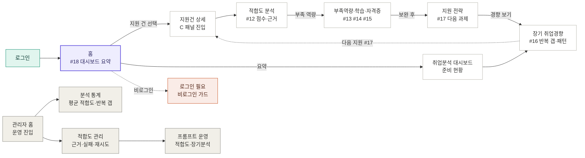

> 채용공고 적합도 분석 → 부족 역량·학습·자격증 → 지원 전략 → 장기 취업 경향까지. C 영역 사용자 여정과 관리자 운영 화면

**영역** C · 홈/스펙비교/취업분석/대시보드 · **데모 사용자** 김데모 · **출처** mock 데모 빌드 (VITE_USE_MOCK=true · 백엔드 없이 자체완결) · **생성** 2026-06-18

## C 가치 여정

로그인 후 적합도 → 보완 → 전략 → 경향으로 이어지는 화면 흐름.

## 화면별 흐름

각 화면의 핵심 요소와 동작·이동을 정리했다. 화면 캡처(주석 포함)는 PPTX/PDF 스토리보드를 참조.

### 01. 홈 대시보드 `사용자`

경로 `/` · #18 대시보드 AI 요약 · #12 공고-스펙 적합도 분석 · #13 부족 역량 추천 · #17 다음 지원 방향 추천

로그인 직후 사용자가 자신의 지원 흐름을 한눈에 보는 회원 대시보드로, AI 요약·준비도·지원 건별 적합도·오늘의 할 일을 모아 다음 행동으로 연결한다.

1. **AI 대시보드 요약 + 재생성** (#18 대시보드 AI 요약) — 최근 지원 건들을 종합해 평균 적합도와 다음 액션을 한 문단으로 요약한다. 우측 '재생성(크레딧 1)'을 누르면 최신 데이터로 AI가 요약을 다시 생성하며 크레딧 1이 차감된다. → 같은 화면 갱신(요약 재생성)
2. **준비도 점수** (#18 대시보드 AI 요약) — 지원 건 분석·학습·면접 진척을 집계한 전체 준비도를 % 게이지로 보여준다. 분석 가능한 지원 건이 없으면 0%와 안내 문구가 뜬다. → 지표 표시(이동 없음)
3. **지원 건별 적합도 점수** (#12 공고-스펙 적합도 분석) — 진행 중 지원 건 카드마다 회사·직무와 적합도 점수(미분석 시 '미분석')를 보여준다. 카드를 누르면 해당 지원 건 상세로 이동해 스펙비교 적합도를 본다. → /applications/:id (지원 건 상세 → 스펙비교)
4. **오늘의 우선순위(할 일)** (#17 다음 지원 방향 추천) — 적합도·부족 역량 분석에서 파생된 '다음 할 일'과 직접 추가한 항목을 체크리스트로 보여준다. 항목을 체크하면 완료 처리되고, 하단 입력창으로 직접 할 일을 추가할 수 있다. → 같은 화면(완료/추가 처리)
5. **취업 분석 바로가기** (#16 장기 취업 경향 분석) — 헤더 카드의 '취업 분석' 버튼으로, 여러 지원 건을 종합한 장기 경향·반복 약점 대시보드로 이동한다. → /analysis (취업분석 대시보드)
6. **AI 면접 에이전트 입력창** — 모바일에서 첫 화면 상단에 고정되는 면접 진입 검색창으로, 한 줄 요청을 입력해 모드 선택부터 질문 생성까지 바로 진행한다. '예: 네이버 백엔드 직무 면접 준비해줘' 같은 자연어를 넣고 '맡기기'를 누르면 면접 흐름이 시작된다. → AI 가상 면접 진입

_분기·상태: 인증 확인 중: '세션을 확인하는 중입니다' 로딩 카드 표시 · 대시보드 로딩 중(요약 미수신): '회원 홈 데이터를 불러오는 중입니다' 스피너 · 로딩 실패: 빨간 오류 카드 + '다시 불러오기' 버튼으로 재시도 · 빈 상태(지원 건 0): '아직 진행 중인 지원 건이 없습니다' / 적합도·약점 영역에 등록 유도 문구 · 비로그인 상태: 회원 대시보드 대신 랜딩(Hero·기능 소개) 페이지 노출 · 요약 재생성 실패: AI 요약 박스 아래 빨간 오류 메시지 · 백그라운드 동기화: 우하단 '최신 데이터 동기화 중' 토스트_

### 02. 취업분석 대시보드 `사용자`

경로 `/dashboard` · #18 대시보드 AI 요약 · #12 공고-스펙 적합도 분석 · #13 부족 역량 추천 · #16 장기 취업 경향 분석

지원 건·적합도·부족 역량·준비도를 한 화면에 집계해 오늘 할 일과 다음 행동을 제시하는 C 영역 메인 대시보드.

1. **AI 요약 배너 + 재생성** (#18 대시보드 AI 요약) — 최근 지원 건과 적합도를 종합한 AI 한줄 요약을 띄운다. 우측 '재생성(크레딧 1)' 버튼을 누르면 AI를 다시 호출해 최신 데이터로 요약을 갱신하고 크레딧 1이 차감된다. 아래 mock-demo·FALLBACK 라벨로 실행 상태를 노출한다. → 취업분석 대시보드 (현재 화면 갱신)
2. **평균 적합도 카드** (#12 공고-스펙 적합도 분석) — 전체 지원 건의 평균 적합도(78점)와 '우선 지원 후보' 건수를 보여주는 핵심 지표 카드다. 적합도 분석 결과가 누적되며 자동 집계된다. → 지표 요약 (정적 표시)
3. **내 지원 건 + 적합도 바** (#12 공고-스펙 적합도 분석) — 회사·직무·상태 배지와 함께 건별 적합도를 막대로 보여준다. 카드를 누르면 해당 지원 건 상세로, 우측 '전체 보기'는 지원 건 목록으로 이동한다. → 지원 건 상세 / 지원 건 목록(/applications)
4. **이번 주 우선순위** (#17 다음 지원 방향 추천) — 가장 유망한 지원 건과 가장 시급한 보완 역량을 묶어 다음 행동을 제안한다. 유망 건을 누르면 상세로, 보완 역량을 누르면 취업분석 약점 탭으로 이동한다. → 지원 건 상세 / 취업 분석 약점 탭(/analysis?tab=weakness)
5. **전체 취업 준비도 게이지** (#16 장기 취업 경향 분석) — 여러 지원 건을 결정적으로 집계한 전체 준비도 점수와 최근 변화 추이를 게이지로 보여준다. 장기 경향을 한눈에 파악하게 한다. → 준비도 요약 (정적 집계)
6. **하단 고정 CTA (모바일)** — 모바일에서는 상단 버튼 대신 화면 하단에 '새 지원 건 만들기' 버튼을 고정해 핵심 행동을 항상 노출한다. 누르면 지원 건 등록 흐름으로 이동한다. → 지원 건 목록/등록(/applications)

_분기·상태: 로딩: 진입 시 getDashboardSummary 호출 중 '대시보드 데이터를 불러오는 중입니다' 스피너 카드 표시 · 에러: 요약 조회 실패 시 빨간 카드로 오류 메시지 표시(데이터 영역 미렌더) · 빈 상태(지원 건 0): '아직 등록된 지원 건이 없습니다 — 첫 공고를 등록하면 적합도와 다음 행동이 표시됩니다' 안내 · 빈 상태(부족 역량 없음): '반복 부족 역량이 아직 없습니다 — 분석 결과가 쌓이면 자동 정리' 안내 · 재생성 실패: AI 요약 재생성 중 오류 시 배너 하단에 빨간 오류 문구 표시, 버튼은 다시 활성화 · 위험 알림: 반복 부족 역량이 분석 절반 이상(>=50%, total>=2)이면 빨간 경고 카드 노출 · 우선순위 빈 분기: 유망 지원 건·시급 보완 역량이 모두 없으면 '이번 주 우선순위' 카드 자체 미표시_

### 03. 취업분석·장기경향 `사용자`

경로 `/analysis` · #16 장기 취업 경향 분석 · #13 부족 역량 추천 · #17 다음 지원 방향 추천

여러 지원 건의 적합도·면접 데이터를 종합해 평균 준비도, 직무·산업·기술별 경향, 부족 역량과 다음 지원 방향을 한 화면에서 보여주는 장기 취업 경향 분석 대시보드.

1. **분석 관점 탭** (#16 장기 취업 경향 분석) — 내 지원 경향·자주 부족한 역량·직무별 준비도·적합도 점수 변화·추천 지원 방향 5개 관점을 전환한다. 누르면 URL ?tab= 쿼리가 바뀌고 해당 관점의 카드들만 보이며, 추천 지원 방향 탭에서는 AI 전략 리포트와 재분석 버튼이 노출된다. → 같은 화면 내 탭 전환(?tab=weakness/readiness/score/recommendation)
2. **평균 적합도 KPI** (#16 장기 취업 경향 분석) — 여러 지원 건을 종합한 평균 적합도와 분석 완료·준비 완료·모의면접 건수를 한 줄로 요약한다. 클릭 동작은 없고 장기 준비도의 현재 수준을 보여주는 지표 카드다. → 표시 전용(이동 없음)
3. **자주 지원하는 직무** (#16 장기 취업 경향 분석) — 지원 건을 직무별로 묶어 비중(%)과 평균 적합도를 막대로 보여줘 지원 패턴의 쏠림을 진단한다. 데이터가 없으면 지원 건 등록을 안내하는 빈 상태가 뜬다. → 표시 전용(이동 없음)
4. **기업·산업 유형별 적합도** (#16 장기 취업 경향 분석) — 인터넷/SaaS·핀테크 등 산업 유형별 평균 적합도를 비교해 어떤 기업군에서 강한지 알려준다. 기업 분석 산업 정보가 쌓여야 채워지는 경향 카드다. → 표시 전용(이동 없음)
5. **지난주 변화·3줄 요약** (#16 장기 취업 경향 분석) — 지난주 대비 적합도·면접 점수 변화와 핵심 3줄 요약을 한 카드로 압축해 다음 행동의 우선순위를 잡아준다. 주간 비교 데이터가 없으면 안내 문구로 대체된다. → 추천 지원 방향 탭(전략 리포트)
6. **모바일 요약 카드** (#13 부족 역량 추천) — 모바일에서 먼저 보이는 카드로 현재 준비도(평균 적합도)와 점수 변화, 가장 강한 역량, 우선 보완 역량(TypeScript·AWS·테스트)을 칩으로 보여준다. lg 이상 데스크톱에서는 숨겨지는 모바일 전용 요약이다. → 표시 전용(이동 없음)

_분기·상태: 로딩: '취업 분석 데이터를 불러오는 중입니다.' 스피너 카드 · 에러: getAnalysisSummary 실패 시 빨강 카드에 오류 메시지 표시 · 빈 상태: 분석 이력 없으면 각 카드가 지원 건 등록·적합도 분석 실행을 안내 · 재분석: 추천 지원 방향 탭의 '재분석(크레딧 1)' 버튼 → refreshAnalysisSummary, 실패 시 재분석 에러 문구 · 기간 메타: period.analyzedCount>0일 때만 분석 대상 기간·건수 줄 노출_

### 04. 지원건 상세 진입 `사용자`

경로 `/applications/1` · #12 공고-스펙 적합도 분석 · #18 대시보드 AI 요약

지원 건 하나의 개요·공고·분석을 묶어 보여주는 상세 셸 화면으로, 상단 '적합도' 탭과 'AI 분석 종합' 카드의 '적합도 보기'를 통해 C 영역(적합도·부족역량·학습/자격증·전략) 패널로 진입시킨다.

1. **적합도 탭** (#12 공고-스펙 적합도 분석) — 상세 상단 탭 줄의 마지막 '적합도' 탭. 누르면 /applications/1/fit 으로 이동해 적합도 분석 생성/결과·부족 역량·학습/자격증·전략 패널이 있는 C 영역 화면으로 진입한다. → 05-fit (적합도 패널)
2. **AI 분석 종합 카드** (#18 대시보드 AI 요약) — 개요 탭에서 이 지원 건의 공고 분석/적합도 분석 완료 여부를 한눈에 보여주는 종합 카드. GET /application-cases/{id}/analysis 로 두 분석의 완료 상태를 불러온다. → 같은 화면(개요 탭) 내 요약
3. **적합도 분석 상태 배지** (#12 공고-스펙 적합도 분석) — 적합도 분석이 완료/미완료/확인 중 어느 상태인지 보여주는 상태 셀. 미완료면 적합도 탭에서 분석을 생성하라는 신호 역할을 한다. → 05-fit (미완료 시 분석 생성)
4. **적합도 보기 링크** (#12 공고-스펙 적합도 분석) — AI 분석 종합 카드 우측의 '적합도 보기' 바로가기. 누르면 적합도 탭(/applications/1/fit)으로 이동해 C 적합도 패널을 연다. → 05-fit (적합도 패널)
5. **공고문 추출 진행 토스트** — 공고문 텍스트 추출이 백그라운드로 돌아가는 동안 뜨는 진행 알림. 추출이 SUCCEEDED 되면 상세/공고 데이터가 자동 새로고침되어 분석 입력이 채워진다. → 추출 완료 시 자동 새로고침
6. **모바일 탭바(가로 스크롤)** (#12 공고-스펙 적합도 분석) — 모바일에서는 폭이 좁아 개요·공고문·공고 분석·기업 분석까지만 보이고 '적합도' 탭은 탭바를 좌우로 스크롤해야 닿는다. C 진입 동선이 웹보다 한 단계 숨겨져 있는 지점이다. → 05-fit (스크롤 후 적합도 탭)

_분기·상태: 비로그인: LoginRequiredState로 '지원 건 상세는 로그인 후 확인' 안내 · 잘못된 ID: '지원 건 ID가 올바르지 않습니다' 카드 + 목록으로 이동 버튼 · 로딩 중: 상세/탭 콘텐츠 자리에 스켈레톤(animate-pulse) 표시 · 로드 실패(error): 상단 빨간 오류 배너 표시, 새로고침으로 재시도 · 추출 실패(FAILED): '다시 추출' 버튼 노출 + extractionError 배너 · 유형 동기화 실패: '지원 건 유형 동기화 실패' 노란 배너 · AI 분석 종합 조회 실패: 공고/적합도 모두 '미완료'로 폴백 표시_

### 05. 적합도 분석 + 전략 + 학습추천 `사용자`

경로 `/applications/1/fit` · #12 공고-스펙 적합도 분석 · #13 부족 역량 추천 · #14 학습 로드맵 추천 · #15 자격증 추천 · #17 다음 지원 방향 추천

하나의 지원 건에서 공고-스펙 적합도 점수, 지원 여부 최종 판단, 부족 역량, 학습/자격증 로드맵, 지원 전략을 한 화면에 모아 보여주는 C 영역 핵심 패널.

1. **적합도 재분석 버튼** (#12 공고-스펙 적합도 분석) — 공고 분석 결과와 내 프로필을 다시 비교해 적합도·부족역량·학습/자격증·전략을 새로 산출한다. 누르면 단계별 진행 인디케이터가 뜨고 완료되면 아래 카드들이 최신 기준으로 갱신된다. → 05-fit (재분석 결과 갱신)
2. **직무 적합도 점수+구간** (#12 공고-스펙 적합도 분석) — 공고 요구사항 대비 내 스펙 적합도를 점수와 진행바, 그리고 구간 설명으로 함께 보여준다. 숫자만이 아니라 '지원 가능 구간' 같은 의미를 함께 안내해 지원 판단을 돕는다. → 05-fit
3. **지원 판단 카드** (#17 다음 지원 방향 추천) — 점수와 부족 역량을 종합해 '지원 가능 / 보완 후 지원 권장 / 지원 보류'를 최종 판단으로 제시하고 그 근거와 추천 행동을 번호순으로 정리한다. 지원 여부를 바로 결정하도록 돕는 핵심 결론부다. → 05-fit
4. **분석 신뢰도 안내** (#12 공고-스펙 적합도 분석) — 신뢰도가 높음이 아닐 때 '신뢰도 보통/낮음'과 그 이유를 표시해, 점수보다 프로필·공고 입력 보강을 먼저 안내한다. 입력이 부실하면 점수를 과신하지 않도록 경고하는 장치다. → 05-fit
5. **AI 제안·신뢰도 배지** (#12 공고-스펙 적합도 분석) — 카드 상단에 'AI 제안', '확인 필요', '신뢰도 보통 · 72점' 배지를 붙여 이 결과가 AI 생성물이며 검토가 필요함을 명시한다. 사용자가 결과를 그대로 신뢰하기 전에 점검하도록 유도한다. → 05-fit
6. **모바일 적합도 탭바** (#12 공고-스펙 적합도 분석) — 모바일에서는 개요·공고문·공고 분석·기업 분석·적합도 탭을 가로 스크롤로 전환한다. '적합도' 탭을 누르면 한 화면에서 점수·전략·학습추천을 세로로 이어 보는 C 핵심 패널로 들어온다. → 05-fit (적합도 탭)

_분기·상태: 로딩: 적합도/전략/학습 패널마다 '불러오는 중입니다' 상태 카드 표시 · 빈 상태: 분석 결과가 없으면 '아직 적합도 분석 결과가 없습니다 — 공고문 분석을 먼저 실행' 안내 · 생성 중: 재분석 요청 시 FitAnalysisProgress 단계별 진행 인디케이터 · 에러: 적합도/전략/학습 패널 각각 에러 메시지를 빨간 상태 카드로 표시 · 필수 조건 미충족: 점수와 별개로 'N개 미충족' 경고 박스를 상단에 노출 · 학습 과제 토글 실패: '학습 과제 상태를 변경하지 못했습니다 — 잠시 후 다시 시도' 오류 · 학습 80% 이상 완료: 녹색 박스로 '적합도 재분석' 유도 버튼 노출_

### 06. 관리자 홈 `관리자`

경로 `/admin/home` · #12 공고-스펙 적합도 분석 · #16 장기 취업 경향 분석 · #18 대시보드 AI 요약

운영자가 지금 처리할 적합도 분석 대기 큐(실패·강등·재분석·미분석·장기 실패·신규)와 운영 화면 바로가기를 모아 보여주는 C 관리자 진입 화면.

1. **적합도 분석 실패 / 강등 결과 노출** (#12 공고-스펙 적합도 분석) — AI 호출이 실패했거나 최신 분석이 FALLBACK/FAILED 상태로 강등된 적합도 분석 건수를 빨강으로 보여주는 처리 대기 큐다. 운영자가 가장 먼저 재시도/점검해야 할 항목으로, 클릭 시 적합도 분석 관리·상세로 연결된다. → 적합도 분석 관리(/admin 적합도 분석 상세)
2. **재분석 요청 / 미분석 지원 건** (#12 공고-스펙 적합도 분석) — 재분석 필요 메모가 달린 분석과 아직 적합도 분석이 실행되지 않은 지원 건 수를 노랑 경고로 표시한다. 운영자가 재분석을 돌리거나 누락 건을 채워 적합도→부족역량 흐름을 정상화하도록 유도한다. → 적합도 분석 관리 큐
3. **장기 분석 실패 / 최근 7일 신규 분석** (#16 장기 취업 경향 분석) — 장기 취업 경향·대시보드 요약 실행이 실패한 건수와 최근 7일간 새로 생성된 적합도 분석 수를 보여준다. 경향/대시보드 파이프라인 건강도와 신규 유입량을 한눈에 점검하는 지표다. → 운영 종합 대시보드
4. **적합도 분석 관리 바로가기** (#12 공고-스펙 적합도 분석) — 전체 지원 건의 적합도 분석 결과를 점검하고 재분석하는 운영 화면으로 이동하는 바로가기 카드다. 누르면 적합도 분석 관리 목록으로 이동한다. → 적합도 분석 관리
5. **운영 종합 대시보드 바로가기** (#18 대시보드 AI 요약) — 전 도메인 분석·운영 현황과 AI 호출 현황을 모은 운영 종합 대시보드(/admin/dashboard)로 이동한다. 현황 숫자 중심의 대시보드로, 처리 대기 큐 중심인 이 홈과 역할이 다르다. → 운영 종합 대시보드(/admin/dashboard)
6. **새로고침** — 관리자 홈 요약(getAdminHomeSummary)을 다시 호출해 대기 큐 숫자와 바로가기를 갱신한다. 로딩 중에는 버튼이 비활성화되고 아이콘이 회전한다. → 현재 화면 갱신

_분기·상태: 로딩: 요약 호출 중 6개 카드가 스켈레톤(animate-pulse)으로 표시되고 새로고침 버튼 비활성화 · 실패: getAdminHomeSummary 에러 시 빨강 경고 박스에 '관리자 홈 정보를 불러오지 못했습니다.' 메시지 노출, 새로고침으로 재시도 · 빈 상태: shortcuts 배열이 비면 하단 바로가기 카드 영역이 렌더되지 않음 / 큐 값이 0이면 0으로 표시 · 진행 토스트: '공고문 추출이 진행 중입니다.' 등 백그라운드 작업 진행 상태 토스트가 하단에 표시 · 권한: 관리자 인증 필요(관리자 전용 화면), 미인증 시 관리자 로그인으로 분기_

### 07. 분석 통계 `관리자`

경로 `/admin/analytics` · #12 공고-스펙 적합도 분석 · #13 부족 역량 추천 · #16 장기 취업 경향 분석 · #18 대시보드 AI 요약

C 운영자가 적합도·부족 역량 통계와 장기 경향·대시보드 요약 AI 실행 이력을 보고, 실패·품질 의심 분석을 큐로 처리하는 분석 통계 운영 화면.

1. **운영 핵심 지표 카드** (#18 대시보드 AI 요약) — 전체 회원·분석 완료 지원 건·평균 적합도·이번 달 AI 크레딧을 한 줄로 집계해 C 영역 운영 상태를 한눈에 보여준다. 새로고침을 누르면 요약·실행 이력을 한 번에 다시 불러온다. → 분석 통계 대시보드(현재 화면)
2. **적합도 점수 분포** (#12 공고-스펙 적합도 분석) — AI 적합도 분석 결과를 90-100~0-59 구간별 건수·비율 막대로 묶어 전체 분포를 보여준다. 운영자가 점수 쏠림이나 저점수 비중을 빠르게 파악하는 시작점이다. → 적합도 분석 검수(/admin/fit-analysis)
3. **반복 부족 역량** (#13 부족 역량 추천) — 여러 분석에서 반복 지적된 부족 역량(TypeScript·테스트 코드 등)을 빈도순으로 누적해 보여준다. 어떤 스킬이 사용자 전반의 공통 약점인지 드러내 추천·로드맵 품질을 점검하게 한다. → 분석 통계 대시보드(현재 화면)
4. **분석 실패 큐** (#12 공고-스펙 적합도 분석) — FAILED/FALLBACK로 끝난 적합도·장기 경향·대시보드 요약 실행을 사용자·오류·모델과 함께 모아 보여주고, 재시도 가능 건은 배지로 표시한다. 운영자가 먼저 처리할 비정상 실행을 추린다. → 분석 통계 대시보드(현재 화면)
5. **품질 검수 큐** (#12 공고-스펙 적합도 분석) — 점수-근거 상충·자격증 과다 추천 등 품질 의심 분석을 심각도와 함께 큐로 띄운다. '적합도 분석 검수 화면 열기'로 해당 분석을 열거나 '검수 완료'로 큐에서 제거한다. → 적합도 분석 검수(/admin/fit-analysis?analysisId=...)
6. **지표 카드 세로 스택** (#18 대시보드 AI 요약) — 모바일에서는 4개 지표 카드가 가로 그리드 대신 세로로 한 장씩 쌓여, 좁은 화면에서도 각 숫자와 보조 설명을 또렷하게 읽도록 재배치된다. → 분석 통계 대시보드(현재 화면)

_분기·상태: 로딩: 첫 진입과 새로고침 시 '분석 통계를 불러오는 중입니다' 카드 노출 · 에러: 요약/이력 조회 실패 시 빨간 카드로 오류 메시지 표시 · 빈 상태: 적합도 분포·반복 부족 역량·실패 큐·품질 큐 각각 데이터 없으면 안내 문구 표시 · 실행 이력 검색/필터 결과 0건이면 '조건에 맞는 실행 이력이 없습니다' · 재시도 가능: FAILED/FALLBACK 건에 '재시도 가능' 배지 분기 · 품질 검수 완료 시 해당 항목을 큐에서 제거 · 권한: 관리자(C 관리자) 전용 화면 — 비관리자는 진입 불가_

### 08. 적합도 분석 관리 `관리자`

경로 `/admin/fit-analysis` · #12 공고-스펙 적합도 분석 · #13 부족 역량 추천 · #14 학습 로드맵 추천 · #15 자격증 추천 · #18 대시보드 AI 요약

운영자가 지원 건별 적합도 점수·매칭/부족 역량·추천 학습·자격증 산출물을 검수하고 운영 메모를 남기는 C 영역 적합도 분석 관리 콘솔.

1. **운영 요약 지표** (#18 대시보드 AI 요약) — 전체 분석 결과 건수·평균 적합도 점수·운영 메모 건수를 한눈에 보여주는 카드 3종. 목록이 갱신되면 평균 점수와 메모 합계가 자동 재계산됩니다. → 이 화면 내 집계(상호작용 없음)
2. **점수·상태·재분석 필터** (#12 공고-스펙 적합도 분석) — 점수 구간(80↑/70-79/50-69/50미만), 성공·실패 상태, 메모 보유, 재분석 필요 조건으로 분석 목록을 클라이언트 필터링합니다. 우측에 표시되는 N/M건으로 결과 수를 확인합니다. → 이 화면 내 목록 필터링
3. **분석 결과 카드** (#12 공고-스펙 적합도 분석) — 지원 건별 기업·직무·사용자와 적합도 점수(색상 등급), 상태/메모/재분석 배지를 보여주는 카드. 누르면 우측 상세 패널이 해당 분석으로 바뀌고 URL에 analysisId가 기록됩니다. → 우측 상세 패널 갱신
4. **매칭/부족 역량** (#13 부족 역량 추천) — 선택한 분석의 매칭 역량과 부족 역량을 칩 형태로 나열합니다. 운영자가 사용자에게 제시된 부족 역량 추천 결과의 품질을 점검할 수 있습니다. → 05-fit 사용자 적합도 결과 대응
5. **추천 학습·자격증** (#14 학습 로드맵 추천) — 부족 역량을 메우는 추천 학습 항목과 추천 자격증(#15)을 함께 표시합니다. 아래 구조화 결과·학습 체크리스트와 묶여 추천 산출물 전체를 검증하는 영역입니다. → 이 화면 내 추천 산출물 검증
6. **공고문 추출 진행 토스트** (#12 공고-스펙 적합도 분석) — 모바일에서 적합도 분석 파이프라인의 공고문 추출 단계가 진행 중임을 알리는 토스트. 비동기 분석 작업 상태를 운영자에게 알려 완료를 기다리게 합니다. → 분석 완료 후 목록 자동 반영

_분기·상태: 목록 로딩 중: '목록을 불러오는 중입니다.' 스피너 표시 · 목록 빈 상태: '적합도 분석 결과가 아직 없습니다.' · 필터 결과 없음: 카드 미표시(N/M건 0으로 표기) · 상세 로딩 중: '상세를 불러오는 중입니다.' 스피너 · 미선택 상태: '선택된 적합도 분석 결과가 없습니다.' · 분석 실패 status≠SUCCESS: 빨강 상태 배지 + errorMessage 박스 노출 · 목록/상세 호출 실패: 상단 빨강 에러 카드 · 메모 저장·삭제 실패: '운영 메모를 저장/삭제하지 못했습니다.' 에러 · 메모 없음: '아직 운영 메모가 없습니다.'_

### 09. 적합도 프롬프트 운영 `관리자`

경로 `/admin/prompts/fit-analysis` · #12 공고-스펙 적합도 분석 · #13 부족 역량 추천 · #17 다음 지원 방향 추천

관리자가 적합도 분석에 쓰이는 세 AI 프롬프트(공고-스펙 채점·부족 역량 추천·지원 전략 생성)의 목적·버전·입출력·품질/위험 기준을 점검하는 읽기 전용 운영 콘솔.

1. **Prompt Ops 헤더** (#12 공고-스펙 적합도 분석) — 적합도 분석에 쓰이는 프롬프트의 목적과 품질 기준을 운영자가 확인하는 읽기 전용 콘솔이다. 공고-스펙 비교, 부족 역량 추천, 지원 전략 생성 세 프롬프트를 한눈에 점검한다. → 현재 화면(프롬프트 운영 콘솔)
2. **공고-스펙 적합도 채점 카드** (#12 공고-스펙 적합도 분석) — 공고 요건과 지원자 스펙을 항목별로 매칭해 fitScore(0~100)와 충족/부족 역량을 산출하는 프롬프트다. 버전·운영 상태·검토일과 입력/출력 필드를 확인한다. → 05-fit (사용자 적합도 분석 결과)
3. **부족 역량 추천 카드** (#13 부족 역량 추천) — missingSkills와 목표 직무를 받아 우선순위 역량과 학습 과제·예상 소요 기간을 추천하는 프롬프트다. 품질 체크와 위험 노트로 추천 신뢰도를 관리한다. → 부족 역량/학습 추천 결과
4. **지원 전략 생성 카드** (#17 다음 지원 방향 추천) — fitScore와 강·약점을 바탕으로 자소서 강조점·면접 대비 포인트를 제안하는 프롬프트다. 거짓 경력 유도 금지 등 위험 노트가 함께 표시된다. → 지원 전략 / 다음 지원 방향 추천
5. **품질 체크 / 위험 노트** (#12 공고-스펙 적합도 분석) — 각 프롬프트가 지켜야 할 품질 기준(점수 매핑·항목 근거)과 환각·과장 방지를 위한 위험 노트를 나열한다. 운영자가 출력 품질을 검수하는 기준이 된다. → 현재 화면(검수 기준 영역)
6. **공고문 추출 진행 토스트** (#12 공고-스펙 적합도 분석) — 공고문 추출 같은 백그라운드 AI 작업의 진행 상태를 알리는 전역 토스트다. 모바일에서는 화면 하단에 고정 표시되며 X로 닫을 수 있다. → 동일 화면(백그라운드 작업 알림)

_분기·상태: 로딩: 데이터 조회 중 'Loader2' 스피너와 '프롬프트 정보를 불러오는 중입니다.' 카드 표시 · 오류: getFitAnalysisPrompts 실패 시 빨간 카드에 오류 메시지(기본 '적합도 프롬프트를 불러오지 못했습니다.') 표시 · 빈 상태: prompts 배열이 비면 카드 그리드에 아무 항목도 렌더링되지 않음 · 정상: 로딩·오류 없이 세 프롬프트 카드가 3열 그리드(모바일 1열)로 표시 · 권한: /admin 경로 관리자 전용 화면(미인증/비관리자 접근 시 차단)_

### 10. 장기분석 프롬프트 운영 `관리자`

경로 `/admin/prompts/analytics` · #16 장기 취업 경향 분석 · #17 다음 지원 방향 추천 · #18 대시보드 AI 요약

C 장기분석 계열 프롬프트(취업 경향·다음 액션·직무 준비도)의 버전·입출력·품질 기준을 운영자가 읽기 전용으로 점검하는 화면.

1. **장기 분석 프롬프트 운영 확인** (#16 장기 취업 경향 분석) — Prompt Ops 배지와 함께 장기 취업 경향·대시보드 다음 액션·직무별 준비도 프롬프트의 품질 기준을 한눈에 확인하는 읽기 전용 운영 화면이다. 운영자가 C 분석 AI가 어떤 기준으로 동작하는지 점검하는 진입점. → 같은 화면(읽기 전용)
2. **장기 취업 경향 분석 카드** (#16 장기 취업 경향 분석) — 누적 지원·분석·면접 데이터를 종합해 취업 준비 경향과 변화 추세를 요약하는 프롬프트로, 버전(a-v2.3)·운영중 상태·최근 검토일이 함께 표시된다. 취업분석 대시보드의 경향 요약을 만드는 엔진이다. → 취업분석 대시보드
3. **대시보드 다음 액션 카드** (#17 다음 지원 방향 추천) — 현재 진행 중 지원 건과 부족 역량을 기준으로 이번 주 권장 액션을 생성하는 프롬프트로 입력·출력·품질 체크가 정리돼 있다. 사용자 대시보드의 다음 지원 방향 추천 영역으로 이어진다. → 대시보드 다음 액션 위젯
4. **직무별 준비도 카드** (#13 부족 역량 추천) — 직무군별로 보유 역량과 시장 요구를 비교해 준비도 레벨과 보완 로드맵을 산출하는 프롬프트다. 부족 역량·학습 추천으로 연결되는 준비도 진단의 기준을 보여준다. → 부족 역량/학습 로드맵
5. **입력·출력 명세 블록** (#18 대시보드 AI 요약) — 각 카드 안에서 프롬프트가 받는 입력 필드(지원 건 이력·적합도 점수 추이 등)와 산출하는 출력 필드, 품질 체크·위험 노트를 나열한다. 운영자가 AI 요약의 입출력 계약을 검수하는 부분이다. → 같은 화면(읽기 전용)
6. **공고문 추출 진행 토스트** — 화면 하단에 전역 작업 토스트가 떠 공고문 추출 등 백그라운드 작업 진행 상태를 알린다. 모바일에서는 카드가 한 줄로 쌓여 스크롤되며 이 토스트가 화면 폭 전체를 차지한다. → 백그라운드 작업 알림

_분기·상태: 로딩: 스피너와 '프롬프트 정보를 불러오는 중입니다.' 카드 표시 · 에러: 빨강 카드에 실패 메시지(기본 '분석 프롬프트를 불러오지 못했습니다.') 표시 · 정상: 3개 프롬프트 카드를 lg 3열 그리드로 렌더 (모바일은 1열) · 데이터 없음: prompts 비면 빈 그리드(카드 없음)_

### 11. 로그인 필요 상태 `상태`

경로 `/applications/1/fit` · #12 공고-스펙 적합도 분석

적합도 분석 상세에 비로그인으로 접근한 사용자를 막고, 본인 데이터만 조회 가능함을 알리며 원래 경로로 되돌아오는 로그인 동선으로 안내하는 가드 화면.

1. **로그인 안내 아이콘** (#12 공고-스펙 적합도 분석) — 적합도 분석 상세(/applications/1/fit)에 비로그인 상태로 접근하면 본문 대신 표시되는 로그인 유도 아이콘이다. 적합도 점수·부족 역량 같은 개인 분석 결과를 가린다. → 현재 화면(가드 카드)
2. **가드 제목** (#12 공고-스펙 적합도 분석) — '지원 건 상세는 로그인 후 확인할 수 있습니다' 안내로, 적합도 분석 결과가 로그인 사용자 본인에게만 열린다는 점을 알린다. → 05-fit (로그인 후 적합도 상세)
3. **본인 데이터 안내문** (#12 공고-스펙 적합도 분석) — '지원 건 상세와 공고문은 본인 데이터만 조회합니다'로, 타인 분석 결과 노출을 막는 데이터 소유권 가드임을 설명한다. → 현재 화면(설명 텍스트)
4. **로그인으로 이동 버튼** — 누르면 현재 경로(/applications/1/fit)를 from 상태로 담아 /login으로 이동하고, 로그인 성공 시 원래 적합도 분석 화면으로 되돌아온다. → /login → 로그인 후 05-fit 복귀
5. **분석 탭(하단)** (#16 장기 취업 경향 분석) — 모바일 하단 탭바의 '분석' 탭으로, 비로그인이라도 개인 지원 건 대신 취업 분석/대시보드 영역으로 이동하는 대체 동선을 제공한다. → 취업분석 대시보드

_분기·상태: 비로그인 접근: 적합도 상세 대신 로그인 가드 카드 표시 · 로그인으로 이동 클릭: from=현재경로 상태와 함께 /login 이동 · 로그인 성공: from 경로(05-fit 적합도 상세)로 복귀 · 로그인된 본인: 가드 미표시, 적합도 분석 본문 렌더 · title/description prop 미지정 시 기본 문구 사용(본 화면은 커스텀 문구 적용)_

## 산출물

- PPTX/PDF 스토리보드(웹·앱 캡처 + 주석 + 여정도)
- 통합 기획서 · C 파트 DB 설계서
- 코드: `docs/storyboard/` (캡처→스펙→렌더 파이프라인, 재현 가능)
