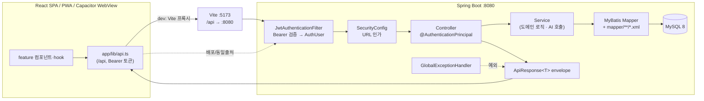

# 아키텍처

CareerTuner는 채용공고에 맞춰 스펙과 면접 답변을 조정하는 AI 취업 전략 플랫폼입니다. 핵심 단위는 공고가 아니라 **지원 건(Application Case)** 으로, 기업·직무·공고 조합마다 독립된 작업 공간을 두고 그 안에 공고 분석·기업 분석·스펙 비교·면접·리포트를 모읍니다.

시스템은 하나의 모노레포 안에서 Spring Boot 백엔드(REST API), React SPA(사용자 + 관리자), 자체 파인튜닝 LLM 연동, 그리고 PWA·Capacitor·C++17/Qt/QML 데스크톱 패키징까지 함께 관리합니다. 이 문서는 모노레포 구성, 백엔드 4계층 구조와 응답 규약, 인증 흐름, 프런트 feature 모듈 구조와 Vite 프록시, 모바일 패키징, CI 파이프라인을 실제 코드 기준으로 정리합니다.

## 주요 기능

- 단일 모노레포에서 백엔드·프런트·ML·문서를 함께 버전 관리
- 백엔드 `controller → service → mapper → domain/dto` 4계층 + MyBatis XML 매퍼 + MySQL 8
- 모든 응답을 `ApiResponse<T>` 단일 envelope로 통일, 전역 예외 처리로 에러 포맷 일원화
- JWT stateless 인증 필터 + URL 역할 게이트 + 관리자 도메인별 CRUD 권한 집행
- 프런트 기능별 `features/<feature>/{pages,components,api,hooks,types}` 수직 모듈 구조
- Vite dev 프록시로 `/api` 요청을 `:8080` 백엔드에 전달, 배포/데모는 동일 출처 또는 mock 모드
- PWA(서비스워커·설치형 셸) + Capacitor 네이티브 WebView가 동일 빌드를 공유
- GitHub Actions CI: 프런트 typecheck/build, 백엔드/워커 테스트, mock 데모 배포, Android/iOS/데스크탑 릴리스

## 핵심 구현

### 모노레포 구조

레포 루트 아래에 실행 단위별 디렉터리를 두고, IntelliJ/에디터로 루트를 열어 함께 다룹니다.

```text
backend/    Spring Boot 4.1.0 + Java 21 + MyBatis + MySQL 8  (REST API, :8080)
frontend/   React 19 + Vite 8 + TypeScript + Tailwind v4      (사용자/관리자 SPA, :5173)
ml/         자체 LLM 파인튜닝·평가 실험, job-posting-worker 등
docs/       기획·아키텍처 문서
.github/    GitHub Actions 워크플로
```

관리자 화면은 별도 앱으로 분리하지 않고 `frontend/src/admin/` 아래에 두어 같은 인증·API·디자인 시스템을 공유합니다(`docs/ARCHITECTURE.md` §1).

### 백엔드 4계층과 도메인 패키지

도메인 패키지는 `com.careertuner.<도메인>` 이며, 각 도메인이 `controller → service → mapper(MyBatis) → domain(model/dto)` 4계층을 채웁니다. 영속성은 **MyBatis만** 사용하고 JPA는 의도적으로 배제했습니다. `backend/build.gradle`이 `mybatis-spring-boot-starter`와 `spring-boot-starter-jdbc`, `mysql-connector-j`만 의존하고 JPA 스타터를 포함하지 않는 것으로 확인됩니다.

매퍼 인터페이스는 `resources/mapper/**/*.xml`의 SQL과 짝을 이루며, 디렉터리는 도메인명을 따릅니다. 예를 들어 `mapper/interview/InterviewMapper.xml`, `mapper/applicationcase/ApplicationCaseMapper.xml`, `mapper/file/FileAssetMapper.xml`처럼 도메인별로 나뉘고, 관리자용 SQL은 `mapper/admin/<도메인>/` 하위에 별도로 둡니다.

### ApiResponse envelope과 전역 예외 처리

모든 REST 응답은 `common/web/ApiResponse`의 단일 record envelope로 감쌉니다.

```java
public record ApiResponse<T>(boolean success, String code, String message, T data) {
    public static <T> ApiResponse<T> ok(T data) { ... }        // success=true,  code="OK"
    public static <T> ApiResponse<T> error(String code, String message) { ... }
}
```

`@JsonInclude(NON_NULL)`로 null 필드는 직렬화에서 제외됩니다. 성공은 `{ success:true, code:"OK", data:{...} }`, 실패는 `{ success:false, code:"...", message:"..." }` 형태입니다.

에러 포맷은 `common/exception/GlobalExceptionHandler`(`@RestControllerAdvice`)가 일원화합니다.

- `BusinessException` → `ErrorCode`의 상태·이름으로 매핑
- `MethodArgumentNotValidException` → `INVALID_INPUT`과 함께 어긋난 필드·메시지 반환
- `MaxUploadSizeExceededException` → 업로드 용량 초과 안내
- 그 외 `Exception` → `INTERNAL_ERROR`로 수렴(스택트레이스는 로깅만)

프런트도 같은 계약을 공유합니다. `frontend/src/app/lib/api.ts`가 `ApiEnvelope<T>` 타입과 `ApiError`를 정의해 envelope을 그대로 해석합니다.

### JWT 인증 필터와 URL 인가

인증은 세션 없는 stateless 방식입니다. `common/security/JwtAuthenticationFilter`(`OncePerRequestFilter`)가 `Authorization: Bearer <access token>` 헤더를 파싱해 `AuthUser(id, email, role)` 주체를 복원하고 `SecurityContext`에 채웁니다. 토큰이 없거나 유효하지 않으면 예외를 삼키고 익명으로 통과시키며, 최종 인가 판단은 `SecurityConfig`가 맡습니다.

```java
// JwtAuthenticationFilter — 토큰 검증 후 ROLE_<role> 권한 부여
AuthUser user = tokenProvider.parseAccessToken(header.substring(7));
var authentication = new UsernamePasswordAuthenticationToken(
        user, null, List.of(new SimpleGrantedAuthority("ROLE_" + user.role())));
```

`common/config/SecurityConfig`는 CSRF·formLogin·httpBasic을 끄고 `SessionCreationPolicy.STATELESS`로 설정한 뒤 인가 규칙을 URL 레벨에서 정의합니다.

- 공개 화이트리스트: `/api/health/**`, Swagger, 인증 진입점(`/api/auth/register`·`login`·`refresh` 등), 커뮤니티/법적 문서/FAQ의 GET 조회, 결제 상품·가격 조회, 챗봇 질문 등
- `/api/admin/**` 은 `hasAnyRole("ADMIN", "SUPER_ADMIN")` 으로 1차 역할 게이트를 통과해야 함
- `AdminPermissionInterceptor`는 컨트롤러의 `@RequireAdminPermission`을 읽어 직접 부여와 그룹 경유 권한의 합집합을 다시 검사함. 정책을 선언하지 않은 관리자 API는 `@AdminRoleOnly`가 명시된 예외가 아니면 fail-closed로 403 처리
- 프런트 `AdminRouteBoundary`와 메뉴도 같은 권한 카탈로그를 사용해 권한 없는 route를 마운트하지 않고 lazy import도 시작하지 않음. mock API 역시 GET·쓰기 동작을 정확한 READ/CREATE/UPDATE/DELETE 코드로 재검사
- 그 외 모든 요청은 `authenticated()`
- SSE·async·error 내부 재디스패치(`DispatcherType.ASYNC`, `ERROR`)는 `permitAll`로 열어 401을 방지

컨트롤러는 `@AuthenticationPrincipal AuthUser`로 인증 주체를 주입받습니다. CORS는 `/api/**`에 한해 Vite dev 서버와 Capacitor WebView 오리진(`http://localhost`, `capacitor://localhost`)을 기본 허용하고, 배포/LAN 테스트용 오리진은 `careertuner.cors.allowed-origins` 프로퍼티로 교체합니다. 비밀번호는 `BCryptPasswordEncoder`로 저장합니다.

### 프런트 feature 모듈과 Vite 프록시

프런트는 앱 전역 기반(`src/app/`)과 기능별 수직 모듈(`src/features/`, 관리자는 `src/admin/features/`)로 나뉩니다. 각 기능은 다음 하위 구조를 표준으로 합니다.

```text
frontend/src/features/<feature>/{pages,components,api,hooks,types}
```

실제로 `features/applications`, `features/analysis`, `features/interview`, `features/billing`, `features/community`, `features/autoprep` 등이 이 구조로 구현되어 있습니다. 예를 들어 `features/applications`는 `api/applicationCasesApi.ts`, `hooks/useApplicationCases.ts`, `pages/ApplicationDetailPage.tsx`, `types/applicationCase.ts`처럼 기능 전용 API·hook·type·페이지를 자기 폴더 안에 둡니다. 공통 API 클라이언트(`app/lib/api.ts`)는 토큰 저장(`tokenStore`), 401 시 단일 refresh 공유, mock 폴백을 담당합니다.

개발 시 브라우저는 항상 상대경로 `/api`로 호출하고, `frontend/vite.config.ts`의 dev 프록시가 이를 백엔드로 전달합니다.

```ts
server: {
  port: 5173,
  proxy: { '/api': { target: 'http://localhost:8080', changeOrigin: true } },
}
```

따라서 백엔드 컨트롤러는 전부 `/api/**` 하위에 둡니다. 모바일 앱이 PC LAN 백엔드를 가리켜야 할 때만 `VITE_API_BASE_URL`로 절대 URL을 지정합니다.

### 요청 처리 흐름



## 설계 결정과 트레이드오프

- **MyBatis 단독, JPA 배제**: 복잡한 분석·리포트 조회와 MySQL `JSON` 컬럼 활용을 SQL로 직접 제어하기 위해 매퍼 XML 방식을 택했습니다. 대신 엔티티 자동 매핑·변경 감지 같은 ORM 편의는 포기하고, 매퍼 XML을 도메인별로 직접 유지합니다.
- **단일 응답 envelope**: `success`/`code`/`message`/`data`를 고정해 프런트가 성공·실패를 일관되게 해석합니다. HTTP 상태코드와 별개로 body에서 도메인 코드를 전달할 수 있는 대신, 순수 REST 상태코드 규약과는 다소 어긋납니다.
- **stateless JWT + 필터에서 예외 삼킴**: 필터는 토큰 검증만 하고 인가는 `SecurityConfig`에서 URL 단위로 결정합니다. 익명 통과를 허용해 공개/비공개 엔드포인트를 한곳에서 관리하지만, 인가 규칙이 컨트롤러가 아니라 config 화이트리스트에 집중됩니다.
- **관리자 앱 미분리, 권한 경계는 중복 적용**: 사용자 SPA와 인증·API·디자인 시스템은 공유하지만, URL 역할 게이트·라우트/메뉴 정책·컨트롤러 권한 인터셉터·서비스 역할 검사를 별도로 둡니다. 화면을 숨기는 것은 UX이고, 최종 보안 경계는 백엔드입니다.
- **단일 빌드 = 웹 + PWA + Capacitor**: 하나의 Vite 빌드를 웹, 설치형 PWA, 네이티브 WebView가 공유합니다. 민감 데이터(`/api` 응답)는 서비스워커 캐시 대상에서 제외해 오프라인 캐시 위험을 줄입니다.

## 데이터 · 연동

- **DB**: MySQL 8. 핵심 테이블은 `users`, `user_profile`, `application_case`, `job_posting`, `job_analysis`, `company_analysis`, `fit_analysis`, `interview_session`·`interview_question`·`interview_answer`, `file_asset`, `payment`, `credit_transaction`, `ai_usage_log` 등이며 배열·구조 데이터는 `JSON` 컬럼으로 저장합니다(`docs/ARCHITECTURE.md` §5). 지원 건은 물리 삭제 대신 `deleted_at`·`archived_at` 시각 컬럼으로 소프트 삭제·보관을 관리합니다.
- **AI provider**: 자체 파인튜닝 LLM(Ollama)·Anthropic Claude·OpenAI를 함께 쓰며, LangChain4j Spring Boot 4 스타터(`langchain4j-spring-boot4-starter`, `langchain4j-ollama-spring-boot4-starter`)를 사용합니다. 공통 인프라는 `ai/common`, 프롬프트 템플릿은 `ai/prompt`에 두고 도메인별 AI 서비스는 각 도메인 안에 둡니다. provider 선택은 단일 전역 dispatcher가 아니라 **도메인별 폴백 provider**가 담당합니다. 예를 들어 프로필 평가는 `profile/ai/FallbackProfileAiService`가 `Claude → OpenAI → 규칙기반` 순으로, 면접 평가는 `interview/service/InterviewEvaluatorProvider`가, 공고 분석은 `jobanalysis/ai/JobAnalysisAiProvider`가 각자 체인을 구성해, 외부 LLM이 모두 실패해도 결정적 폴백으로 화면이 채워지도록 합니다. 도메인마다 자체모델·Claude·OpenAI·Mock 단계의 구성은 다릅니다. 한편 하나의 전략 인터페이스에 `@Primary` 구현체는 최대 하나만 두도록 규약화되어 있고, 이 규약은 테스트 `SpringBeanConventionTests`로 고정합니다.
- **부가 연동**: PDF 파싱(`pdfbox`), HTML 파싱(`jsoup`), 이메일 인증/재설정(`spring-boot-starter-mail`), Web Push(VAPID, `web-push`)와 네이티브 푸시(Firebase Admin) 의존성이 포함됩니다.

## CI 파이프라인

`.github/workflows/` 아래에서 목적별 워크플로가 나뉩니다.

- **`frontend-ci.yml`**: PR/`dev`·`main` push 시 `frontend/**` 변경에 대해 Node 22로 `npm run typecheck` → `npm run build` 게이트를 돌립니다. 프런트-백엔드 계약이 걸린 특정 컨트롤러/DTO 경로 변경도 트리거에 포함됩니다.
- **`service-pipeline-ci.yml`**: `backend/**` 변경 시 Java 21(temurin)로 `./gradlew test`를 실행하고, `ml/job-posting-worker`의 Python 유닛테스트·운영 드릴·릴리스 준비 정적 점검, `docker compose config` 검증과 워커 이미지 스모크 테스트를 병렬 job으로 수행합니다.
- **`deploy-demo.yml`**: `dev` push 시 `VITE_DEMO_MODE`·`VITE_USE_MOCK`·`VITE_PUBLIC_BASE`로 mock 데모를 빌드하고, 배포 전 dist에 시크릿 패턴이 없는지 grep으로 스캔한 뒤 공개 데모 레포에 반영합니다.
- **릴리스 워크플로**: `android-release.yml`(태그 push 시 mock 데모 APK 빌드·Release 첨부), `ios-build.yml`, `desktop-release.yml`(`desktop-v*` 태그로 Windows Qt 데스크탑 빌드·Release 생성).
- **`4090-job-trigger.yml`**: 자체 4090 LLM 잡을 수동 dispatch 전용으로 트리거하는 초안 워크플로(자동 트리거 없음, 시크릿 미설정 시 즉시 실패).

## 사용 기술

- **백엔드**: Spring Boot 4.1.0, Java 21, Spring Security, Spring Web MVC, MyBatis, MySQL 8, springdoc-openapi, JJWT, BCrypt, LangChain4j(Ollama), pdfbox·jsoup, Web Push/Firebase Admin
- **프런트엔드**: React 19, Vite 8, TypeScript, Tailwind CSS v4, react-router, `vite-plugin-pwa`
- **모바일/데스크톱**: PWA(서비스워커·manifest) → Capacitor 8(Android/iOS) 패키징, C++17/Qt 6.11/QML 데스크톱 릴리스
- **AI/ML**: OpenAI, Ollama 로컬 LLM, LoRA/QLoRA 자체 파인튜닝 모델, provider 폴백 dispatcher
- **인프라/CI**: GitHub Actions(typecheck·build·test·데모 배포·릴리스), Docker Compose(워커)
